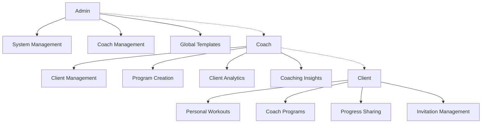

# Coach Role System Design

## Overview

This design document outlines the technical implementation of a hierarchical coach role system for the Exercise Tracker application. The system builds upon the existing Supabase PostgreSQL database with Row Level Security (RLS) and extends the current role-based architecture to support coach-client relationships.

The design leverages the existing infrastructure including:
- Supabase PostgreSQL with RLS policies
- Existing roles array in users table ('user', 'admin')
- Role management functions (add_user_role, remove_user_role, user_has_role)
- React 19 frontend with React Bootstrap
- Supabase real-time subscriptions for live updates

## Architecture

### System Hierarchy



### Role Definitions

- **Admin**: Full system access, coach promotion/demotion, global template management
- **Coach**: Client management, client data access (with permissions), program creation for clients
- **User/Client**: Personal data access + coach interaction capabilities when in coaching relationship

## Components and Interfaces

### Database Schema Extensions

#### 1. Coach Profiles Table
```sql
CREATE TABLE coach_profiles (
    id UUID PRIMARY KEY DEFAULT gen_random_uuid(),
    user_id UUID NOT NULL REFERENCES users(id) ON DELETE CASCADE,
    is_active BOOLEAN DEFAULT true,
    specializations TEXT[],
    certifications TEXT[],
    bio TEXT,
    phone VARCHAR(20),
    website VARCHAR(255),
    client_limit INTEGER, -- NULL for unlimited
    created_at TIMESTAMP WITH TIME ZONE DEFAULT NOW(),
    updated_at TIMESTAMP WITH TIME ZONE DEFAULT NOW(),
    UNIQUE(user_id)
);
```

#### 2. Coach-Client Relationships Table
```sql
CREATE TABLE coach_client_relationships (
    id UUID PRIMARY KEY DEFAULT gen_random_uuid(),
    coach_id UUID NOT NULL REFERENCES users(id) ON DELETE CASCADE,
    client_id UUID NOT NULL REFERENCES users(id) ON DELETE CASCADE,
    status VARCHAR(20) DEFAULT 'pending' CHECK (status IN ('pending', 'active', 'inactive', 'terminated')),
    invited_at TIMESTAMP WITH TIME ZONE DEFAULT NOW(),
    accepted_at TIMESTAMP WITH TIME ZONE,
    terminated_at TIMESTAMP WITH TIME ZONE,
    
    -- -- Granular permissions
    -- can_view_workouts BOOLEAN DEFAULT true,
    -- can_view_progress BOOLEAN DEFAULT true,
    -- can_view_analytics BOOLEAN DEFAULT true,
    -- can_create_programs BOOLEAN DEFAULT true,
    -- can_send_messages BOOLEAN DEFAULT true,
    
    -- Metadata
    invitation_method VARCHAR(20) CHECK (invitation_method IN ('email', 'username')),
    invitation_message TEXT,
    coach_notes TEXT,
    client_goals TEXT[],
    
    created_at TIMESTAMP WITH TIME ZONE DEFAULT NOW(),
    updated_at TIMESTAMP WITH TIME ZONE DEFAULT NOW(),
    
    UNIQUE(coach_id, client_id)
);
```

#### 3. Client Invitations Table
```sql
CREATE TABLE client_invitations (
    id UUID PRIMARY KEY DEFAULT gen_random_uuid(),
    coach_id UUID NOT NULL REFERENCES users(id) ON DELETE CASCADE,
    coach_email VARCHAR(255) NOT NULL,
    coach_name VARCHAR(255) NOT NULL,
    
    -- Invitation target (one of these will be set)
    target_email VARCHAR(255),
    target_user_id UUID REFERENCES users(id),
    
    invitation_code VARCHAR(50) UNIQUE NOT NULL,
    message TEXT,
    
    status VARCHAR(20) DEFAULT 'pending' CHECK (status IN ('pending', 'accepted', 'declined', 'expired')),
    expires_at TIMESTAMP WITH TIME ZONE DEFAULT (NOW() + INTERVAL '7 days'),
    responded_at TIMESTAMP WITH TIME ZONE,
    
    -- Response tracking
    viewed_at TIMESTAMP WITH TIME ZONE,
    ip_address INET,
    user_agent TEXT,
    
    created_at TIMESTAMP WITH TIME ZONE DEFAULT NOW(),
    updated_at TIMESTAMP WITH TIME ZONE DEFAULT NOW()
);
```

#### 4. Coaching Insights Table
```sql
CREATE TABLE coaching_insights (
    id UUID PRIMARY KEY DEFAULT gen_random_uuid(),
    coach_id UUID NOT NULL REFERENCES users(id) ON DELETE CASCADE,
    client_id UUID NOT NULL REFERENCES users(id) ON DELETE CASCADE,
    relationship_id UUID NOT NULL REFERENCES coach_client_relationships(id) ON DELETE CASCADE,
    
    type VARCHAR(30) CHECK (type IN ('recommendation', 'observation', 'goal_update', 'program_adjustment')),
    title VARCHAR(255) NOT NULL,
    content TEXT NOT NULL,
    
    -- AI integration fields
    ai_generated BOOLEAN DEFAULT false,
    ai_confidence DECIMAL(3,2), -- 0.00 to 1.00
    based_on_data JSONB, -- Store workout count, date range, exercises analyzed
    
    -- Client interaction
    client_viewed BOOLEAN DEFAULT false,
    client_viewed_at TIMESTAMP WITH TIME ZONE,
    client_response TEXT,
    
    priority VARCHAR(10) DEFAULT 'medium' CHECK (priority IN ('low', 'medium', 'high')),
    tags TEXT[],
    
    created_at TIMESTAMP WITH TIME ZONE DEFAULT NOW(),
    updated_at TIMESTAMP WITH TIME ZONE DEFAULT NOW()
);
```

#### 5. Enhanced Programs Table
```sql
-- Add coach assignment fields to existing programs table
ALTER TABLE programs ADD COLUMN coach_assigned BOOLEAN DEFAULT false;
ALTER TABLE programs ADD COLUMN assigned_to_client UUID REFERENCES users(id);
ALTER TABLE programs ADD COLUMN assigned_at TIMESTAMP WITH TIME ZONE;
ALTER TABLE programs ADD COLUMN coach_notes TEXT;
ALTER TABLE programs ADD COLUMN client_goals TEXT[];
ALTER TABLE programs ADD COLUMN expected_duration_weeks INTEGER;
ALTER TABLE programs ADD COLUMN program_difficulty VARCHAR(20) CHECK (program_difficulty IN ('beginner', 'intermediate', 'advanced'));
ALTER TABLE programs ADD COLUMN visibility VARCHAR(20) DEFAULT 'private' CHECK (visibility IN ('private', 'coach_only', 'template', 'public'));
```

### Row Level Security Policies

#### Coach Profiles Policies
```sql
-- Coach profiles can be viewed by the coach themselves, their clients, and admins
CREATE POLICY "Coach profiles viewable by coach, clients, and admins" ON coach_profiles
    FOR SELECT USING (
        user_id = auth.uid() OR
        EXISTS (
            SELECT 1 FROM coach_client_relationships ccr
            WHERE ccr.coach_id = user_id 
            AND ccr.client_id = auth.uid() 
            AND ccr.status = 'active'
        ) OR
        EXISTS (
            SELECT 1 FROM users u
            WHERE u.id = auth.uid() 
            AND 'admin' = ANY(u.roles)
        )
    );

-- Only coaches can update their own profiles
CREATE POLICY "Coaches can update own profile" ON coach_profiles
    FOR UPDATE USING (user_id = auth.uid());

-- Only users with coach role can create profiles
CREATE POLICY "Coach role required for profile creation" ON coach_profiles
    FOR INSERT WITH CHECK (
        user_id = auth.uid() AND
        EXISTS (
            SELECT 1 FROM users u
            WHERE u.id = auth.uid() 
            AND 'coach' = ANY(u.roles)
        )
    );
```

#### Coach-Client Relationships Policies
```sql
-- Relationships viewable by coach, client, or admin
CREATE POLICY "Relationships viewable by participants and admins" ON coach_client_relationships
    FOR SELECT USING (
        coach_id = auth.uid() OR 
        client_id = auth.uid() OR
        EXISTS (
            SELECT 1 FROM users u
            WHERE u.id = auth.uid() 
            AND 'admin' = ANY(u.roles)
        )
    );

-- Only coaches can create relationships
CREATE POLICY "Coaches can create relationships" ON coach_client_relationships
    FOR INSERT WITH CHECK (
        coach_id = auth.uid() AND
        EXISTS (
            SELECT 1 FROM users u
            WHERE u.id = auth.uid() 
            AND 'coach' = ANY(u.roles)
        )
    );

-- Coaches and clients can update relationships (different fields)
CREATE POLICY "Participants can update relationships" ON coach_client_relationships
    FOR UPDATE USING (coach_id = auth.uid() OR client_id = auth.uid());
```

#### Enhanced Data Access Policies
```sql
-- Enhanced workout logs policy for coach access
DROP POLICY "Users can view their own workout logs" ON workout_logs;
CREATE POLICY "Users and coaches can view workout logs" ON workout_logs
    FOR SELECT USING (
        user_id = auth.uid() OR
        EXISTS (
            SELECT 1 FROM coach_client_relationships ccr
            WHERE ccr.coach_id = auth.uid() 
            AND ccr.client_id = user_id 
            AND ccr.status = 'active'
            AND ccr.can_view_workouts = true
        ) OR
        EXISTS (
            SELECT 1 FROM users u
            WHERE u.id = auth.uid() 
            AND 'admin' = ANY(u.roles)
        )
    );

-- Enhanced programs policy for coach assignments
DROP POLICY "Users can view their own programs" ON programs;
CREATE POLICY "Users and coaches can view programs" ON programs
    FOR SELECT USING (
        user_id = auth.uid() OR
        assigned_to_client = auth.uid() OR
        (is_template = true AND visibility IN ('template', 'public')) OR
        EXISTS (
            SELECT 1 FROM coach_client_relationships ccr
            WHERE ccr.coach_id = auth.uid() 
            AND ccr.client_id = user_id 
            AND ccr.status = 'active'
        ) OR
        EXISTS (
            SELECT 1 FROM users u
            WHERE u.id = auth.uid() 
            AND 'admin' = ANY(u.roles)
        )
    );
```

### Database Functions

#### Coach Management Functions
```sql
-- Function to promote user to coach
CREATE OR REPLACE FUNCTION promote_to_coach(
    target_user_id UUID,
    coach_specializations TEXT[] DEFAULT '{}',
    coach_bio TEXT DEFAULT ''
)
RETURNS VOID AS $$
BEGIN
    -- Add coach role
    PERFORM add_user_role(target_user_id, 'coach');
    
    -- Create coach profile
    INSERT INTO coach_profiles (user_id, specializations, bio)
    VALUES (target_user_id, coach_specializations, coach_bio)
    ON CONFLICT (user_id) DO UPDATE SET
        is_active = true,
        specializations = EXCLUDED.specializations,
        bio = EXCLUDED.bio,
        updated_at = NOW();
END;
$$ LANGUAGE plpgsql SECURITY DEFINER;

-- Function to create coach-client relationship
CREATE OR REPLACE FUNCTION accept_coaching_invitation(invitation_id UUID)
RETURNS UUID AS $$
DECLARE
    invitation_record client_invitations%ROWTYPE;
    relationship_id UUID;
BEGIN
    -- Get invitation details
    SELECT * INTO invitation_record 
    FROM client_invitations 
    WHERE id = invitation_id 
    AND status = 'pending' 
    AND expires_at > NOW();
    
    IF NOT FOUND THEN
        RAISE EXCEPTION 'Invalid or expired invitation';
    END IF;
    
    -- Create relationship
    INSERT INTO coach_client_relationships (
        coach_id, 
        client_id, 
        status, 
        accepted_at,
        invitation_method
    ) VALUES (
        invitation_record.coach_id,
        auth.uid(),
        'active',
        NOW(),
        'email'
    ) RETURNING id INTO relationship_id;
    
    -- Update invitation status
    UPDATE client_invitations 
    SET status = 'accepted', responded_at = NOW()
    WHERE id = invitation_id;
    
    RETURN relationship_id;
END;
$$ LANGUAGE plpgsql SECURITY DEFINER;

-- Function to check coach permissions for client data
CREATE OR REPLACE FUNCTION coach_can_access_client_data(
    coach_user_id UUID,
    client_user_id UUID,
    data_type TEXT
)
RETURNS BOOLEAN AS $$
BEGIN
    RETURN EXISTS (
        SELECT 1 FROM coach_client_relationships ccr
        WHERE ccr.coach_id = coach_user_id 
        AND ccr.client_id = client_user_id 
        AND ccr.status = 'active'
        AND (
            (data_type = 'workouts') OR
            (data_type = 'progress') OR
            (data_type = 'analytics') OR
            (data_type = 'programs')
        )
    );
END;
$$ LANGUAGE plpgsql SECURITY DEFINER;
```

## Data Models

### Frontend TypeScript Interfaces

```typescript
// Coach Profile Interface
interface CoachProfile {
  id: string;
  userId: string;
  isActive: boolean;
  specializations: string[];
  certifications: string[];
  bio: string;
  phone?: string;
  website?: string;
  clientLimit?: number;
  createdAt: string;
  updatedAt: string;
}

// Coach-Client Relationship Interface
interface CoachClientRelationship {
  id: string;
  coachId: string;
  clientId: string;
  status: 'pending' | 'active' | 'inactive' | 'terminated';
  invitedAt: string;
  acceptedAt?: string;
  terminatedAt?: string;
  
  // Permissions
//   canViewWorkouts: boolean;
//   canViewProgress: boolean;
//   canViewAnalytics: boolean;
//   canCreatePrograms: boolean;
//   canSendMessages: boolean;
  
  // Metadata
  invitationMethod: 'email' | 'username';
  invitationMessage?: string;
  coachNotes?: string;
  clientGoals: string[];
  
  createdAt: string;
  updatedAt: string;
}

// Client Invitation Interface
interface ClientInvitation {
  id: string;
  coachId: string;
  coachEmail: string;
  coachName: string;
  targetEmail?: string;
  targetUserId?: string;
  invitationCode: string;
  message?: string;
  status: 'pending' | 'accepted' | 'declined' | 'expired';
  expiresAt: string;
  respondedAt?: string;
  viewedAt?: string;
  createdAt: string;
}

// Coaching Insight Interface
interface CoachingInsight {
  id: string;
  coachId: string;
  clientId: string;
  relationshipId: string;
  type: 'recommendation' | 'observation' | 'goal_update' | 'program_adjustment';
  title: string;
  content: string;
  aiGenerated: boolean;
  aiConfidence?: number;
  basedOnData?: {
    workoutCount: number;
    dateRange: { start: string; end: string };
    exercisesAnalyzed: string[];
  };
  clientViewed: boolean;
  clientViewedAt?: string;
  clientResponse?: string;
  priority: 'low' | 'medium' | 'high';
  tags: string[];
  createdAt: string;
  updatedAt: string;
}

// Enhanced Program Interface
interface Program {
  // Existing fields...
  id: string;
  userId: string;
  name: string;
  description?: string;
  duration: number;
  daysPerWeek: number;
  isTemplate: boolean;
  
  // New coach fields
  coachAssigned: boolean;
  assignedToClient?: string;
  assignedAt?: string;
  coachNotes?: string;
  clientGoals: string[];
  expectedDurationWeeks?: number;
  programDifficulty?: 'beginner' | 'intermediate' | 'advanced';
  visibility: 'private' | 'coach_only' | 'template' | 'public';
}
```

### Service Layer Architecture

#### Coach Service
```typescript
// src/services/coachService.js
export class CoachService {
  // Coach profile management
  static async createCoachProfile(profileData: Partial<CoachProfile>) {
    const { data, error } = await supabase
      .from('coach_profiles')
      .insert(profileData)
      .select()
      .single();
    
    if (error) throw new Error(`Failed to create coach profile: ${error.message}`);
    return data;
  }
  
  static async getCoachProfile(userId: string) {
    const { data, error } = await supabase
      .from('coach_profiles')
      .select('*')
      .eq('user_id', userId)
      .single();
    
    if (error && error.code !== 'PGRST116') {
      throw new Error(`Failed to fetch coach profile: ${error.message}`);
    }
    return data;
  }
  
  // Client management
  static async getCoachClients(coachId: string) {
    const { data, error } = await supabase
      .from('coach_client_relationships')
      .select(`
        *,
        client:users!client_id(id, name, email, experience_level),
        coach:users!coach_id(id, name, email)
      `)
      .eq('coach_id', coachId)
      .eq('status', 'active');
    
    if (error) throw new Error(`Failed to fetch clients: ${error.message}`);
    return data;
  }
  
  // Invitation management
  static async sendInvitation(invitationData: Partial<ClientInvitation>) {
    const { data, error } = await supabase
      .from('client_invitations')
      .insert({
        ...invitationData,
        invitation_code: this.generateInvitationCode()
      })
      .select()
      .single();
    
    if (error) throw new Error(`Failed to send invitation: ${error.message}`);
    
    // Trigger email sending via Edge Function
    if (invitationData.targetEmail) {
      await this.sendInvitationEmail(data);
    }
    
    return data;
  }
  
  static async acceptInvitation(invitationId: string) {
    const { data, error } = await supabase
      .rpc('accept_coaching_invitation', { invitation_id: invitationId });
    
    if (error) throw new Error(`Failed to accept invitation: ${error.message}`);
    return data;
  }
  
  // Coaching insights
  static async createInsight(insightData: Partial<CoachingInsight>) {
    const { data, error } = await supabase
      .from('coaching_insights')
      .insert(insightData)
      .select()
      .single();
    
    if (error) throw new Error(`Failed to create insight: ${error.message}`);
    return data;
  }
  
  // Utility functions
  private static generateInvitationCode(): string {
    return Math.random().toString(36).substring(2, 15) + 
           Math.random().toString(36).substring(2, 15);
  }
  
  private static async sendInvitationEmail(invitation: ClientInvitation) {
    const { error } = await supabase.functions.invoke('send-coach-invitation', {
      body: { invitation }
    });
    
    if (error) {
      console.error('Failed to send invitation email:', error);
    }
  }
}
```

#### Permission Service
```typescript
// src/services/permissionService.js
export class PermissionService {
  static async canAccessClientData(
    coachId: string, 
    clientId: string, 
    dataType: string
  ): Promise<boolean> {
    const { data, error } = await supabase
      .rpc('coach_can_access_client_data', {
        coach_user_id: coachId,
        client_user_id: clientId,
        data_type: dataType
      });
    
    if (error) {
      console.error('Permission check failed:', error);
      return false;
    }
    
    return data;
  }
  
  static async getCoachClientRelationship(coachId: string, clientId: string) {
    const { data, error } = await supabase
      .from('coach_client_relationships')
      .select('*')
      .eq('coach_id', coachId)
      .eq('client_id', clientId)
      .eq('status', 'active')
      .single();
    
    if (error && error.code !== 'PGRST116') {
      throw new Error(`Failed to fetch relationship: ${error.message}`);
    }
    
    return data;
  }
}
```

## Error Handling

### Custom Error Classes
```typescript
// src/utils/coachErrors.js
export class CoachingError extends Error {
  constructor(message: string, public code: string) {
    super(message);
    this.name = 'CoachingError';
  }
}

export class PermissionDeniedError extends CoachingError {
  constructor(action: string) {
    super(`Permission denied for action: ${action}`, 'PERMISSION_DENIED');
  }
}

export class InvalidInvitationError extends CoachingError {
  constructor(reason: string) {
    super(`Invalid invitation: ${reason}`, 'INVALID_INVITATION');
  }
}

export class RelationshipError extends CoachingError {
  constructor(message: string) {
    super(message, 'RELATIONSHIP_ERROR');
  }
}
```

## Testing Strategy

### Unit Tests
- Coach service methods
- Permission checking functions
- Database function testing
- RLS policy validation

### Integration Tests
- Complete invitation workflow
- Coach-client relationship lifecycle
- Data access permission enforcement
- Real-time subscription functionality

### End-to-End Tests
- Coach dashboard functionality
- Client invitation and acceptance flow
- Program assignment and access
- Coaching insights creation and delivery

## Performance Considerations

### Database Optimization
- Indexes on frequently queried columns (coach_id, client_id, status)
- Composite indexes for complex queries
- Proper use of LIMIT and pagination for large datasets

### Caching Strategy
- Cache coach profiles and client lists
- Real-time subscription management for live updates
- Intelligent cache invalidation on relationship changes

### Real-time Features
- Supabase real-time subscriptions for:
  - New coaching insights
  - Invitation status changes
  - Client workout completions
  - Relationship status updates

This design provides a comprehensive foundation for implementing the coach role system while leveraging the existing Supabase infrastructure and maintaining security through RLS policies.