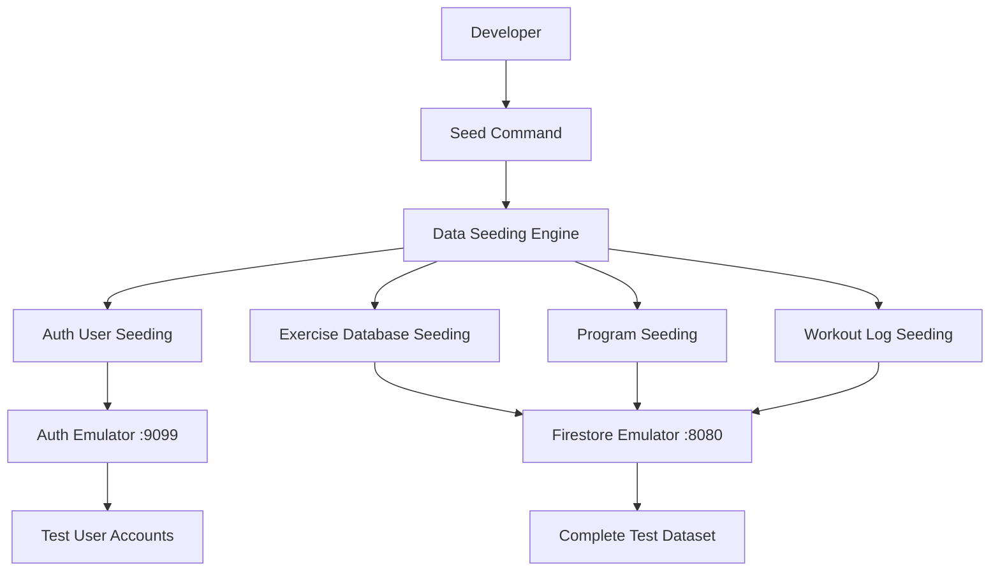
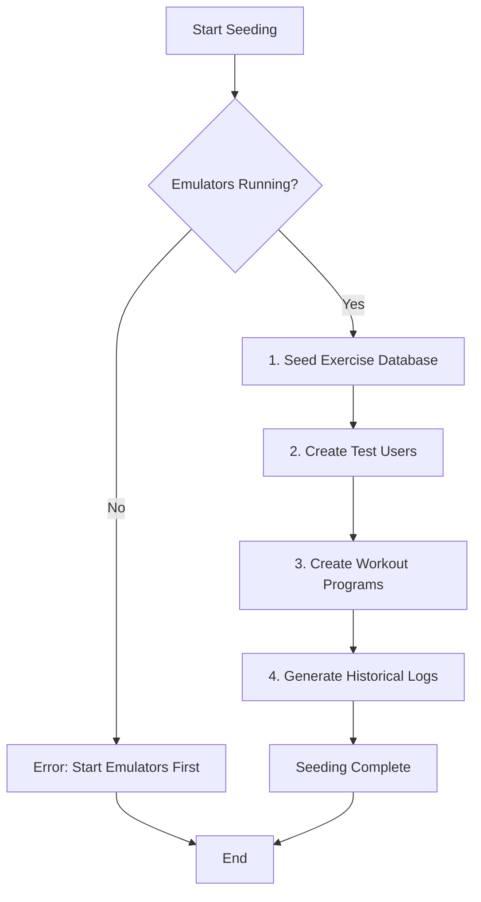

# Design Document: Development Test Data Seeding

## Overview

This design creates a comprehensive test data seeding system for the React Firebase fitness application that automatically populates Firebase emulators with realistic test users, workout programs, exercises, and historical workout logs. The system will enable developers to quickly set up complete testing scenarios without manual data entry, specifically supporting workout logging functionality testing.

Based on the existing codebase analysis, the application uses the following key Firestore collections:
- `users` - User profile information
- `exercises_metadata` - Exercise definitions (global and user-specific)
- `programs` - Workout programs with weekly configurations
- `workoutLogs` - Historical workout session data

## Architecture

### High-Level Architecture



### Data Seeding Flow



## Components and Interfaces

### 1. Seeding Engine Core

**Main Seeding Controller**
```javascript
// scripts/seed-test-data.js
class TestDataSeeder {
  constructor(options = {}) {
    this.scenarios = options.scenarios || ['beginner', 'intermediate', 'advanced'];
    this.emulatorConfig = {
      auth: 'http://localhost:9099',
      firestore: 'localhost:8080'
    };
  }
  
  async seedAll() {
    await this.validateEmulators();
    await this.seedExerciseDatabase();
    await this.seedTestUsers();
    await this.seedWorkoutPrograms();
    await this.seedWorkoutLogs();
  }
}
```

**Environment Validation**
```javascript
const validateEmulators = async () => {
  // Check if Firebase emulators are running
  // Verify connectivity to Auth and Firestore emulators
  // Ensure clean state or warn about existing data
};
```

### 2. Exercise Database Seeding

**Exercise Data Structure**
Based on the codebase analysis, exercises are stored in both the `exercises` collection and the `exercises_metadata` collection:

```javascript
// Individual exercise in 'exercises' collection
const exerciseTemplate = {
  name: 'Barbell Back Squat',
  primaryMuscleGroup: 'Quads',
  exerciseType: 'Barbell',
  // userId is only set for user-specific exercises
  userId: 'user-uid' // optional, only for personal exercises
};

// Global exercises metadata document structure
const exercisesMetadataTemplate = {
  // exercises_metadata/all_exercises document
  exercises: {
    'exercise-id-1': {
      name: 'Barbell Back Squat',
      primaryMuscleGroup: 'Quads',
      exerciseType: 'Barbell'
    },
    'exercise-id-2': {
      name: 'Bench Press',
      primaryMuscleGroup: 'Chest',
      exerciseType: 'Barbell'
    }
  },
  lastUpdated: new Date()
};

// User-specific exercises metadata document structure
const userExercisesMetadataTemplate = {
  // exercises_metadata/{userId} document
  exercises: {
    'exercise-id-3': {
      name: 'Custom Exercise',
      primaryMuscleGroup: 'Back',
      exerciseType: 'Cable',
      userId: 'user-uid'
    }
  },
  lastUpdated: new Date()
};
```

**Exercise Categories to Seed**
- **Compound Movements**: Squat, Deadlift, Bench Press, Overhead Press, Rows
- **Isolation Exercises**: Bicep Curls, Tricep Extensions, Lateral Raises
- **Bodyweight**: Push-ups, Pull-ups, Dips, Planks
- **Machine Exercises**: Leg Press, Lat Pulldown, Cable Flyes

### 3. Test User Creation

**User Scenarios**
```javascript
const userScenarios = {
  beginner: {
    email: 'beginner@test.com',
    password: 'test123',
    profile: {
      name: 'Alex Beginner',
      experienceLevel: 'beginner',
      goals: ['strength', 'muscle_gain'],
      preferredUnits: 'LB'
    }
  },
  intermediate: {
    email: 'intermediate@test.com', 
    password: 'test123',
    profile: {
      name: 'Jordan Intermediate',
      experienceLevel: 'intermediate',
      goals: ['strength', 'powerlifting'],
      preferredUnits: 'LB'
    }
  },
  advanced: {
    email: 'advanced@test.com',
    password: 'test123', 
    profile: {
      name: 'Casey Advanced',
      experienceLevel: 'advanced',
      goals: ['competition', 'strength'],
      preferredUnits: 'KG'
    }
  }
};
```

**User Document Structure**
```javascript
const userDocument = {
  email: user.email,
  name: profile.name,
  createdAt: new Date(),
  experienceLevel: profile.experienceLevel,
  goals: profile.goals,
  preferredUnits: profile.preferredUnits
};
```

### 4. Workout Program Seeding

**Program Structure Analysis**
Based on the codebase analysis, programs have this structure:
```javascript
const programTemplate = {
  userId: 'user-uid',
  isTemplate: false,
  name: 'Starting Strength',
  duration: 12, // weeks
  daysPerWeek: 3,
  weightUnit: 'LB',
  weeklyConfigs: {
    // Week-by-week configuration
    week1_day1: {
      name: 'Day 1',
      exercises: [
        {
          exerciseId: 'squat-id',
          sets: 3,
          reps: 8, // Can be a number or string like "5/3/1" for rep schemes
          notes: ''
        }
      ]
    }
  },
  createdAt: new Date(),
  isCurrent: false // Only one program can be current per user
};
```

**Program Templates to Create**
- **Beginner Program**: Starting Strength (3x5 compound movements)
- **Intermediate Program**: 5/3/1 (percentage-based progression)
- **Advanced Program**: Conjugate Method (max effort/dynamic effort)

### 5. Workout Log Generation

**Workout Log Structure**
```javascript
const workoutLogTemplate = {
  userId: 'user-uid',
  programId: 'program-id',
  weekIndex: 0,
  dayIndex: 0,
  exercises: [
    {
      exerciseId: 'squat-id',
      sets: 3,
      reps: [5, 5, 5],
      weights: [135, 135, 135],
      completed: [true, true, true],
      notes: 'Felt strong today',
      bodyweight: null,
      // Optional fields for added exercises
      isAdded: false,
      addedType: null,
      originalIndex: -1
    }
  ],
  date: Timestamp.fromDate(new Date()),
  isWorkoutFinished: true
};
```

**Historical Data Patterns**
- **Progressive Overload**: Gradual weight increases over time
- **Realistic Failures**: Some missed reps and deload weeks
- **Consistency Patterns**: Some missed workouts, vacation breaks
- **Seasonal Variations**: Different training phases

## Data Models

### Test Data Configuration Model

```javascript
const TestDataConfig = {
  users: {
    count: 3,
    scenarios: ['beginner', 'intermediate', 'advanced'],
    defaultPassword: 'test123'
  },
  exercises: {
    globalCount: 50,
    userSpecificCount: 5,
    categories: ['compound', 'isolation', 'bodyweight', 'machine']
  },
  programs: {
    perUser: 2,
    templates: 3,
    durationWeeks: [8, 12, 16],
    daysPerWeek: [3, 4, 5]
  },
  workoutLogs: {
    historyWeeks: 12,
    completionRate: 0.85, // 85% workout completion
    progressionRate: 0.02 // 2% weight increase per week
  }
};
```

### Exercise Database Model

```javascript
const ExerciseDatabase = {
  compound: [
    {
      name: 'Barbell Back Squat',
      primaryMuscleGroup: 'Quads',
      exerciseType: 'Barbell',
      startingWeight: { beginner: 95, intermediate: 185, advanced: 275 }
    },
    {
      name: 'Conventional Deadlift', 
      primaryMuscleGroup: 'Hamstrings',
      exerciseType: 'Barbell',
      startingWeight: { beginner: 135, intermediate: 225, advanced: 315 }
    }
  ],
  isolation: [
    {
      name: 'Dumbbell Bicep Curl',
      primaryMuscleGroup: 'Biceps', 
      exerciseType: 'Dumbbell',
      startingWeight: { beginner: 20, intermediate: 35, advanced: 50 }
    }
  ]
};
```

## Error Handling

### Emulator Connectivity Errors
```javascript
const handleEmulatorError = (service, error) => {
  console.error(`❌ ${service} emulator connection failed:`, error.message);
  
  if (error.code === 'ECONNREFUSED') {
    console.log(`💡 Make sure ${service} emulator is running on the expected port`);
    console.log('   Run: npm run dev:firebase');
  }
  
  throw new Error(`Cannot seed data: ${service} emulator not available`);
};
```

### Data Validation Errors
```javascript
const validateSeedData = (data, type) => {
  const validators = {
    user: (user) => user.email && user.password,
    exercise: (ex) => ex.name && ex.primaryMuscleGroup,
    program: (prog) => prog.name && prog.weeklyConfigs,
    workoutLog: (log) => log.userId && log.exercises
  };
  
  if (!validators[type](data)) {
    throw new Error(`Invalid ${type} data structure`);
  }
};
```

### Cleanup and Recovery
```javascript
const handleSeedingFailure = async (error, completedSteps) => {
  console.error('❌ Seeding failed:', error.message);
  console.log('🧹 Cleaning up partial data...');
  
  // Rollback completed steps in reverse order
  for (const step of completedSteps.reverse()) {
    await rollbackStep(step);
  }
  
  console.log('✅ Cleanup complete. Safe to retry seeding.');
};
```

## Testing Strategy

### Seeding Script Testing
```javascript
// tests/seed-test-data.test.js
describe('Test Data Seeding', () => {
  beforeEach(async () => {
    // Start emulators in test mode
    await startTestEmulators();
  });
  
  test('should create all test users', async () => {
    const seeder = new TestDataSeeder();
    await seeder.seedTestUsers();
    
    const users = await getTestUsers();
    expect(users).toHaveLength(3);
    expect(users[0].email).toBe('beginner@test.com');
  });
  
  test('should create realistic workout progression', async () => {
    const seeder = new TestDataSeeder();
    await seeder.seedAll();
    
    const logs = await getWorkoutLogs('beginner-user-id');
    const squatLogs = logs.filter(log => 
      log.exercises.some(ex => ex.exerciseId === 'squat-id')
    );
    
    // Verify progressive overload
    const weights = squatLogs.map(log => log.exercises[0].weights[0]);
    expect(weights[weights.length - 1]).toBeGreaterThan(weights[0]);
  });
});
```

### Integration Testing
```javascript
const testWorkoutLoggingFlow = async () => {
  // 1. Seed test data
  await seedTestData();
  
  // 2. Login as test user
  const user = await signInTestUser('beginner@test.com');
  
  // 3. Load user's current program
  const program = await getCurrentProgram(user.uid);
  expect(program).toBeDefined();
  
  // 4. Verify exercises are available
  const exercises = await getExercises();
  expect(exercises.length).toBeGreaterThan(0);
  
  // 5. Test logging a workout
  const workoutLog = await logWorkout(user.uid, program.id, {
    exercises: program.weeklyConfigs.week1_day1.exercises
  });
  expect(workoutLog.id).toBeDefined();
};
```

## Implementation Considerations

### Script Organization
```
scripts/
├── seed-test-data.js           # Main seeding script
├── test-data/
│   ├── exercises.js           # Exercise database
│   ├── programs.js            # Program templates  
│   ├── users.js               # User scenarios
│   └── workout-logs.js        # Log generation logic
└── utils/
    ├── emulator-helpers.js    # Emulator connectivity
    ├── data-generators.js     # Realistic data generation
    └── cleanup.js             # Data cleanup utilities
```

### Performance Optimizations
- **Batch Operations**: Use Firestore batch writes for bulk data creation
- **Parallel Seeding**: Seed independent data types concurrently
- **Progress Reporting**: Show progress for long-running seed operations
- **Incremental Seeding**: Option to seed only missing data

### Integration with Development Workflow
- **NPM Scripts**: Add `seed:dev` and `seed:reset` commands to package.json
- **Auto-Seeding Option**: Provide flag to auto-seed when starting emulators
- **Selective Seeding**: Allow seeding specific data types only

This design provides a comprehensive test data seeding system that will enable thorough testing of workout logging functionality with realistic user scenarios and data patterns.