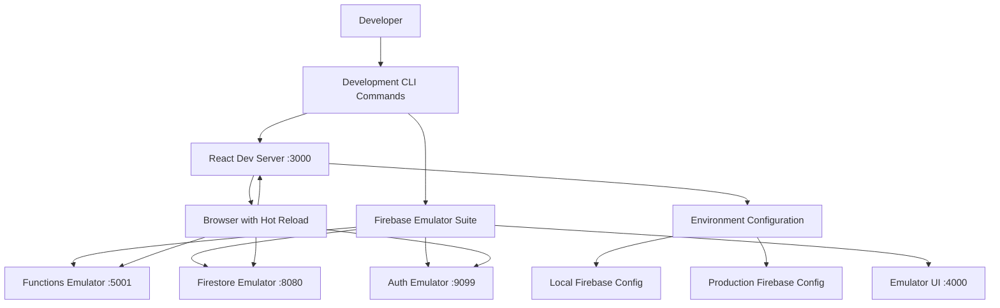
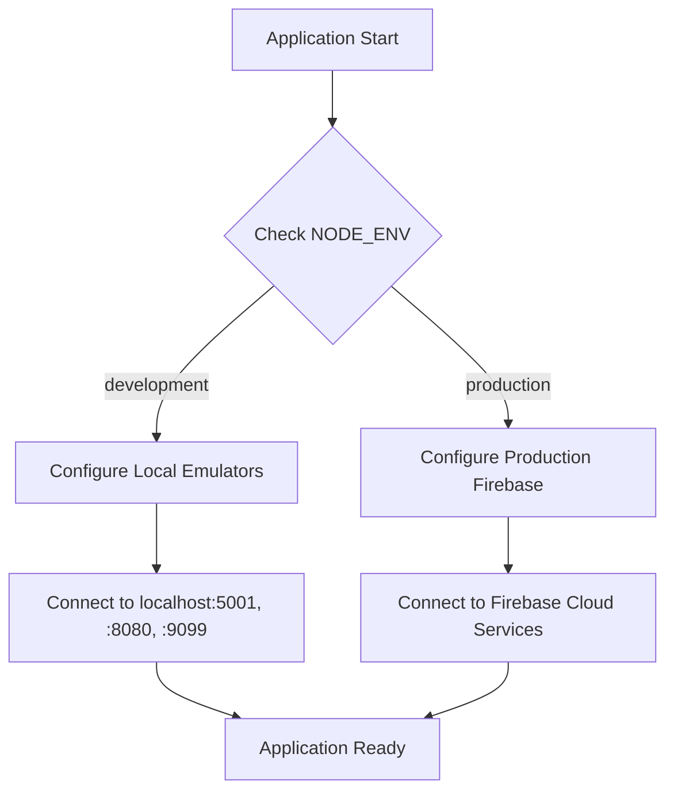

# Design Document: Local Development Environment

## Overview

This design establishes a comprehensive local development environment for the React Firebase application that eliminates the need to build and deploy for every change. The solution leverages Firebase Emulator Suite, React's built-in development server, and environment-based configuration to create a seamless local development experience.

The current workflow requires `npm run build` and `firebase deploy` for every test, which is inefficient and time-consuming. This design will enable instant feedback through hot-reloading and local Firebase services.

## Architecture

### High-Level Architecture



### Environment Detection Flow



## Components and Interfaces

### 1. Development Scripts and Configuration

**Package.json Scripts Enhancement**
- `dev`: Start complete development environment (React + Firebase emulators)
- `dev:react`: Start only React development server
- `dev:firebase`: Start only Firebase emulators
- `dev:functions`: Start only Functions emulator for backend development

**Firebase Configuration Enhancement**
- Add emulator configuration to `firebase.json`
- Configure emulator ports and settings
- Enable emulator UI for debugging

### 2. Environment Configuration System

**Environment Detection Module**
```javascript
// src/config/environment.js
const isDevelopment = process.env.NODE_ENV === 'development'
const isEmulatorMode = process.env.REACT_APP_USE_EMULATORS === 'true'

export const firebaseConfig = {
  // Existing production config
  ...productionConfig,
  // Emulator-specific overrides when in development
  ...(isDevelopment && isEmulatorMode ? emulatorConfig : {})
}
```

**Firebase Service Configuration**
```javascript
// src/firebase.js (enhanced)
import { connectFirestoreEmulator } from 'firebase/firestore'
import { connectAuthEmulator } from 'firebase/auth'
import { connectFunctionsEmulator } from 'firebase/functions'

// Auto-connect to emulators in development
if (isDevelopment && !emulatorConnected) {
  connectFirestoreEmulator(db, 'localhost', 8080)
  connectAuthEmulator(auth, 'http://localhost:9099')
  connectFunctionsEmulator(functions, 'localhost', 5001)
}
```

### 3. Development Workflow Components

**Concurrent Process Manager**
- Use `concurrently` npm package to run multiple services
- Provide colored console output for different services
- Handle graceful shutdown of all processes

**Hot Reload Configuration**
- React Scripts already provides hot reload for frontend
- Firebase Functions emulator provides automatic reload for backend changes
- Configure file watching for optimal performance

### 4. Debugging and Monitoring

**Enhanced Error Handling**
- Development-specific error boundaries
- Detailed Firebase emulator error reporting
- Source map support for debugging

**Development Tools Integration**
- Firebase Emulator UI for database and auth inspection
- React Developer Tools compatibility
- Console logging enhancements for development

## Data Models

### Environment Configuration Model

```javascript
const EnvironmentConfig = {
  development: {
    firebase: {
      useEmulators: true,
      emulatorPorts: {
        functions: 5001,
        firestore: 8080,
        auth: 9099,
        ui: 4000
      }
    },
    react: {
      port: 3000,
      hotReload: true
    }
  },
  production: {
    firebase: {
      useEmulators: false,
      // Production Firebase config from environment variables
    }
  }
}
```

### Development State Model

```javascript
const DevelopmentState = {
  services: {
    react: { status: 'running', port: 3000, pid: 12345 },
    functions: { status: 'running', port: 5001, pid: 12346 },
    firestore: { status: 'running', port: 8080, pid: 12347 },
    auth: { status: 'running', port: 9099, pid: 12348 }
  },
  emulatorData: {
    persistenceEnabled: true,
    dataPath: '.firebase/emulators'
  }
}
```

## Error Handling

### Service Startup Errors
- **Port Conflicts**: Check for port availability and suggest alternatives
- **Missing Dependencies**: Validate Firebase CLI and required packages
- **Configuration Errors**: Provide clear error messages for misconfigured emulators

### Runtime Errors
- **Emulator Connection Failures**: Graceful fallback with clear error messages
- **Hot Reload Issues**: Automatic recovery and restart mechanisms
- **Function Deployment Errors**: Local validation before emulator deployment

### Development-Specific Error Handling
```javascript
const handleDevelopmentError = (error, service) => {
  console.error(`[${service.toUpperCase()}] Error:`, error)
  
  if (isDevelopment) {
    // Show detailed error information
    console.error('Stack trace:', error.stack)
    console.error('Service status:', getServiceStatus(service))
    
    // Suggest common fixes
    suggestFixes(error, service)
  }
}
```

## Testing Strategy

### Local Development Testing
1. **Unit Tests**: Run existing React tests with `npm test` in watch mode
2. **Integration Tests**: Test Firebase emulator integration with automated tests
3. **End-to-End Testing**: Use emulators for consistent E2E test environment

### Emulator Testing Approach
```javascript
// Test configuration for emulators
const testConfig = {
  beforeAll: async () => {
    // Start emulators for testing
    await startEmulators(['firestore', 'auth', 'functions'])
  },
  afterAll: async () => {
    // Clean up emulator data
    await clearEmulatorData()
  }
}
```

### Development Workflow Testing
1. **Hot Reload Verification**: Automated tests to ensure changes trigger reloads
2. **Service Integration**: Tests to verify all services start and communicate correctly
3. **Environment Switching**: Tests to ensure proper configuration switching

### Performance Testing
- **Startup Time**: Measure and optimize development environment startup
- **Hot Reload Speed**: Monitor and optimize reload performance
- **Memory Usage**: Track resource usage of concurrent services

## Implementation Considerations

### Dependencies Required
- `concurrently`: For running multiple development services
- `cross-env`: For cross-platform environment variable handling
- Firebase CLI: Must be installed globally or as dev dependency

### File Structure Changes
```
project-root/
├── .env.development          # Development environment variables
├── .env.production          # Production environment variables
├── firebase.json            # Enhanced with emulator config
├── package.json             # Enhanced with dev scripts
└── src/
    ├── config/
    │   └── environment.js   # Environment detection and config
    └── firebase.js          # Enhanced with emulator connection
```

### Performance Optimizations
- **Selective Service Starting**: Allow starting individual services as needed
- **Emulator Data Persistence**: Configure emulator data persistence for faster restarts
- **File Watching Optimization**: Configure efficient file watching for hot reload

### Security Considerations
- **Emulator Access**: Ensure emulators are only accessible locally
- **Environment Variables**: Separate development and production secrets
- **CORS Configuration**: Proper CORS setup for local development

This design provides a comprehensive solution that addresses all requirements while maintaining simplicity and developer experience. The implementation will significantly improve development velocity by eliminating the build-deploy cycle for local testing.