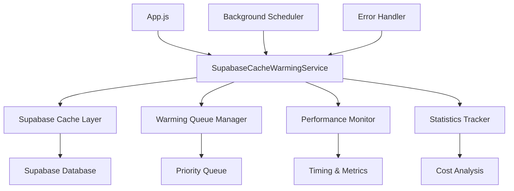

# Design Document

## Overview

The Supabase Cache Warming Service will replace the existing Firestore-based cache warming system with a new implementation that leverages the existing Supabase cache infrastructure. The service will maintain the same external API interface while internally using Supabase cache functions, ensuring seamless integration with the current application architecture.

The design focuses on intelligent cache warming strategies, robust error handling, performance monitoring, and cost optimization. The service will operate as a singleton with background processing capabilities, queue management, and automatic maintenance scheduling.

## Architecture

### High-Level Architecture



### Service Architecture

The service will be structured as a class-based singleton with the following core components:

1. **Main Service Class**: `SupabaseCacheWarmingService`
2. **Queue Manager**: Handles prioritized warming requests
3. **Statistics Tracker**: Monitors performance and cost metrics
4. **Background Scheduler**: Manages periodic maintenance
5. **Error Handler**: Provides retry logic and error recovery

### Integration Points

- **Existing Supabase Cache**: Uses `warmUserCache`, `warmAppCache`, and cache statistics functions
- **Auth Service**: Integrates with current user authentication
- **App Initialization**: Maintains same initialization hooks in App.js
- **Page Navigation**: Preserves existing smart warming triggers

## Components and Interfaces

### Core Service Interface

```javascript
class SupabaseCacheWarmingService {
  // Public API (maintains compatibility with existing service)
  async initializeAppCache()
  async warmUserCacheWithRetry(userId, priority, maxRetries)
  async smartWarmCache(userId, context)
  async progressiveWarmCache(userId)
  async performMaintenance()
  
  // Statistics and monitoring
  getWarmingStats()
  recordWarmingEvent(type, duration, success, error, metadata)
  
  // Lifecycle management
  startMaintenanceSchedule(intervalMinutes)
  stop()
}
```

### Queue Management

```javascript
class WarmingQueueManager {
  constructor() {
    this.queue = new PriorityQueue()
    this.activeWarming = new Set()
  }
  
  addToQueue(userId, priority, context)
  processQueue()
  isUserInQueue(userId)
  clearQueue()
}
```

### Statistics Integration

```javascript
class WarmingStatsTracker {
  constructor() {
    this.history = []
    this.metrics = {}
  }
  
  recordEvent(event)
  getPerformanceMetrics()
  getCostAnalysis()
  getSuccessRates()
}
```

### Priority System

The service will implement a three-tier priority system:

- **High Priority**: Workout hours, workout-related pages, weekdays
- **Normal Priority**: Standard user sessions, general navigation
- **Low Priority**: Background maintenance, extended historical data

### Context-Aware Warming

The service will analyze user context to determine optimal warming strategies:

```javascript
const contextAnalyzer = {
  analyzeTimeOfDay: (hour) => hour >= 6 && hour <= 9 || hour >= 17 && hour <= 20,
  analyzeWorkoutDay: (dayOfWeek) => dayOfWeek >= 1 && dayOfWeek <= 5,
  analyzePageContext: (page) => ['LogWorkout', 'ProgressTracker', 'Programs'].includes(page),
  determinePriority: (context) => { /* priority logic */ }
}
```

## Data Models

### Warming Event Model

```javascript
const WarmingEvent = {
  type: 'app-init' | 'user-cache' | 'smart-warm' | 'progressive-warm' | 'maintenance',
  timestamp: Date,
  duration: Number, // milliseconds
  success: Boolean,
  error: String | null,
  metadata: {
    userId?: String,
    priority?: 'high' | 'normal' | 'low',
    context?: Object,
    result?: Object
  }
}
```

### Queue Item Model

```javascript
const QueueItem = {
  userId: String,
  priority: 'high' | 'normal' | 'low',
  context: Object,
  timestamp: Date,
  retryCount: Number,
  maxRetries: Number
}
```

### Statistics Model

```javascript
const WarmingStats = {
  totalEvents: Number,
  successfulEvents: Number,
  failedEvents: Number,
  successRate: String, // percentage
  averageDuration: String, // milliseconds
  recentEvents: Array<WarmingEvent>,
  currentlyWarming: Boolean,
  queueSize: Number,
  costSavings: Object,
  performanceMetrics: Object
}
```

## Error Handling

### Retry Strategy

The service will implement exponential backoff for failed warming attempts:

1. **First Retry**: 1 second delay
2. **Second Retry**: 2 second delay  
3. **Third Retry**: 4 second delay
4. **Final Failure**: Log error and continue

### Error Categories

- **Network Errors**: Retry with backoff
- **Authentication Errors**: Skip warming, log warning
- **Database Errors**: Retry with reduced scope
- **Cache Errors**: Continue without caching, log error

### Graceful Degradation

When cache warming fails:
- App continues normal operation
- Database queries proceed without cache
- Error is logged for monitoring
- Retry is scheduled for later

## Testing Strategy

### Unit Tests

1. **Service Initialization**: Test singleton creation and configuration
2. **Queue Management**: Test priority ordering and processing
3. **Retry Logic**: Test exponential backoff and failure handling
4. **Statistics Tracking**: Test event recording and metrics calculation
5. **Context Analysis**: Test priority determination logic

### Integration Tests

1. **Supabase Cache Integration**: Test warming function calls
2. **Auth Service Integration**: Test user context handling
3. **App Lifecycle Integration**: Test initialization and cleanup
4. **Performance Monitoring**: Test statistics collection

### Performance Tests

1. **Warming Speed**: Measure cache warming completion times
2. **Memory Usage**: Monitor service memory footprint
3. **Queue Processing**: Test queue throughput under load
4. **Cache Hit Rates**: Verify improved cache performance

### End-to-End Tests

1. **App Startup**: Test complete initialization flow
2. **User Authentication**: Test user-specific warming
3. **Page Navigation**: Test smart warming triggers
4. **Background Maintenance**: Test scheduled operations

## Implementation Phases

### Phase 1: Core Service Migration
- Create new SupabaseCacheWarmingService class
- Implement basic warming functions using Supabase cache
- Maintain existing API compatibility
- Add basic error handling and logging

### Phase 2: Enhanced Features
- Implement intelligent priority system
- Add context-aware warming strategies
- Integrate comprehensive statistics tracking
- Add queue management and retry logic

### Phase 3: Optimization & Monitoring
- Implement advanced performance monitoring
- Add cost analysis and reporting
- Optimize warming strategies based on usage patterns
- Add comprehensive testing suite

### Phase 4: Integration & Deployment
- Replace existing service imports
- Update all consuming components
- Perform thorough testing
- Monitor performance in production