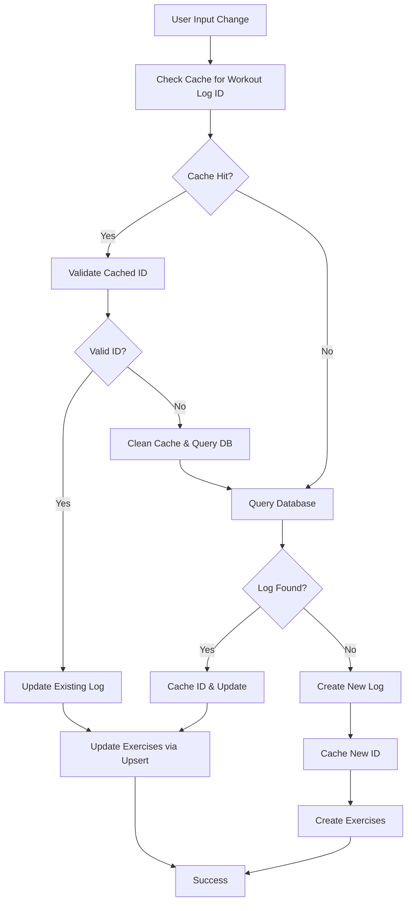

# Design Document

## Overview

This design addresses the critical issues in the LogWorkout component's data persistence system by implementing a robust caching strategy, preventing duplicate database entries, and optimizing exercise data updates. The solution focuses on cache-first operations, database-level constraints, and efficient upsert mechanisms to ensure data integrity and performance.

## Architecture

### High-Level Flow



### Database Schema Changes

The design requires adding a unique constraint to prevent duplicates at the database level:

```sql
-- Add unique constraint to workout_logs table
ALTER TABLE workout_logs 
ADD CONSTRAINT unique_user_program_week_day 
UNIQUE (user_id, program_id, week_index, day_index);

-- Add index for performance
CREATE INDEX idx_workout_logs_lookup 
ON workout_logs (user_id, program_id, week_index, day_index);
```

## Components and Interfaces

### 1. Enhanced Caching System

#### WorkoutLogCache Interface
```typescript
interface WorkoutLogCache {
  workoutLogId: string | null;
  lastSaved: string;
  isValid: boolean;
  exercises: ExerciseData[];
  isWorkoutFinished: boolean;
}

interface CacheManager {
  get(key: string): WorkoutLogCache | null;
  set(key: string, value: WorkoutLogCache): void;
  validate(key: string, workoutLogId: string): Promise<boolean>;
  invalidate(key: string): void;
  cleanup(key: string, reason: string): void;
}
```

#### Cache Key Strategy
- Primary Key: `${weekIndex}_${dayIndex}`
- Validation: UUID format check + database existence verification
- Cleanup: Automatic removal of invalid entries with logging

### 2. Workout Log Service Enhancements

#### Core Methods
```typescript
interface WorkoutLogService {
  // Enhanced save method with duplicate prevention
  saveWorkoutLog(
    userId: string,
    programId: string,
    weekIndex: number,
    dayIndex: number,
    exerciseData: ExerciseData[],
    options: SaveOptions
  ): Promise<WorkoutLog>;

  // Upsert-based exercise updates
  upsertWorkoutExercises(
    workoutLogId: string,
    exercises: ExerciseData[]
  ): Promise<void>;

  // Cache-aware retrieval
  getWorkoutLogWithCache(
    userId: string,
    programId: string,
    weekIndex: number,
    dayIndex: number
  ): Promise<WorkoutLog | null>;
}
```

### 3. Exercise Update Strategy

#### Upsert Logic
Instead of delete-and-recreate, implement intelligent upsert:

```typescript
interface ExerciseUpsertStrategy {
  // Compare existing vs new exercises
  compareExercises(existing: Exercise[], updated: Exercise[]): ExerciseChanges;
  
  // Apply changes efficiently
  applyChanges(workoutLogId: string, changes: ExerciseChanges): Promise<void>;
  
  // Handle order changes
  reorderExercises(workoutLogId: string, exercises: Exercise[]): Promise<void>;
}

interface ExerciseChanges {
  toInsert: Exercise[];
  toUpdate: Exercise[];
  toDelete: string[]; // exercise IDs
  orderChanged: boolean;
}
```

## Data Models

### Enhanced Workout Log State
```typescript
interface WorkoutLogState {
  // Core data
  exercises: ExerciseData[];
  isWorkoutFinished: boolean;
  
  // Caching metadata
  workoutLogId: string | null;
  lastSaved: string;
  cacheValid: boolean;
  
  // Conflict resolution
  version: number;
  lastModified: string;
  
  // Operation tracking
  pendingSave: boolean;
  saveError: Error | null;
}
```

### Exercise Data Structure
```typescript
interface ExerciseData {
  // Identifiers
  id?: string; // Database ID for existing exercises
  exerciseId: string; // Reference to exercise definition
  
  // Core data
  sets: number;
  reps: (number | null)[];
  weights: (number | null)[];
  completed: boolean[];
  
  // Metadata
  orderIndex: number;
  notes: string;
  bodyweight: number | null;
  
  // Change tracking
  isModified: boolean;
  isNew: boolean;
  isDeleted: boolean;
}
```

## Error Handling

### Error Classification
```typescript
enum WorkoutLogErrorType {
  CACHE_VALIDATION_FAILED = 'cache_validation_failed',
  DUPLICATE_CONSTRAINT_VIOLATION = 'duplicate_constraint_violation',
  EXERCISE_UPSERT_FAILED = 'exercise_upsert_failed',
  NETWORK_ERROR = 'network_error',
  INVALID_DATA = 'invalid_data'
}

interface WorkoutLogError extends Error {
  type: WorkoutLogErrorType;
  context: Record<string, any>;
  recoverable: boolean;
  retryable: boolean;
}
```

### Error Recovery Strategies
1. **Cache Validation Failures**: Clear cache and retry with database query
2. **Duplicate Constraints**: Attempt to update existing record instead
3. **Network Errors**: Queue operations for retry with exponential backoff
4. **Data Validation**: Sanitize and retry, or prompt user for correction

## Testing Strategy

### Unit Tests
- Cache manager operations (get, set, validate, cleanup)
- Exercise upsert logic and change detection
- Error handling and recovery mechanisms
- Data transformation and validation

### Integration Tests
- End-to-end save flow with cache hits and misses
- Database constraint violation handling
- Cache invalidation across component re-renders

### Performance Tests
- Cache performance under high-frequency saves
- Database query optimization with new constraints
- Memory usage of cache storage
- Exercise upsert performance vs delete-recreate

## Implementation Phases

### Phase 1: Database Schema Updates
1. Add unique constraint to workout_logs table
2. Create performance indexes
3. Update migration scripts
4. Test constraint behavior

### Phase 2: Enhanced Caching System
1. Implement CacheManager interface
2. Add cache validation logic
3. Integrate with existing programLogs state
4. Add comprehensive logging

### Phase 3: Workout Log Service Refactoring
1. Implement cache-first save logic
2. Add duplicate constraint handling
3. Enhance error classification and recovery
4. Update existing service methods

### Phase 4: Exercise Upsert Implementation
1. Implement change detection algorithm
2. Create upsert operations for exercises
3. Handle order changes efficiently
4. Add transaction boundaries

### Phase 5: LogWorkout Component Integration
1. Update save flow to use enhanced service
2. Implement error handling UI
3. Add conflict resolution dialogs
4. Update real-time synchronization

### Phase 6: Testing and Optimization
1. Comprehensive test suite implementation
2. Performance optimization
3. Memory leak prevention
4. Production monitoring setup

## Performance Considerations

### Cache Optimization
- **Memory Usage**: Limit cache size and implement LRU eviction
- **Validation Frequency**: Only validate on errors or stale data
- **Batch Operations**: Group multiple changes into single database operations

### Database Optimization
- **Query Performance**: Use indexes for lookup operations
- **Connection Pooling**: Optimize database connection usage
- **Transaction Boundaries**: Minimize transaction scope and duration

### Network Optimization
- **Debouncing**: Intelligent debouncing based on user activity
- **Compression**: Compress large exercise data payloads
- **Retry Logic**: Exponential backoff for failed operations

## Security Considerations

### Data Validation
- **Input Sanitization**: Validate all exercise data before database operations
- **SQL Injection Prevention**: Use parameterized queries exclusively
- **Data Integrity**: Verify data consistency across cache and database

### Access Control
- **User Authorization**: Verify user ownership of workout logs
- **Session Management**: Handle expired sessions gracefully
- **Audit Logging**: Log all data modification operations

## Monitoring and Observability

### Metrics to Track
- Cache hit/miss ratios
- Database constraint violations
- Save operation latency
- Error rates by type

### Logging Strategy
- **Structured Logging**: Use consistent log format with metadata
- **Error Context**: Include full context for debugging
- **Performance Metrics**: Log operation timing and resource usage
- **User Actions**: Track user interaction patterns

### Alerting
- High error rates in save operations
- Frequent cache validation failures
- Database constraint violations
- Performance degradation alerts