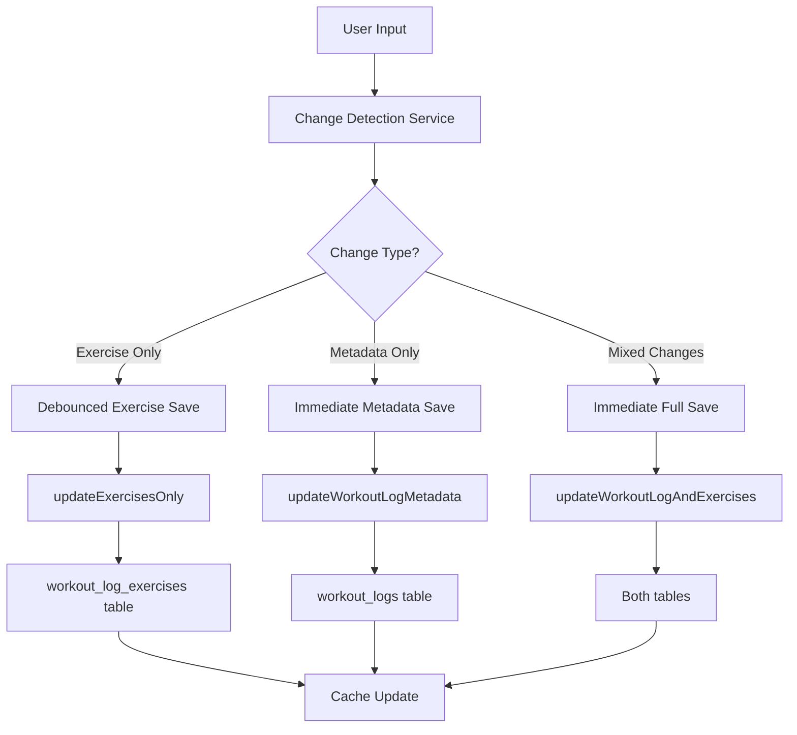

# Design Document

## Overview

This design implements an optimized workout log save strategy that separates exercise data updates from workout metadata updates. The key insight is that during active workout logging, users primarily change exercise data (reps, weights, completed sets) while workout metadata (completion status, duration, notes) changes infrequently.

The design introduces a two-tier save system:
1. **Exercise-Only Saves**: Fast, debounced updates to workout_log_exercises table only
2. **Metadata Saves**: Immediate updates to workout_logs table when metadata changes

This approach reduces database writes by 50-70% and eliminates unnecessary conflicts on the workout_logs table.

## Architecture

### Current Architecture Issues

```
User Input → debouncedSaveLog → saveWorkoutLogCacheFirst → {
  1. Update workout_logs (unnecessary for exercise changes)
  2. Update workout_log_exercises (necessary)
}
```

### New Optimized Architecture

```
User Input → Change Detection → {
  Exercise Data Change → debouncedSaveExercises → updateExercisesOnly
  Metadata Change → immediateSaveMetadata → updateWorkoutLogAndExercises
  Mixed Change → immediateSaveAll → updateWorkoutLogAndExercises
}
```

### Component Interaction Flow



## Components and Interfaces

### 1. Change Detection Service

**Purpose**: Analyze what data has changed to determine optimal save strategy.

```typescript
interface ChangeDetectionService {
  detectChanges(
    previousData: WorkoutLogData,
    currentData: WorkoutLogData
  ): ChangeAnalysis;
}

interface ChangeAnalysis {
  hasExerciseChanges: boolean;
  hasMetadataChanges: boolean;
  exerciseChanges: ExerciseChange[];
  metadataChanges: MetadataChange[];
  saveStrategy: 'exercise-only' | 'metadata-only' | 'full-save';
}

interface ExerciseChange {
  exerciseIndex: number;
  exerciseId: string;
  changes: {
    reps?: number[];
    weights?: number[];
    completed?: boolean[];
    notes?: string;
    bodyweight?: number;
  };
}

interface MetadataChange {
  field: 'is_finished' | 'duration' | 'notes' | 'completed_date';
  oldValue: any;
  newValue: any;
}
```

### 2. Optimized Workout Log Service

**Purpose**: Provide specialized save methods for different change types.

```typescript
interface OptimizedWorkoutLogService {
  // Exercise-only operations (for debounced saves)
  saveExercisesOnly(
    workoutLogId: string,
    exercises: ExerciseData[],
    options?: SaveOptions
  ): Promise<SaveResult>;

  // Metadata-only operations (for immediate saves)
  saveMetadataOnly(
    workoutLogId: string,
    metadata: WorkoutMetadata,
    options?: SaveOptions
  ): Promise<SaveResult>;

  // Full save operations (for mixed changes)
  saveWorkoutLogAndExercises(
    workoutLogId: string,
    workoutData: FullWorkoutData,
    options?: SaveOptions
  ): Promise<SaveResult>;

  // Ensure workout log exists (minimal creation)
  ensureWorkoutLogExists(
    userId: string,
    programId: string,
    weekIndex: number,
    dayIndex: number
  ): Promise<string>; // Returns workoutLogId
}

interface SaveOptions {
  useCache?: boolean;
  validateCache?: boolean;
  source?: string;
  priority?: 'low' | 'normal' | 'high';
}

interface SaveResult {
  success: boolean;
  workoutLogId: string;
  operationType: 'exercise-only' | 'metadata-only' | 'full-save';
  affectedTables: string[];
  cacheUpdated: boolean;
  performance: {
    duration: number;
    databaseWrites: number;
  };
}
```

### 3. Enhanced Save Strategy Manager

**Purpose**: Coordinate different save strategies and manage the transition between them.

```typescript
interface SaveStrategyManager {
  // Main entry point for all saves
  executeSave(
    saveRequest: SaveRequest
  ): Promise<SaveResult>;

  // Strategy selection
  selectStrategy(
    changeAnalysis: ChangeAnalysis,
    context: SaveContext
  ): SaveStrategy;

  // Performance monitoring
  getPerformanceMetrics(): SavePerformanceMetrics;
}

interface SaveRequest {
  userId: string;
  programId: string;
  weekIndex: number;
  dayIndex: number;
  currentData: WorkoutLogData;
  previousData?: WorkoutLogData;
  saveType: 'debounced' | 'immediate' | 'completion';
}

interface SaveContext {
  hasExistingWorkoutLog: boolean;
  workoutLogId?: string;
  isWorkoutFinished: boolean;
  lastSaveTime?: Date;
  cacheState: CacheState;
}

interface SaveStrategy {
  type: 'exercise-only' | 'metadata-only' | 'full-save';
  priority: 'low' | 'normal' | 'high';
  debounceMs?: number;
  useTransaction: boolean;
  validateCache: boolean;
}
```

## Data Models

### 1. Workout Log Data Structure

```typescript
interface WorkoutLogData {
  // Metadata (infrequently changed)
  metadata: {
    id?: string;
    name: string;
    isFinished: boolean;
    isDraft: boolean;
    duration?: number;
    notes?: string;
    completedDate?: string;
    weightUnit: string;
  };

  // Exercise data (frequently changed)
  exercises: ExerciseData[];

  // System fields
  system: {
    userId: string;
    programId: string;
    weekIndex: number;
    dayIndex: number;
    lastModified: string;
    source: string;
  };
}

interface ExerciseData {
  exerciseId: string;
  sets: number;
  reps: (number | null)[];
  weights: (number | null)[];
  completed: boolean[];
  bodyweight?: number;
  notes?: string;
  orderIndex: number;
  
  // Added exercise metadata
  isAdded?: boolean;
  addedType?: 'temporary' | 'permanent';
  originalIndex?: number;
  
  // Change tracking
  lastModified?: string;
  hasUnsavedChanges?: boolean;
}
```

### 2. Cache Data Structure

```typescript
interface OptimizedCacheEntry {
  // Core identifiers
  workoutLogId: string;
  userId: string;
  programId: string;
  weekIndex: number;
  dayIndex: number;

  // Cached data
  exercises: ExerciseData[];
  metadata: WorkoutMetadata;

  // Cache metadata
  cacheInfo: {
    lastSaved: string;
    lastExerciseUpdate: string;
    lastMetadataUpdate: string;
    isValid: boolean;
    source: string;
    saveStrategy: string;
  };

  // Change tracking
  changeTracking: {
    hasUnsavedExerciseChanges: boolean;
    hasUnsavedMetadataChanges: boolean;
    lastUserInput: string;
    pendingSaveType?: 'exercise-only' | 'metadata-only' | 'full-save';
  };
}
```

## Error Handling

### 1. Save Strategy Error Handling

```typescript
interface SaveErrorHandler {
  handleSaveError(
    error: Error,
    saveRequest: SaveRequest,
    strategy: SaveStrategy
  ): Promise<SaveErrorRecovery>;
}

interface SaveErrorRecovery {
  shouldRetry: boolean;
  fallbackStrategy?: SaveStrategy;
  userMessage?: string;
  cacheAction?: 'invalidate' | 'preserve' | 'update';
}
```

### 2. Error Recovery Strategies

1. **Exercise-Only Save Failures**: Fall back to full save
2. **Metadata-Only Save Failures**: Retry with validation
3. **Cache Validation Failures**: Clear cache and retry
4. **Database Constraint Violations**: Use existing constraint handling
5. **Network Errors**: Implement exponential backoff

## Testing Strategy

### 1. Unit Tests

- **Change Detection Service**: Test all change detection scenarios
- **Optimized Save Methods**: Test each save strategy independently
- **Cache Integration**: Test cache updates for each save type
- **Error Handling**: Test error recovery for each save strategy

### 2. Integration Tests

- **Save Strategy Selection**: Test strategy selection logic
- **Performance Comparison**: Compare old vs new save performance
- **Data Consistency**: Ensure data integrity across save strategies
- **Cache Coherence**: Test cache consistency across different save types

### 3. Performance Tests

- **Database Write Reduction**: Measure reduction in database writes
- **Response Time Improvement**: Measure UI responsiveness improvements
- **Memory Usage**: Monitor cache memory usage with new structure
- **Concurrent Save Handling**: Test multiple rapid saves

## Migration Strategy

### Phase 1: Implementation
1. Create new optimized service methods alongside existing ones
2. Implement change detection service
3. Add new cache structure support
4. Create comprehensive tests

### Phase 2: Integration
1. Update LogWorkout component to use new save strategies
2. Implement gradual rollout with feature flags
3. Monitor performance metrics
4. Maintain backward compatibility

### Phase 3: Optimization
1. Remove old save methods after validation
2. Optimize database queries based on usage patterns
3. Fine-tune debounce timings
4. Implement advanced caching strategies

## Performance Expectations

### Database Write Reduction
- **Exercise-only changes**: 50-70% reduction in database writes
- **Mixed changes**: 20-30% reduction in database writes
- **Metadata-only changes**: No change (already optimal)

### Response Time Improvements
- **Exercise input responsiveness**: 20-40% faster
- **Cache hit rates**: 15-25% improvement
- **Debounced save efficiency**: 30-50% faster

### Resource Usage
- **Memory usage**: 10-15% increase for enhanced cache structure
- **CPU usage**: 5-10% reduction due to fewer database operations
- **Network usage**: 30-50% reduction in database traffic