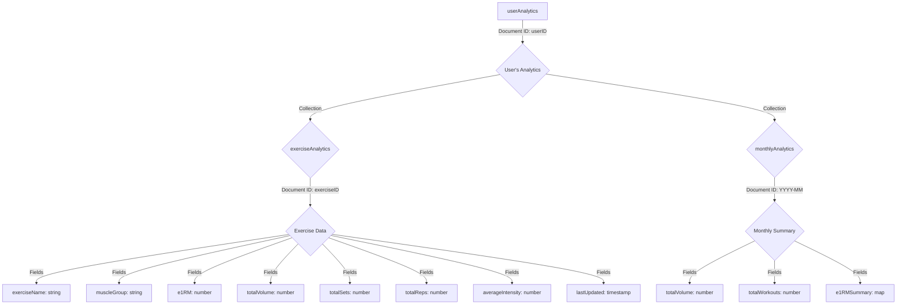

# Technical Specification: Analytics Backend

## 1. Overview

This document outlines the technical design for the backend data aggregation architecture of the new analytics feature. It includes the Firestore schema for the `userAnalytics` collection and the logic for the Google Cloud Function responsible for data processing.

## 2. `userAnalytics` Collection Schema

The `userAnalytics` collection is designed to store aggregated workout metrics for each user, enabling efficient querying for the frontend dashboard.

### 2.1. High-Level Structure

The data will be structured hierarchically, with a top-level document for each user containing sub-collections for detailed analytics.

### 2.2. Detailed Schema Definition

#### `userAnalytics/{userID}`

*   **Description:** A document representing a single user's aggregated analytics.
*   **Fields:** None at the top level. Data is held in sub-collections.

#### `userAnalytics/{userID}/exerciseAnalytics/{exerciseID}`

*   **Description:** A document containing aggregated metrics for a specific exercise performed by the user.
*   **Fields:**
    *   `exerciseName` (string): The name of the exercise (e.g., "Barbell Squat").
    *   `muscleGroup` (string): The primary muscle group targeted by the exercise (e.g., "Legs").
    *   `e1RM` (number): The user's current estimated one-rep max for this exercise.
    *   `totalVolume` (number): The cumulative volume load for this exercise.
    *   `totalSets` (number): The cumulative number of sets performed for this exercise.
    *   `totalReps` (number): The cumulative number of reps performed for this exercise.
    *   `averageIntensity` (number): The average weight lifted per rep.
    *   `lastUpdated` (timestamp): The timestamp of the last time this document was updated.

#### `userAnalytics/{userID}/monthlyAnalytics/{YYYY-MM}`

*   **Description:** A document summarizing the user's workout activity for a specific month.
*   **Fields:**
    *   `totalVolume` (number): The total volume load across all exercises for the month.
    *   `totalWorkouts` (number): The total number of completed workouts for the month.
    *   `e1RMSummary` (map): A map where keys are `exerciseID`s and values are the user's e1RM for that exercise at the end of the month.

## 3. Google Cloud Function: `processWorkout`

This function will be responsible for processing completed workouts and updating the `userAnalytics` collection.

### 3.1. Trigger

*   **Type:** Cloud Firestore
*   **Event:** `onUpdate`
*   **Resource:** `workoutLogs/{logId}`
*   **Condition:** The function will only execute if the `isWorkoutFinished` field of the updated `workoutLogs` document is set to `true`.

### 3.2. Logic

1.  **Get Workout Data:** The function will retrieve the data from the updated `workoutLogs` document.
2.  **Iterate Through Exercises:** For each exercise in the `exercises` array of the workout log:
    *   **Calculate Metrics:**
        *   **e1RM:** For each set, calculate the e1RM using the Epley formula: `e1RM = weight * (1 + (reps / 30))`. The highest e1RM value across all sets for that exercise will be considered the e1RM for that workout.
        *   **Volume Load:** For each set, calculate `weight * reps`. Sum these values to get the total volume load for the exercise in that workout.
        *   **Intensity:** The maximum weight lifted for each rep range.
    *   **Update `exerciseAnalytics`:**
        *   Read the existing `exerciseAnalytics` document for the user and exercise.
        *   Update the `e1RM` if the newly calculated value is higher.
        *   Increment `totalVolume`, `totalSets`, and `totalReps`.
        *   Recalculate `averageIntensity`.
        *   Set `lastUpdated` to the current timestamp.
    *   **Update `monthlyAnalytics`:**
        *   Determine the current month (e.g., "2025-07").
        *   Read the existing `monthlyAnalytics` document for the user and month.
        *   Increment `totalVolume` and `totalWorkouts`.
        *   Update the `e1RMSummary` map with the latest e1RM for the exercise.

### 3.3. Error Handling

The function will include robust error handling to log any issues during processing and prevent data corruption. If a document in `userAnalytics` does not exist, it will be created.