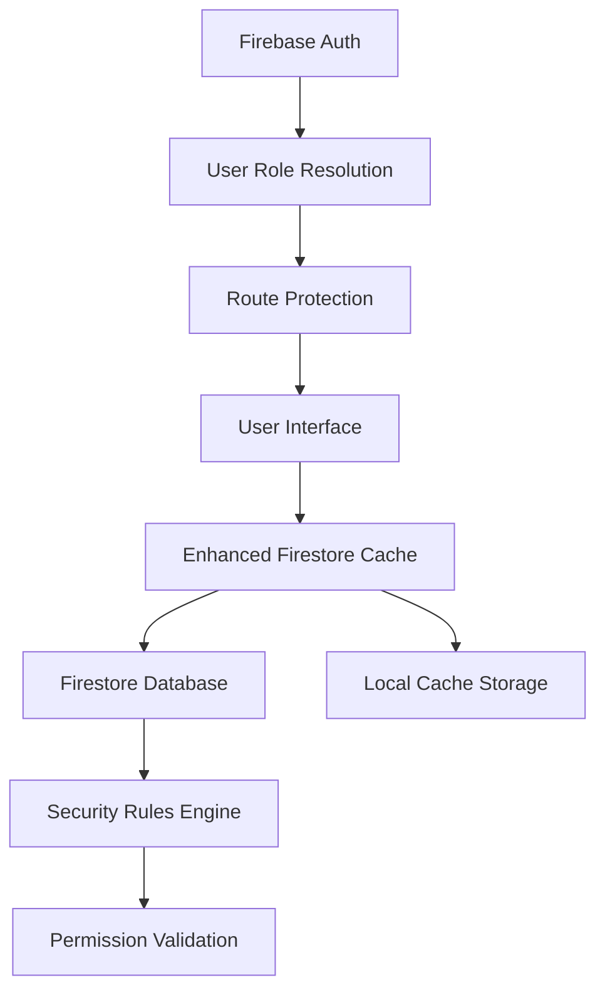
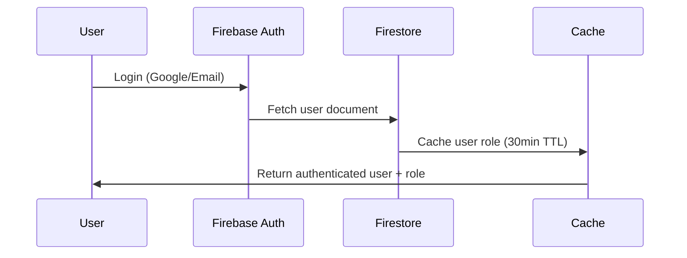
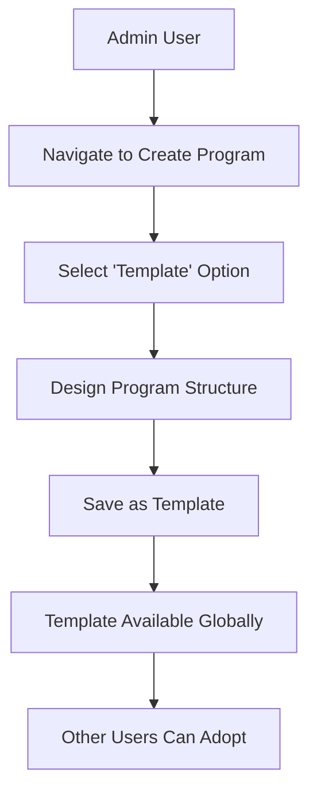
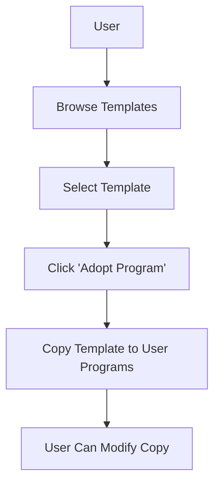
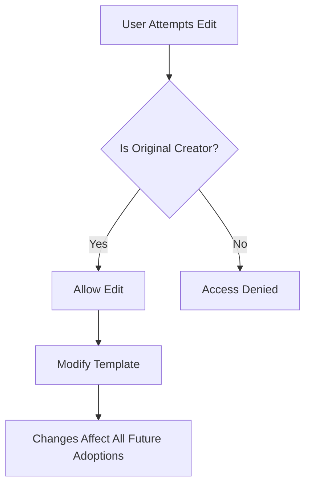

# Exercise Tracker - Comprehensive Architecture Analysis

## Executive Summary

This document provides a detailed analysis of the current Exercise Tracker application architecture, focusing on data models, user permission systems, workflow patterns, and recommendations for implementing enhanced permission management for program template editing.

**Key Findings:**
- Current system uses basic role-based access control with binary permissions
- Template editing is restricted to original creators only
- No delegation mechanism for coaches or admins to edit others' templates
- Architecture supports both traditional role-based and granular permission systems
- Firestore security rules will require significant enhancement for advanced permissions

## 1. Current Architecture Overview

### 1.1 Technology Stack
- **Frontend**: React 18 with React Router for navigation
- **Backend**: Firebase (Firestore database, Authentication, Functions)
- **State Management**: React Context (ThemeContext) + local component state
- **UI Framework**: React Bootstrap with custom CSS
- **Caching**: Custom Enhanced Firestore Cache with read tracking
- **Authentication**: Firebase Auth (Google OAuth + email/password)

### 1.2 Application Structure
```
src/
├── components/          # Reusable UI components
├── pages/              # Route-based page components
├── api/                # Enhanced caching and data access
├── context/            # React context providers
├── styles/             # CSS styling
├── utils/              # Utility functions
└── firebase.js         # Firebase configuration
```

### 1.3 Data Flow Architecture


## 2. Data Models Analysis

### 2.1 Core Collections

#### Users Collection
```javascript
{
  uid: "firebase_auth_uid",
  email: "user@example.com",
  displayName: "User Name",
  role: "user" | "admin",  // Binary role system
  createdAt: timestamp,
  lastLogin: timestamp
}
```

#### Programs Collection
```javascript
{
  id: "program_id",
  userId: "creator_uid",
  name: "Program Name",
  description: "Program Description",
  isTemplate: boolean,     // Template flag
  weeklyConfigs: {         // Flattened structure
    "week1": { days: {...} },
    "week2": { days: {...} }
  },
  createdAt: timestamp,
  updatedAt: timestamp
}
```

#### Exercises Collection
```javascript
{
  id: "exercise_id",
  userId: "creator_uid",   // null for global exercises
  name: "Exercise Name",
  category: "category",
  muscleGroups: ["muscle1", "muscle2"],
  equipment: ["equipment1"],
  instructions: "text",
  createdAt: timestamp
}
```

### 2.2 Data Relationships
- **One-to-Many**: User → Programs (creator relationship)
- **Many-to-Many**: Programs → Exercises (via program structure)
- **Template Inheritance**: Users can "adopt" templates (copy mechanism)
- **No Permission Delegation**: No intermediate permission entities

## 3. Current Permission System Analysis

### 3.1 Authentication Flow


### 3.2 Current Security Rules (firestore.rules)
```javascript
// Templates: Globally readable, creator-only editable
allow read: if resource.data.isTemplate == true;
allow write: if request.auth.uid == resource.data.userId;

// User data: Owner-only access
allow read, write: if request.auth.uid == resource.data.userId;
```

### 3.3 Role-Based Route Protection
- **Admin Routes**: `/admin`, `/cache-demo` (admin role required)
- **User Routes**: Most routes accessible to authenticated users
- **Public Routes**: `/auth`, `/programs` (template viewing), `/exercises`

### 3.4 Permission Limitations
1. **Binary Creator Rights**: Only original template creator can edit
2. **No Role Hierarchy**: Admin cannot edit user-created templates
3. **No Delegation**: Cannot grant specific users edit rights
4. **No Template Ownership Transfer**: Cannot reassign template ownership
5. **Limited Admin Capabilities**: Admin panel lacks user/role management

## 4. Workflow Pattern Analysis

### 4.1 Template Creation Workflow


**Current Constraints:**
- Only admins can create templates (`userRole === 'admin' && isTemplate`)
- Templates immediately become globally readable
- No approval or review process

### 4.2 Template Adoption Workflow


**Current Behavior:**
- Creates independent copy of template
- No link maintained to original template
- User modifications don't affect original template

### 4.3 Template Editing Workflow (Current)


**Problem Areas:**
- Admins cannot edit user-created templates
- No collaborative editing capabilities
- No version control or change tracking

## 5. Enhanced Firestore Cache Analysis

### 5.1 Cache Architecture
```javascript
// Cache structure with user-specific invalidation
{
  collections: {
    programs: {
      data: [...],
      timestamp: Date,
      reads: number
    }
  },
  userSpecific: {
    [userId]: {
      lastInvalidation: Date,
      collections: {...}
    }
  }
}
```

### 5.2 Cache Warming Strategy
- **User Context Aware**: Warms cache based on user role and navigation
- **Performance Optimized**: Tracks database reads and costs
- **Permission Agnostic**: Current implementation doesn't cache permission data

### 5.3 Cache Implications for Permissions
- **Challenge**: Permission changes require cache invalidation
- **Opportunity**: Can cache computed permissions for performance
- **Consideration**: User-specific permission caching needed

## 6. Gap Analysis

### 6.1 Technical Gaps

#### Permission System Gaps
1. **No Granular Permissions**: Cannot assign specific capabilities
2. **No Permission Inheritance**: No role hierarchy beyond admin/user
3. **No Dynamic Role Assignment**: Cannot promote users to coaches
4. **No Permission Caching**: Permissions computed on every request
5. **Limited Firestore Rules**: Current rules don't support complex scenarios

#### Data Model Gaps
1. **No Permission Entities**: No collections for roles, permissions, or assignments
2. **No Audit Trail**: No tracking of permission changes or template modifications
3. **No Template Versioning**: No history of template changes
4. **No Collaboration Metadata**: No tracking of who can edit what

#### UI/UX Gaps
1. **No Permission Management UI**: Admin panel lacks user/role management
2. **No Permission Indicators**: Users don't see what they can/cannot edit
3. **No Collaboration Workflow**: No UI for granting/revoking edit access
4. **No Template Ownership Transfer**: No UI for changing template ownership

### 6.2 Security Gaps
1. **Client-Side Role Checks**: Role validation happens in React components
2. **No Server-Side Permission Validation**: Beyond basic Firestore rules
3. **No Permission Audit**: No logging of permission-based actions
4. **No Rate Limiting**: No protection against permission abuse

## 7. Permission System Recommendations

### 7.1 Approach Comparison

#### Traditional Role-Based Access Control (RBAC)
**Pros:**
- Simple to implement and understand
- Fits current binary admin/user model
- Easy to extend with coach role
- Minimal database schema changes

**Cons:**
- Less flexible for future requirements
- Cannot handle complex permission scenarios
- Difficult to implement template-specific permissions
- Limited scalability for diverse use cases

**Implementation:**
```javascript
// Enhanced role system
{
  uid: "user_id",
  role: "admin" | "coach" | "user",
  permissions: {
    canCreateTemplates: boolean,
    canEditAllTemplates: boolean,
    canManageUsers: boolean
  }
}
```

#### Granular Permission System (Capability-Based)
**Pros:**
- Highly flexible and scalable
- Supports complex permission scenarios
- Enables fine-grained access control
- Future-proof for advanced features

**Cons:**
- More complex to implement
- Requires significant database schema changes
- Higher cognitive load for administrators
- Potential performance implications

**Implementation:**
```javascript
// Permission entities
{
  permissions: {
    id: "permission_id",
    name: "edit_template",
    description: "Can edit program templates"
  },
  
  user_permissions: {
    userId: "user_id",
    permissionId: "permission_id",
    resourceId: "template_id", // Optional: resource-specific
    grantedBy: "admin_id",
    grantedAt: timestamp
  }
}
```

### 7.2 Recommended Hybrid Approach

Based on the current architecture and future scalability needs, I recommend a **Hybrid Role-Permission System**:

#### Phase 1: Enhanced RBAC
1. **Expand Role System**: Add `coach` role with template editing capabilities
2. **Role-Based Permissions**: Define capabilities per role
3. **Template-Specific Overrides**: Allow admins to grant specific users edit access

#### Phase 2: Granular Permissions
1. **Permission Entities**: Introduce permission collections
2. **Resource-Specific Permissions**: Enable template-specific access control
3. **Dynamic Permission Assignment**: UI for managing permissions

### 7.3 Recommended Data Model Changes

#### Enhanced Users Collection
```javascript
{
  uid: "user_id",
  email: "user@example.com",
  displayName: "User Name",
  role: "admin" | "coach" | "user",
  permissions: {
    // Role-based permissions
    canCreateTemplates: boolean,
    canEditAllTemplates: boolean,
    canManageUsers: boolean,
    canAssignPermissions: boolean
  },
  createdAt: timestamp,
  updatedAt: timestamp
}
```

#### New Template Permissions Collection
```javascript
{
  id: "permission_id",
  templateId: "template_id",
  userId: "user_id",
  permission: "edit" | "view" | "manage",
  grantedBy: "admin_id",
  grantedAt: timestamp,
  expiresAt: timestamp // Optional
}
```

#### Enhanced Programs Collection
```javascript
{
  // ... existing fields
  permissions: {
    isPublic: boolean,
    allowedEditors: ["user_id1", "user_id2"], // Quick lookup
    requiresApproval: boolean
  },
  metadata: {
    lastEditedBy: "user_id",
    lastEditedAt: timestamp,
    version: number
  }
}
```

## 8. Implementation Roadmap

### 8.1 Phase 1: Enhanced RBAC (Weeks 1-2)
1. **Database Schema Updates**
   - Add `coach` role support
   - Extend user permissions object
   - Create template permissions collection

2. **Security Rules Enhancement**
   - Update Firestore rules for coach role
   - Add template-specific permission checks
   - Implement permission validation functions

3. **UI Updates**
   - Add coach role to navigation
   - Update admin panel with user management
   - Add permission indicators to templates

### 8.2 Phase 2: Permission Management UI (Weeks 3-4)
1. **Admin Dashboard Enhancement**
   - User role management interface
   - Template permission assignment UI
   - Permission audit log viewer

2. **Template Management**
   - Template ownership transfer
   - Collaborative editing indicators
   - Permission request workflow

### 8.3 Phase 3: Advanced Features (Weeks 5-6)
1. **Granular Permissions**
   - Resource-specific permission system
   - Dynamic permission assignment
   - Permission inheritance rules

2. **Audit and Monitoring**
   - Permission change logging
   - Template modification history
   - Security event monitoring

## 9. Security Considerations

### 9.1 Firestore Security Rules Strategy
```javascript
// Enhanced security rules structure
rules_version = '2';
service cloud.firestore {
  match /databases/{database}/documents {
    // Helper functions
    function isAdmin() {
      return get(/databases/$(database)/documents/users/$(request.auth.uid)).data.role == 'admin';
    }
    
    function isCoach() {
      return get(/databases/$(database)/documents/users/$(request.auth.uid)).data.role in ['admin', 'coach'];
    }
    
    function hasTemplatePermission(templateId, permission) {
      return exists(/databases/$(database)/documents/template_permissions/$(templateId + '_' + request.auth.uid)) &&
             get(/databases/$(database)/documents/template_permissions/$(templateId + '_' + request.auth.uid)).data.permission == permission;
    }
    
    // Programs collection rules
    match /programs/{programId} {
      allow read: if resource.data.isTemplate == true || 
                     resource.data.userId == request.auth.uid;
      
      allow write: if resource.data.userId == request.auth.uid ||
                      (resource.data.isTemplate == true && isCoach()) ||
                      hasTemplatePermission(programId, 'edit');
    }
  }
}
```

### 9.2 Client-Side Security
1. **Role Validation**: Implement consistent role checking utilities
2. **Permission Caching**: Cache user permissions with appropriate TTL
3. **UI State Management**: Hide/disable features based on permissions
4. **Error Handling**: Graceful handling of permission denied scenarios

## 10. Performance Implications

### 10.1 Database Read Optimization
- **Permission Caching**: Cache user permissions to reduce reads
- **Batch Permission Checks**: Group permission validations
- **Indexed Queries**: Ensure proper indexing for permission lookups

### 10.2 Cache Strategy Updates
```javascript
// Enhanced cache structure for permissions
{
  userPermissions: {
    [userId]: {
      role: "admin",
      permissions: {...},
      templatePermissions: {...},
      lastUpdated: timestamp,
      ttl: 30 * 60 * 1000 // 30 minutes
    }
  }
}
```

## 11. Migration Strategy

### 11.1 Data Migration Plan
1. **User Role Migration**: Update existing users with default permissions
2. **Template Permission Seeding**: Create initial permission records
3. **Backward Compatibility**: Maintain existing functionality during transition

### 11.2 Rollout Strategy
1. **Feature Flags**: Use feature flags for gradual rollout
2. **A/B Testing**: Test new permission system with subset of users
3. **Monitoring**: Track performance and user experience metrics

## 12. Conclusion

The current Exercise Tracker architecture provides a solid foundation for implementing enhanced permission management. The recommended hybrid approach balances immediate needs with future scalability:

**Immediate Benefits:**
- Coaches can edit program templates
- Admins have full template management capabilities
- Template-specific permission assignment
- Improved user experience for template collaboration

**Long-term Advantages:**
- Scalable permission system architecture
- Support for complex permission scenarios
- Foundation for advanced collaboration features
- Maintainable and extensible codebase

**Next Steps:**
1. Implement Phase 1 enhanced RBAC system
2. Update Firestore security rules
3. Create permission management UI
4. Test with pilot user group
5. Gradually roll out advanced features

This analysis provides the foundation for designing and implementing a robust permission system that meets current needs while supporting future growth and feature expansion.