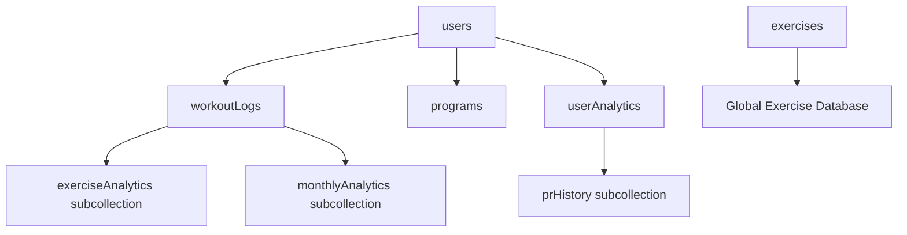
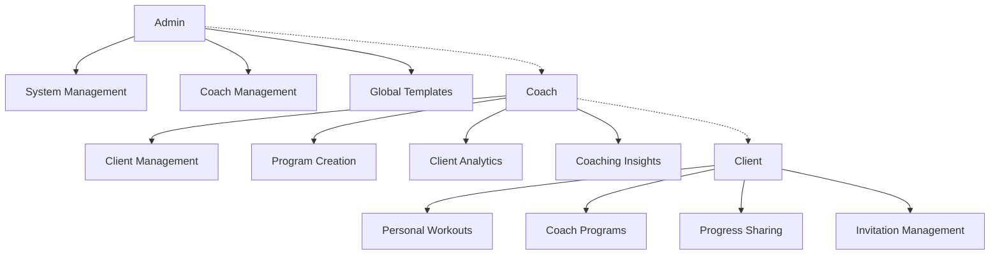
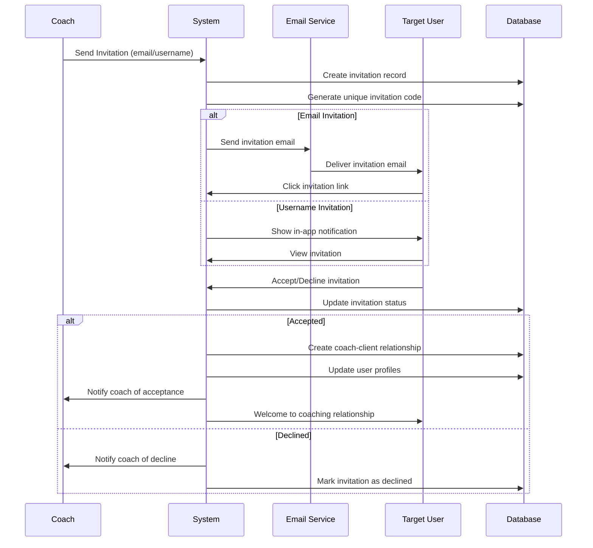
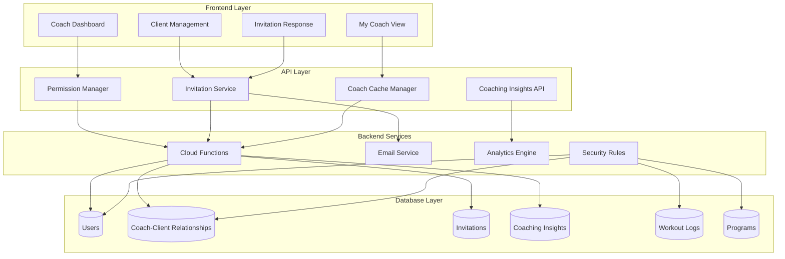
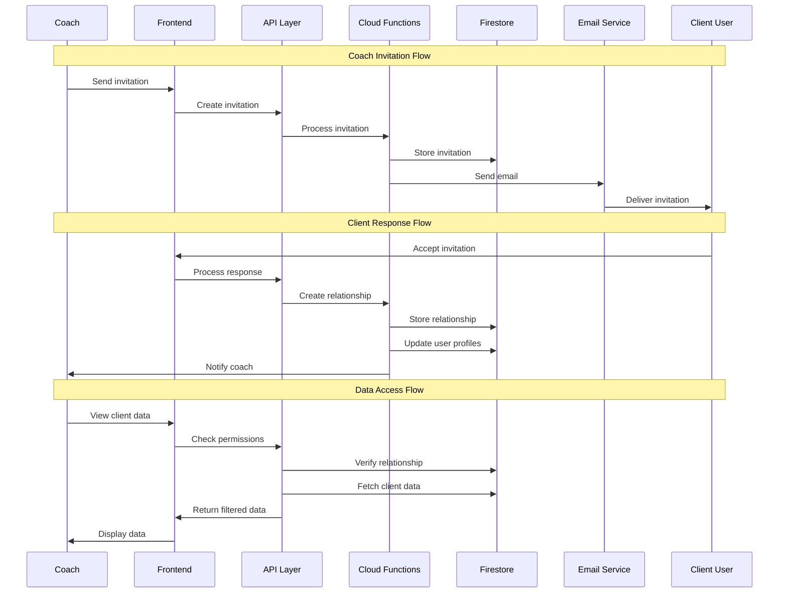
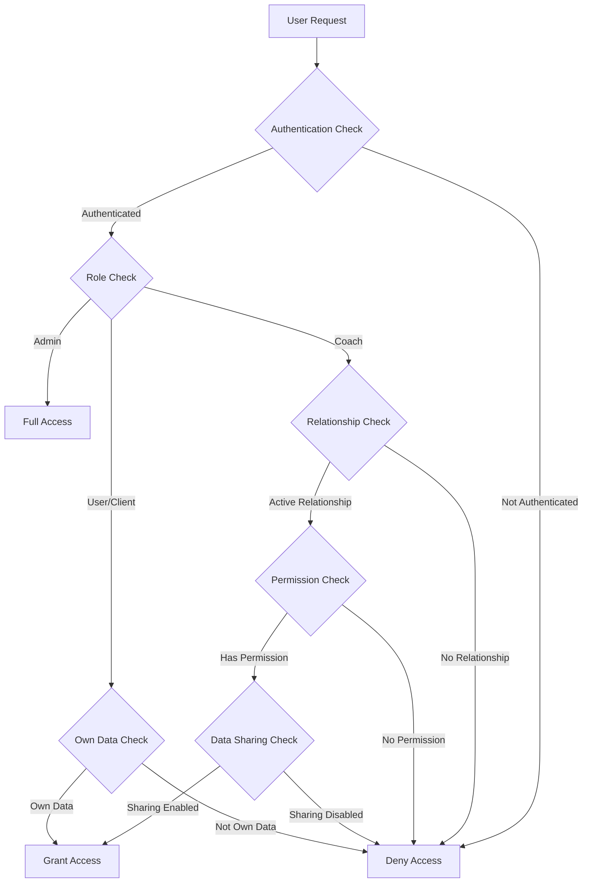

# Hierarchical Coach Role System - Master Implementation Plan

**Project**: Exercise Tracker - Coach Role System Implementation  
**Version**: 1.0  
**Date**: July 11, 2025  
**Status**: Planning Phase  

---

## Table of Contents

1. [Executive Summary](#executive-summary)
2. [Current System Analysis](#current-system-analysis)
3. [Architecture Overview](#architecture-overview)
4. [Database Schema Design](#database-schema-design)
5. [Permission System Architecture](#permission-system-architecture)
6. [Client Invitation Workflow](#client-invitation-workflow)
7. [UI/UX Integration Strategy](#uiux-integration-strategy)
8. [Implementation Roadmap](#implementation-roadmap)
9. [Technical Specifications](#technical-specifications)
10. [Integration Guidelines](#integration-guidelines)
11. [Security Considerations](#security-considerations)
12. [Testing Strategy](#testing-strategy)
13. [Migration Plan](#migration-plan)
14. [Success Metrics](#success-metrics)

---

## Executive Summary

This document outlines the complete implementation plan for a hierarchical coach role system in the Exercise Tracker application. The system implements a three-tier hierarchy: **Admin → Coach → Client**, enabling coaches to manage multiple clients, view their workout data, create personalized programs, and provide coaching insights.

### Key Features
- **Coach Role Management**: Coaches can invite and manage multiple clients
- **Client Data Access**: Coaches can view client workouts, progress, and analytics
- **Program Creation**: Coaches can create and assign personalized programs to clients
- **Coaching Insights**: Integration with existing AI coaching features for enhanced recommendations
- **Invitation System**: Secure client invitation and acceptance workflow
- **Data Privacy**: Granular permissions and data sharing controls

### Business Impact
- **Revenue Growth**: Enable premium coaching subscriptions
- **User Engagement**: Increase retention through personalized coaching
- **Market Expansion**: Attract fitness professionals and their clients
- **Platform Value**: Transform from individual app to coaching platform

---

## Current System Analysis

### Existing Authentication & Role System

#### Current Implementation
```javascript
// Current role structure (src/App.js, src/pages/Auth.js)
const userRoles = {
  'user': 'Standard user with personal data access',
  'admin': 'Full system access and template creation'
};

// User document structure
{
  email: string,
  createdAt: timestamp,
  role: 'user' | 'admin'
}
```

#### Current Permissions
- **Users**: Access own data, create personal programs, log workouts
- **Admins**: All user permissions + create template programs, access admin panel

#### Current Database Collections


### Existing UI/UX Integration Points

#### Navigation System
- **NavBar Component**: Role-based navigation (`src/components/NavBar.js`)
- **Route Protection**: Role-based route access in `src/App.js`
- **Admin Panel**: Dedicated admin interface (`src/pages/Admin.js`)

#### Data Flow Architecture
- **Enhanced Caching**: Sophisticated caching system with user-specific invalidation
- **Analytics Integration**: Advanced workout analytics and AI coaching insights
- **Performance Optimization**: Comprehensive performance monitoring and optimization

---

## Architecture Overview

### System Hierarchy



### Role Definitions

#### Admin Role
- **Permissions**: All system access, coach management, global template creation
- **Capabilities**: 
  - Promote users to coach status
  - Create system-wide program templates
  - Access all user data for support purposes
  - Manage platform settings and configurations

#### Coach Role
- **Permissions**: Client management, client data access, program creation for clients
- **Capabilities**:
  - Send client invitations via email or username
  - View invited and accepted clients' workout data
  - Create and assign personalized programs to clients
  - Access client analytics and progress reports
  - Provide coaching insights and recommendations
  - Manage client roster (remove clients if needed)

#### Client Role (Enhanced User)
- **Permissions**: Personal data access + coach interaction capabilities
- **Capabilities**:
  - Accept or decline coach invitations
  - Share workout data with assigned coach
  - Receive coach-created programs
  - Control data sharing preferences
  - View coaching insights and recommendations

---

## Database Schema Design

### Enhanced User Document
```javascript
// users/{userId}
{
  email: string,
  displayName: string,
  createdAt: timestamp,
  role: 'user' | 'coach' | 'admin',
  
  // Coach-specific fields
  coachProfile: {
    isActive: boolean,
    specializations: string[],
    certifications: string[],
    bio: string,
    contactInfo: {
      phone: string,
      website: string
    },
    clientLimit: number, // null for unlimited
    createdAt: timestamp
  },
  
  // Client-specific fields
  clientProfile: {
    currentCoach: string | null, // userId of coach
    coachHistory: string[], // Array of previous coach userIds
    dataSharing: {
      workouts: boolean,
      progress: boolean,
      analytics: boolean,
      personalInfo: boolean
    },
    joinedAt: timestamp
  },
  
  lastUpdated: timestamp
}
```

### Coach-Client Relationships
```javascript
// coachClientRelationships/{relationshipId}
{
  coachId: string,
  clientId: string,
  status: 'pending' | 'active' | 'inactive' | 'terminated',
  invitedAt: timestamp,
  acceptedAt: timestamp | null,
  terminatedAt: timestamp | null,
  
  permissions: {
    viewWorkouts: boolean,
    viewProgress: boolean,
    viewAnalytics: boolean,
    createPrograms: boolean,
    sendMessages: boolean
  },
  
  metadata: {
    invitationMethod: 'email' | 'username',
    invitationMessage: string,
    clientNotes: string, // Coach's notes about client
    goals: string[]
  },
  
  lastUpdated: timestamp
}
```

### Client Invitations
```javascript
// clientInvitations/{invitationId}
{
  coachId: string,
  coachEmail: string,
  coachDisplayName: string,
  
  // Invitation target
  targetEmail: string | null, // For email invitations
  targetUserId: string | null, // For username invitations
  
  invitationCode: string, // Unique code for email invitations
  message: string,
  
  status: 'pending' | 'accepted' | 'declined' | 'expired',
  createdAt: timestamp,
  expiresAt: timestamp,
  respondedAt: timestamp | null,
  
  // Response tracking
  viewedAt: timestamp | null,
  ipAddress: string | null,
  userAgent: string | null
}
```

### Coach Programs (Enhanced)
```javascript
// programs/{programId} - Enhanced for coach assignments
{
  // Existing fields...
  name: string,
  description: string,
  userId: string, // Creator (coach or user)
  isTemplate: boolean,
  
  // New coach-specific fields
  coachAssignment: {
    isCoachProgram: boolean,
    assignedToClient: string | null, // clientId
    assignedAt: timestamp | null,
    coachNotes: string,
    clientGoals: string[],
    expectedDuration: number, // weeks
    difficulty: 'beginner' | 'intermediate' | 'advanced'
  },
  
  // Program sharing and visibility
  visibility: 'private' | 'coach-only' | 'template' | 'public',
  
  lastUpdated: timestamp
}
```

### Coaching Insights & Messages
```javascript
// coachingInsights/{insightId}
{
  coachId: string,
  clientId: string,
  relationshipId: string,
  
  type: 'recommendation' | 'observation' | 'goal-update' | 'program-adjustment',
  title: string,
  content: string,
  
  // AI-generated insights integration
  aiGenerated: boolean,
  aiConfidence: number, // 0-1
  basedOnData: {
    workoutCount: number,
    dateRange: { start: timestamp, end: timestamp },
    exercisesAnalyzed: string[]
  },
  
  // Client interaction
  clientViewed: boolean,
  clientViewedAt: timestamp | null,
  clientResponse: string | null,
  
  priority: 'low' | 'medium' | 'high',
  tags: string[],
  
  createdAt: timestamp,
  lastUpdated: timestamp
}
```

---

## Permission System Architecture

### Firestore Security Rules Enhancement

```javascript
rules_version = '2';

service cloud.firestore {
  match /databases/{database}/documents {
    
    // Enhanced user document access
    match /users/{userId} {
      allow read: if request.auth != null && (
        request.auth.uid == userId || 
        isCoachOfUser(request.auth.uid, userId) ||
        isAdmin(request.auth.uid)
      );
      allow write: if request.auth != null && request.auth.uid == userId;
    }
    
    // Coach-Client relationships
    match /coachClientRelationships/{relationshipId} {
      allow read: if request.auth != null && (
        request.auth.uid == resource.data.coachId ||
        request.auth.uid == resource.data.clientId ||
        isAdmin(request.auth.uid)
      );
      allow create: if request.auth != null && 
        request.auth.uid == request.resource.data.coachId &&
        isCoach(request.auth.uid);
      allow update: if request.auth != null && (
        request.auth.uid == resource.data.coachId ||
        request.auth.uid == resource.data.clientId
      );
    }
    
    // Client invitations
    match /clientInvitations/{invitationId} {
      allow read: if request.auth != null && (
        request.auth.uid == resource.data.coachId ||
        request.auth.email == resource.data.targetEmail ||
        request.auth.uid == resource.data.targetUserId
      );
      allow create: if request.auth != null && 
        request.auth.uid == request.resource.data.coachId &&
        isCoach(request.auth.uid);
      allow update: if request.auth != null && (
        request.auth.uid == resource.data.coachId ||
        request.auth.email == resource.data.targetEmail ||
        request.auth.uid == resource.data.targetUserId
      );
    }
    
    // Enhanced workout logs access
    match /workoutLogs/{logId} {
      allow read: if request.auth != null && (
        request.auth.uid == resource.data.userId ||
        isCoachOfUser(request.auth.uid, resource.data.userId) ||
        isAdmin(request.auth.uid)
      );
      allow write: if request.auth != null && request.auth.uid == resource.data.userId;
    }
    
    // Enhanced programs access
    match /programs/{programId} {
      allow read: if request.auth != null && (
        resource.data.isTemplate == true ||
        request.auth.uid == resource.data.userId ||
        isCoachOfUser(request.auth.uid, resource.data.userId) ||
        (resource.data.coachAssignment.assignedToClient == request.auth.uid)
      );
      allow write: if request.auth != null && (
        request.auth.uid == resource.data.userId ||
        (isCoach(request.auth.uid) && 
         resource.data.coachAssignment.assignedToClient != null &&
         isCoachOfUser(request.auth.uid, resource.data.coachAssignment.assignedToClient))
      );
    }
    
    // Coaching insights
    match /coachingInsights/{insightId} {
      allow read: if request.auth != null && (
        request.auth.uid == resource.data.coachId ||
        request.auth.uid == resource.data.clientId
      );
      allow create: if request.auth != null && 
        request.auth.uid == request.resource.data.coachId &&
        isCoachOfUser(request.auth.uid, request.resource.data.clientId);
      allow update: if request.auth != null && (
        request.auth.uid == resource.data.coachId ||
        (request.auth.uid == resource.data.clientId && 
         onlyUpdatingClientFields())
      );
    }
    
    // Helper functions
    function isAdmin(userId) {
      return get(/databases/$(database)/documents/users/$(userId)).data.role == 'admin';
    }
    
    function isCoach(userId) {
      let userDoc = get(/databases/$(database)/documents/users/$(userId)).data;
      return userDoc.role == 'coach' || userDoc.role == 'admin';
    }
    
    function isCoachOfUser(coachId, clientId) {
      return exists(/databases/$(database)/documents/coachClientRelationships/$(coachId + '_' + clientId)) &&
        get(/databases/$(database)/documents/coachClientRelationships/$(coachId + '_' + clientId)).data.status == 'active';
    }
    
    function onlyUpdatingClientFields() {
      return request.resource.data.diff(resource.data).affectedKeys()
        .hasOnly(['clientViewed', 'clientViewedAt', 'clientResponse']);
    }
  }
}
```

### Frontend Permission Utilities

```javascript
// src/utils/permissions.js
export class PermissionManager {
  constructor(user, userRole, coachClientRelationships = []) {
    this.user = user;
    this.userRole = userRole;
    this.relationships = coachClientRelationships;
  }
  
  // Check if user can view another user's data
  canViewUserData(targetUserId, dataType = 'basic') {
    if (this.userRole === 'admin') return true;
    if (this.user.uid === targetUserId) return true;
    
    if (this.userRole === 'coach') {
      const relationship = this.getActiveRelationship(targetUserId);
      if (!relationship) return false;
      
      switch (dataType) {
        case 'workouts': return relationship.permissions.viewWorkouts;
        case 'progress': return relationship.permissions.viewProgress;
        case 'analytics': return relationship.permissions.viewAnalytics;
        default: return true;
      }
    }
    
    return false;
  }
  
  // Check if user can create programs for another user
  canCreateProgramsFor(targetUserId) {
    if (this.userRole === 'admin') return true;
    if (this.userRole === 'coach') {
      const relationship = this.getActiveRelationship(targetUserId);
      return relationship?.permissions.createPrograms || false;
    }
    return false;
  }
  
  // Get active coach-client relationship
  getActiveRelationship(userId) {
    return this.relationships.find(rel => 
      (rel.coachId === this.user.uid && rel.clientId === userId) ||
      (rel.clientId === this.user.uid && rel.coachId === userId)
    );
  }
  
  // Check if user can send invitations
  canSendInvitations() {
    return this.userRole === 'coach' || this.userRole === 'admin';
  }
}
```

---

## Client Invitation Workflow

### Invitation Process Flow



### Implementation Components

#### 1. Invitation Creation
```javascript
// src/services/invitationService.js
export class InvitationService {
  static async sendInvitation(coachId, targetIdentifier, message, method = 'email') {
    const invitationData = {
      coachId,
      coachEmail: auth.currentUser.email,
      coachDisplayName: await this.getCoachDisplayName(coachId),
      message,
      status: 'pending',
      createdAt: new Date(),
      expiresAt: new Date(Date.now() + 7 * 24 * 60 * 60 * 1000), // 7 days
      invitationCode: this.generateInvitationCode()
    };
    
    if (method === 'email') {
      invitationData.targetEmail = targetIdentifier;
      await this.sendEmailInvitation(invitationData);
    } else {
      invitationData.targetUserId = targetIdentifier;
      await this.sendInAppInvitation(invitationData);
    }
    
    return await addDoc(collection(db, 'clientInvitations'), invitationData);
  }
  
  static generateInvitationCode() {
    return Math.random().toString(36).substring(2, 15) + 
           Math.random().toString(36).substring(2, 15);
  }
}
```

#### 2. Email Integration
```javascript
// Cloud Function for sending invitation emails
exports.sendCoachInvitation = functions.firestore
  .document('clientInvitations/{invitationId}')
  .onCreate(async (snap, context) => {
    const invitation = snap.data();
    
    if (invitation.targetEmail) {
      const emailContent = {
        to: invitation.targetEmail,
        subject: `${invitation.coachDisplayName} invited you to join as their client`,
        html: generateInvitationEmailHTML(invitation)
      };
      
      await sendEmail(emailContent);
    }
  });
```

#### 3. Invitation Response Handling
```javascript
// src/components/InvitationResponse.js
export function InvitationResponse({ invitationId }) {
  const handleResponse = async (action) => {
    const invitationRef = doc(db, 'clientInvitations', invitationId);
    
    if (action === 'accept') {
      // Create coach-client relationship
      const relationshipData = {
        coachId: invitation.coachId,
        clientId: auth.currentUser.uid,
        status: 'active',
        acceptedAt: new Date(),
        permissions: {
          viewWorkouts: true,
          viewProgress: true,
          viewAnalytics: true,
          createPrograms: true,
          sendMessages: true
        }
      };
      
      await addDoc(collection(db, 'coachClientRelationships'), relationshipData);
      
      // Update user profile
      await updateDoc(doc(db, 'users', auth.currentUser.uid), {
        'clientProfile.currentCoach': invitation.coachId,
        'clientProfile.joinedAt': new Date()
      });
    }
    
    // Update invitation status
    await updateDoc(invitationRef, {
      status: action === 'accept' ? 'accepted' : 'declined',
      respondedAt: new Date()
    });
  };
  
  return (
    <div className="invitation-response">
      <h3>Coaching Invitation</h3>
      <p>{invitation.message}</p>
      <Button onClick={() => handleResponse('accept')}>Accept</Button>
      <Button onClick={() => handleResponse('decline')}>Decline</Button>
    </div>
  );
}
```

---

## UI/UX Integration Strategy

### Navigation Enhancement

#### Enhanced NavBar Component
```javascript
// src/components/NavBar.js - Enhanced for coach roles
function NavBar({ user, userRole, coachClientCount = 0 }) {
  return (
    <Navbar>
      <Nav>
        {/* Standard navigation */}
        <Nav.Link href="/">Home</Nav.Link>
        <Nav.Link href="/exercises">Exercises</Nav.Link>
        <Nav.Link href="/programs">Programs</Nav.Link>
        
        {/* Coach-specific navigation */}
        {(userRole === 'coach' || userRole === 'admin') && (
          <>
            <Nav.Link href="/coach-dashboard">
              Coach Dashboard
              {coachClientCount > 0 && (
                <Badge bg="primary" className="ms-1">{coachClientCount}</Badge>
              )}
            </Nav.Link>
            <Nav.Link href="/client-management">Clients</Nav.Link>
            <Nav.Link href="/coaching-insights">Insights</Nav.Link>
          </>
        )}
        
        {/* Client-specific navigation */}
        {user?.clientProfile?.currentCoach && (
          <Nav.Link href="/my-coach">My Coach</Nav.Link>
        )}
        
        {/* Admin navigation */}
        {userRole === 'admin' && (
          <Nav.Link href="/admin">Admin</Nav.Link>
        )}
      </Nav>
    </Navbar>
  );
}
```

### New Page Components

#### 1. Coach Dashboard
```javascript
// src/pages/CoachDashboard.js
export function CoachDashboard() {
  const [clients, setClients] = useState([]);
  const [insights, setInsights] = useState([]);
  const [stats, setStats] = useState({});
  
  return (
    <Container>
      <Row>
        <Col md={8}>
          <Card>
            <Card.Header>
              <h4>Client Overview</h4>
            </Card.Header>
            <Card.Body>
              <ClientOverviewTable clients={clients} />
            </Card.Body>
          </Card>
        </Col>
        
        <Col md={4}>
          <Card>
            <Card.Header>
              <h5>Quick Stats</h5>
            </Card.Header>
            <Card.Body>
              <CoachStatsWidget stats={stats} />
            </Card.Body>
          </Card>
          
          <Card className="mt-3">
            <Card.Header>
              <h5>Recent Insights</h5>
            </Card.Header>
            <Card.Body>
              <RecentInsightsList insights={insights} />
            </Card.Body>
          </Card>
        </Col>
      </Row>
    </Container>
  );
}
```

#### 2. Client Management
```javascript
// src/pages/ClientManagement.js
export function ClientManagement() {
  const [activeClients, setActiveClients] = useState([]);
  const [pendingInvitations, setPendingInvitations] = useState([]);
  const [showInviteModal, setShowInviteModal] = useState(false);
  
  return (
    <Container>
      <div className="d-flex justify-content-between align-items-center mb-4">
        <h2>Client Management</h2>
        <Button onClick={() => setShowInviteModal(true)}>
          <PlusCircle className="me-2" />
          Invite Client
        </Button>
      </div>
      
      <Tabs defaultActiveKey="active">
        <Tab eventKey="active" title={`Active Clients (${activeClients.length})`}>
          <ActiveClientsTable clients={activeClients} />
        </Tab>
        
        <Tab eventKey="pending" title={`Pending Invitations (${pendingInvitations.length})`}>
          <PendingInvitationsTable invitations={pendingInvitations} />
        </Tab>
      </Tabs>
      
      <InviteClientModal 
        show={showInviteModal}
        onHide={() => setShowInviteModal(false)}
      />
    </Container>
  );
}
```

#### 3. Client Coach View
```javascript
// src/pages/MyCoach.js
export function MyCoach() {
  const [coach, setCoach] = useState(null);
  const [coachPrograms, setCoachPrograms] = useState([]);
  const [insights, setInsights] = useState([]);
  const [dataSharing, setDataSharing] = useState({});
  
  return (
    <Container>
      <Row>
        <Col md={8}>
          <Card>
            <Card.Header>
              <h4>Programs from {coach?.displayName}</h4>
            </Card.Header>
            <Card.Body>
              <CoachProgramsList programs={coachPrograms} />
            </Card.Body>
          </Card>
          
          <Card className="mt-3">
            <Card.Header>
              <h4>Coaching Insights</h4>
            </Card.Header>
            <Card.Body>
              <CoachingInsightsList insights={insights} />
            </Card.Body>
          </Card>
        </Col>
        
        <Col md={4}>
          <Card>
            <Card.Header>
              <h5>Coach Information</h5>
            </Card.Header>
            <Card.Body>
              <CoachProfileCard coach={coach} />
            </Card.Body>
          </Card>
          
          <Card className="mt-3">
            <Card.Header>
              <h5>Data Sharing Settings</h5>
            </Card.Header>
            <Card.Body>
              <DataSharingControls 
                settings={dataSharing}
                onChange={setDataSharing}
              />
            </Card.Body>
          </Card>
        </Col>
      </Row>
    </Container>
  );
}
```

### Enhanced Existing Components

#### Programs Page Enhancement
```javascript
// src/pages/Programs.js - Enhanced for coach assignments
function Programs({ userRole }) {
  const [userPrograms, setUserPrograms] = useState([]);
  const [coachPrograms, setCoachPrograms] = useState([]); // New
  const [clientPrograms, setClientPrograms] = useState([]); // New
  
  // Enhanced program rendering with coach context
  const renderProgramCard = (program, context = 'user') => (
    <Card className={`program-card ${context}`}>
      <Card.Header>
        <div className="d-flex justify-content-between">
          <h5>{program.name}</h5>
          {context === 'coach' && (
            <Badge bg="info">Coach Program</Badge>
          )}
          {context === 'client' && (
            <Badge bg="success">From Coach</Badge>
          )}
        </div>
      </Card.Header>
      <Card.Body>
        {/* Enhanced program details with coach context */}
      </Card.Body>
    </Card>
  );
  
  return (
    <Container>
      <Tabs defaultActiveKey="my-programs">
        <Tab eventKey="my-programs" title="My Programs">
          {userPrograms.map(program => renderProgramCard(program, 'user'))}
        </Tab>
        
        {userRole === 'coach' && (
          <Tab eventKey="client-programs" title="Client Programs">
            {clientPrograms.map(program => renderProgramCard(program, 'coach'))}
          </Tab>
        )}
        
        {coachPrograms.length > 0 && (
          <Tab eventKey="coach-programs" title="From Coach">
            {coachPrograms.map(program => renderProgramCard(program, 'client'))}
          </Tab>
        )}
      </Tabs>
    </Container>
  );
}
```

---

## Implementation Roadmap

### Phase 1: Foundation (Weeks 1-3)
**Goal**: Establish basic coach role system and database structure

#### Week 1: Database Schema & Security
- [ ] **Database Schema Implementation**
  - [ ] Create enhanced user document structure
  - [ ] Implement coachClientRelationships collection
  - [ ] Create clientInvitations collection
  - [ ] Set up coachingInsights collection

- [ ] **Security Rules Enhancement**
  - [ ] Update Firestore security rules for new collections
  - [ ] Implement role-based access controls
  - [ ] Add coach-client relationship validation
  - [ ] Test security rule coverage

#### Week 2: Backend Services
- [ ] **Cloud Functions Development**
  - [ ] Create invitation email service
  - [ ] Implement relationship management functions
  - [ ] Develop coaching insights generation
  - [ ] Add role promotion/demotion functions

- [ ] **Permission System**
  - [ ] Implement PermissionManager utility class
  - [ ] Create role validation middleware
  - [ ] Add data access control helpers
  - [ ] Test permission enforcement

#### Week 3: Basic UI Framework
- [ ] **Navigation Enhancement**
  - [ ] Update NavBar for coach roles
  - [ ] Add role-based route protection
  - [ ] Implement coach/client indicators
  - [ ] Create role switching interface (admin)

- [ ] **Core Page Structure**
  - [ ] Create CoachDashboard page skeleton
  - [ ] Build ClientManagement page framework
  - [ ] Develop MyCoach page structure
  - [ ] Add invitation response components

### Phase 2: Invitation System (Weeks 4-5)
**Goal**: Complete client invitation and relationship management

#### Week 4: Invitation Workflow
- [ ] **Invitation Creation**
  - [ ] Build InviteClientModal component
  - [ ] Implement email invitation service
  - [ ] Create username-based invitation system
  - [ ] Add invitation validation and error handling

- [ ] **Invitation Response**
  - [ ] Develop invitation acceptance/decline flow
  - [ ] Create relationship establishment process
  - [ ] Implement user profile updates
  - [ ] Add notification system for responses

#### Week 5: Relationship Management
- [ ] **Client Management Interface**
  - [ ] Build active clients table
  - [ ] Create pending invitations view
  - [ ] Implement client removal functionality
  - [ ] Add relationship status management

- [ ] **Data Sharing Controls**
  - [ ] Create data sharing preference interface
  - [ ] Implement granular permission controls
  - [ ] Add privacy settings for clients
  - [ ] Test data access restrictions

### Phase 3: Coach Features (Weeks 6-8)
**Goal**: Implement core coaching functionality

#### Week 6: Program Management
- [ ] **Coach Program Creation**
  - [ ] Enhance CreateProgram for client assignment
  - [ ] Add client selection interface
  - [ ] Implement program assignment workflow
  - [ ] Create program template system for coaches

- [ ] **Client Program View**
  - [ ] Build coach-assigned program display
  - [ ] Add program progress tracking for coaches
  - [ ] Implement program modification capabilities
  - [ ] Create program completion notifications

#### Week 7: Client Data Access
- [ ] **Workout Data Integration**
  - [ ] Enable coach access to client workout logs
  - [ ] Create client workout history view for coaches
  - [ ] Implement workout performance analytics for coaches
  - [ ] Add workout comparison and trend analysis

- [ ] **Progress Analytics**
  - [ ] Integrate existing analytics system with coach access
  - [ ] Create client progress dashboard for coaches
  - [ ] Implement multi-client progress comparison
  - [ ] Add progress report generation

#### Week 8: Coaching Insights
- [ ] **AI Integration Enhancement**
  - [ ] Extend existing AI coaching system for coach-client relationships
  - [ ] Create coach-specific insight generation
  - [ ] Implement client-specific recommendations
  - [ ] Add coaching insight delivery system

- [ ] **Communication Features**
  - [ ] Build coaching insights interface
  - [ ] Create client feedback system
  - [ ] Implement insight acknowledgment tracking
  - [ ] Add coaching note-taking functionality

### Phase 4: Integration & Polish (Weeks 9-10)
**Goal**: Complete system integration and user experience optimization

#### Week 9: System Integration
- [ ] **Cache System Integration**
  - [ ] Extend enhanced caching for coach-client data
  - [ ] Implement coach-specific cache warming
  - [ ] Add relationship-based cache invalidation
  - [ ] Optimize performance for multi-client access

- [ ] **Existing Feature Enhancement**
  - [ ] Update all existing pages for coach role compatibility
  - [ ] Enhance exercise creation for coach templates
  - [ ] Integrate coach features with existing analytics
  - [ ] Update user profile management

#### Week 10: Testing & Optimization
- [ ] **Comprehensive Testing**
  - [ ] End-to-end testing of invitation workflow
  - [ ] Security testing for role-based access
  - [ ] Performance testing with multiple coach-client relationships
  - [ ] User acceptance testing

- [ ] **Performance Optimization**
  - [ ] Optimize database queries for coach features
  - [ ] Implement efficient data loading strategies
  - [ ] Add performance monitoring for new features
  - [ ] Fine-tune caching strategies

### Phase 5: Launch Preparation (Weeks 11-12)
**Goal**: Prepare for production deployment

#### Week 11: Documentation & Training
- [ ] **User Documentation**
  - [ ] Create coach onboarding guide
  - [ ] Develop client invitation tutorial
  - [ ] Write feature documentation
  - [ ] Create troubleshooting guides

- [ ] **Admin Tools**
  - [ ] Build admin interface for coach management
  - [ ] Create role promotion/demotion tools
  - [ ] Implement system monitoring dashboard
  - [ ] Add usage analytics tracking

#### Week 12: Deployment & Monitoring
- [ ] **Production Deployment**
  - [ ] Deploy database schema updates
  - [ ] Release backend services
  - [ ] Deploy frontend updates
  - [ ] Configure monitoring and alerts

- [ ] **Launch Support**
  - [ ] Monitor system performance
  - [ ] Track user adoption metrics
  - [ ] Collect user feedback
  - [ ] Address any critical issues

---

## Technical Specifications

### Database Collection Schemas

#### Enhanced Users Collection
```typescript
interface User {
  // Existing fields
  email: string;
  displayName?: string;
  createdAt: Timestamp;
  role: 'user' | 'coach' | 'admin';
  
  // Coach-specific profile
  coachProfile?: {
    isActive: boolean;
    specializations: string[];
    certifications: string[];
    bio: string;
    contactInfo: {
      phone?: string;
      website?: string;
    };
    clientLimit?: number; // null for unlimited
    createdAt: Timestamp;
  };
  
  // Client-specific profile
  clientProfile?: {
    currentCoach?: string; // userId of coach
    coachHistory: string[]; // Array of previous coach userIds
    dataSharing: {
      workouts: boolean;
      progress: boolean;
      analytics: boolean;
      personalInfo: boolean;
    };
    joinedAt?: Timestamp;
  };
  
  lastUpdated: Timestamp;
}
```

#### Coach-Client Relationships Collection
```typescript
interface CoachClientRelationship {
  id: string; // Format: `${coachId}_${clientId}`
  coachId: string;
  clientId: string;
  status: 'pending' | 'active' | 'inactive' | 'terminated';
  invitedAt: Timestamp;
  acceptedAt?: Timestamp;
  terminatedAt?: Timestamp;
  
  permissions: {
    viewWorkouts: boolean;
    viewProgress: boolean;
    viewAnalytics: boolean;
    createPrograms: boolean;
    sendMessages: boolean;
  };
  
  metadata: {
    invitationMethod: 'email' | 'username';
    invitationMessage: string;
    clientNotes: string; // Coach's notes about client
    goals: string[];
  };
  
  lastUpdated: Timestamp;
}
```

#### Client Invitations Collection
```typescript
interface ClientInvitation {
  id: string;
  coachId: string;
  coachEmail: string;
  coachDisplayName: string;
  
  // Invitation target
  targetEmail?: string; // For email invitations
  targetUserId?: string; // For username invitations
  
  invitationCode: string; // Unique code for email invitations
  message: string;
  
  status: 'pending' | 'accepted' | 'declined' | 'expired';
  createdAt: Timestamp;
  expiresAt: Timestamp;
  respondedAt?: Timestamp;
  
  // Response tracking
  viewedAt?: Timestamp;
  ipAddress?: string;
  userAgent?: string;
}
```

#### Coaching Insights Collection
```typescript
interface CoachingInsight {
  id: string;
  coachId: string;
  clientId: string;
  relationshipId: string;
  
  type: 'recommendation' | 'observation' | 'goal-update' | 'program-adjustment';
  title: string;
  content: string;
  
  // AI-generated insights integration
  aiGenerated: boolean;
  aiConfidence?: number; // 0-1
  basedOnData?: {
    workoutCount: number;
    dateRange: { start: Timestamp; end: Timestamp };
    exercisesAnalyzed: string[];
  };
  
  // Client interaction
  clientViewed: boolean;
  clientViewedAt?: Timestamp;
  clientResponse?: string;
  
  priority: 'low' | 'medium' | 'high';
  tags: string[];
  
  createdAt: Timestamp;
  lastUpdated: Timestamp;
}
```

### Firestore Security Rules (Complete)

```javascript
rules_version = '2';

service cloud.firestore {
  match /databases/{database}/documents {
    
    // Enhanced user document access
    match /users/{userId} {
      allow read: if request.auth != null && (
        request.auth.uid == userId || 
        isCoachOfUser(request.auth.uid, userId) ||
        isAdmin(request.auth.uid)
      );
      allow write: if request.auth != null && request.auth.uid == userId;
      allow update: if request.auth != null && (
        request.auth.uid == userId ||
        (isAdmin(request.auth.uid) && onlyUpdatingRole())
      );
    }
    
    // Coach-Client relationships
    match /coachClientRelationships/{relationshipId} {
      allow read: if request.auth != null && (
        request.auth.uid == resource.data.coachId ||
        request.auth.uid == resource.data.clientId ||
        isAdmin(request.auth.uid)
      );
      allow create: if request.auth != null && 
        request.auth.uid == request.resource.data.coachId &&
        isCoach(request.auth.uid) &&
        validRelationshipId(relationshipId, request.resource.data);
      allow update: if request.auth != null && (
        (request.auth.uid == resource.data.coachId && onlyUpdatingCoachFields()) ||
        (request.auth.uid == resource.data.clientId && onlyUpdatingClientFields()) ||
        isAdmin(request.auth.uid)
      );
      allow delete: if request.auth != null && (
        request.auth.uid == resource.data.coachId ||
        request.auth.uid == resource.data.clientId ||
        isAdmin(request.auth.uid)
      );
    }
    
    // Client invitations
    match /clientInvitations/{invitationId} {
      allow read: if request.auth != null && (
        request.auth.uid == resource.data.coachId ||
        request.auth.email == resource.data.targetEmail ||
        request.auth.uid == resource.data.targetUserId ||
        isAdmin(request.auth.uid)
      );
      allow create: if request.auth != null && 
        request.auth.uid == request.resource.data.coachId &&
        isCoach(request.auth.uid) &&
        validInvitation(request.resource.data);
      allow update: if request.auth != null && (
        request.auth.uid == resource.data.coachId ||
        request.auth.email == resource.data.targetEmail ||
        request.auth.uid == resource.data.targetUserId ||
        isAdmin(request.auth.uid)
      ) && onlyUpdatingInvitationResponse();
      allow delete: if request.auth != null && (
        request.auth.uid == resource.data.coachId ||
        isAdmin(request.auth.uid)
      );
    }
    
    // Enhanced workout logs access
    match /workoutLogs/{logId} {
      allow read: if request.auth != null && (
        request.auth.uid == resource.data.userId ||
        (isCoachOfUser(request.auth.uid, resource.data.userId) && 
         hasWorkoutPermission(request.auth.uid, resource.data.userId)) ||
        isAdmin(request.auth.uid)
      );
      allow write: if request.auth != null && request.auth.uid == resource.data.userId;
      allow create: if request.auth != null && request.resource.data.userId == request.auth.uid;
    }
    
    // Enhanced programs access
    match /programs/{programId} {
      allow read: if request.auth != null && (
        resource.data.isTemplate == true ||
        request.auth.uid == resource.data.userId ||
        (isCoachOfUser(request.auth.uid, resource.data.userId) && 
         hasProgramPermission(request.auth.uid, resource.data.userId)) ||
        (resource.data.coachAssignment.assignedToClient == request.auth.uid) ||
        isAdmin(request.auth.uid)
      );
      allow write: if request.auth != null && (
        request.auth.uid == resource.data.userId ||
        (isCoach(request.auth.uid) && 
         resource.data.coachAssignment.assignedToClient != null &&
         isCoachOfUser(request.auth.uid, resource.data.coachAssignment.assignedToClient) &&
         hasProgramPermission(request.auth.uid, resource.data.coachAssignment.assignedToClient)) ||
        isAdmin(request.auth.uid)
      );
    }
    
    // Coaching insights
    match /coachingInsights/{insightId} {
      allow read: if request.auth != null && (
        request.auth.uid == resource.data.coachId ||
        request.auth.uid == resource.data.clientId ||
        isAdmin(request.auth.uid)
      );
      allow create: if request.auth != null && 
        request.auth.uid == request.resource.data.coachId &&
        isCoachOfUser(request.auth.uid, request.resource.data.clientId);
      allow update: if request.auth != null && (
        (request.auth.uid == resource.data.coachId && onlyUpdatingCoachInsightFields()) ||
        (request.auth.uid == resource.data.clientId && onlyUpdatingClientInsightFields()) ||
        isAdmin(request.auth.uid)
      );
      allow delete: if request.auth != null && (
        request.auth.uid == resource.data.coachId ||
        isAdmin(request.auth.uid)
      );
    }
    
    // User analytics with coach access
    match /userAnalytics/{userId}/{document=**} {
      allow read: if request.auth != null && (
        request.auth.uid == userId ||
        (isCoachOfUser(request.auth.uid, userId) && 
         hasAnalyticsPermission(request.auth.uid, userId)) ||
        isAdmin(request.auth.uid)
      );
      allow write: if request.auth != null && request.auth.uid == userId;
    }
    
    // Exercises - enhanced for coach templates
    match /exercises/{exerciseId} {
      allow read: if true; // Public read access
      allow write: if request.auth != null && (
        request.auth.uid == resource.data.userId ||
        !exists(/databases/$(database)/documents/exercises/$(exerciseId)) ||
        isAdmin(request.auth.uid)
      );
      allow create: if request.auth != null;
    }
    
    // Helper functions
    function isAdmin(userId) {
      return get(/databases/$(database)/documents/users/$(userId)).data.role == 'admin';
    }
    
    function isCoach(userId) {
      let userDoc = get(/databases/$(database)/documents/users/$(userId)).data;
      return userDoc.role == 'coach' || userDoc.role == 'admin';
    }
    
    function isCoachOfUser(coachId, clientId) {
      let relationshipId = coachId + '_' + clientId;
      return exists(/databases/$(database)/documents/coachClientRelationships/$(relationshipId)) &&
        get(/databases/$(database)/documents/coachClientRelationships/$(relationshipId)).data.status == 'active';
    }
    
    function hasWorkoutPermission(coachId, clientId) {
      let relationshipId = coachId + '_' + clientId;
      return get(/databases/$(database)/documents/coachClientRelationships/$(relationshipId)).data.permissions.viewWorkouts == true;
    }
    
    function hasProgramPermission(coachId, clientId) {
      let relationshipId = coachId + '_' + clientId;
      return get(/databases/$(database)/documents/coachClientRelationships/$(relationshipId)).data.permissions.createPrograms == true;
    }
    
    function hasAnalyticsPermission(coachId, clientId) {
      let relationshipId = coachId + '_' + clientId;
      return get(/databases/$(database)/documents/coachClientRelationships/$(relationshipId)).data.permissions.viewAnalytics == true;
    }
    
    function validRelationshipId(relationshipId, data) {
      return relationshipId == data.coachId + '_' + data.clientId;
    }
    
    function validInvitation(data) {
      return (data.targetEmail is string && data.targetEmail.size() > 0) ||
             (data.targetUserId is string && data.targetUserId.size() > 0);
    }
    
    function onlyUpdatingRole() {
      return request.resource.data.diff(resource.data).affectedKeys().hasOnly(['role']);
    }
    
    function onlyUpdatingCoachFields() {
      return request.resource.data.diff(resource.data).affectedKeys()
        .hasOnly(['metadata', 'permissions', 'lastUpdated']);
    }
    
    function onlyUpdatingClientFields() {
      return request.resource.data.diff(resource.data).affectedKeys()
        .hasOnly(['status', 'acceptedAt', 'lastUpdated']);
    }
    
    function onlyUpdatingInvitationResponse() {
      return request.resource.data.diff(resource.data).affectedKeys()
        .hasOnly(['status', 'respondedAt', 'viewedAt']);
    }
    
    function onlyUpdatingCoachInsightFields() {
      return request.resource.data.diff(resource.data).affectedKeys()
        .hasOnly(['title', 'content', 'priority', 'tags', 'lastUpdated']);
    }
    
    function onlyUpdatingClientInsightFields() {
      return request.resource.data.diff(resource.data).affectedKeys()
        .hasOnly(['clientViewed', 'clientViewedAt', 'clientResponse']);
    }
  }
}
```

### Caching Strategy Enhancement

```javascript
// src/api/coachEnhancedCache.js
export class CoachCacheManager extends EnhancedFirestoreCache {
  
  // Coach-specific cache warming
  static async warmCoachCache(coachId, priority = 'medium') {
    const warmingTasks = [];
    
    // Warm coach's client relationships
    warmingTasks.push(
      this.getCollectionCached('coachClientRelationships', {
        where: [['coachId', '==', coachId], ['status', '==', 'active']]
      }, 30 * 60 * 1000) // 30 minutes
    );
    
    // Warm pending invitations
    warmingTasks.push(
      this.getCollectionCached('clientInvitations', {
        where: [['coachId', '==', coachId], ['status', '==', 'pending']]
      }, 15 * 60 * 1000) // 15 minutes
    );
    
    // Warm coaching insights
    warmingTasks.push(
      this.getCollectionCached('coachingInsights', {
        where: [['coachId', '==', coachId]],
        orderBy: [['createdAt', 'desc']],
        limit: 50
      }, 15 * 60 * 1000) // 15 minutes
    );
    
    if (priority === 'high') {
      await Promise.all(warmingTasks);
    } else {
      // Background warming for medium/low priority
      Promise.all(warmingTasks).catch(console.warn);
    }
  }
  
  // Client-specific cache warming
  static async warmClientCache(clientId, coachId = null) {
    const warmingTasks = [];
    
    if (coachId) {
      // Warm coach-assigned programs
      warmingTasks.push(
        this.getCollectionCached('programs', {
          where: [['coachAssignment.assignedToClient', '==', clientId]]
        }, 30 * 60 * 1000)
      );
      
      // Warm coaching insights for this client
      warmingTasks.push(
        this.getCollectionCached('coachingInsights', {
          where: [['clientId', '==', clientId], ['coachId', '==', coachId]]
        }, 15 * 60 * 1000)
      );
    }
    
    // Warm client's coach relationship
    warmingTasks.push(
      this.getCollectionCached('coachClientRelationships', {
        where: [['clientId', '==', clientId], ['status', '==', 'active']]
      }, 30 * 60 * 1000)
    );
    
    Promise.all(warmingTasks).catch(console.warn);
  }
  
  // Invalidate coach-related caches
  static invalidateCoachCache(coachId, collections = []) {
    const patterns = [
      `coachClientRelationships_coachId_${coachId}`,
      `clientInvitations_coachId_${coachId}`,
      `coachingInsights_coachId_${coachId}`,
      `programs_coachAssignment`
    ];
    
    if (collections.length > 0) {
      patterns = patterns.filter(pattern => 
        collections.some(col => pattern.includes(col))
      );
    }
    
    this.invalidateCache(null, null, patterns, 'coach-update');
  }
  
  // Invalidate client-related caches
  static invalidateClientCache(clientId, coachId = null) {
    const patterns = [
      `coachClientRelationships_clientId_${clientId}`,
      `programs_assignedToClient_${clientId}`,
      `coachingInsights_clientId_${clientId}`
    ];
    
    if (coachId) {
      patterns.push(`coachingInsights_coachId_${coachId}_clientId_${clientId}`);
    }
    
    this.invalidateCache(null, null, patterns, 'client-update');
  }
}
```

---

## Integration Guidelines

### Backward Compatibility Requirements

#### 1. Existing User Data Preservation
- **No Breaking Changes**: All existing user data must remain accessible
- **Role Migration**: Existing users default to 'user' role with no functionality loss
- **Program Compatibility**: Existing programs continue to work without modification
- **Workout Data**: All historical workout data remains intact and accessible

#### 2. API Compatibility
```javascript
// Maintain existing API signatures while adding new functionality
export class BackwardCompatibleAPI {
  // Existing function signatures remain unchanged
  static async getCollectionCached(collection, query, ttl) {
    // Enhanced with coach permissions but same interface
    return EnhancedFirestoreCache.getCollectionCached(collection, query, ttl);
  }
  
  // New coach-specific functions are additive
  static async getCoachClients(coachId) {
    return this.getCollectionCached('coachClientRelationships', {
      where: [['coachId', '==', coachId], ['status', '==', 'active']]
    });
  }
}
```

#### 3. UI/UX Compatibility
- **Progressive Enhancement**: New coach features are additive, not replacing existing UI
- **Role-Based Visibility**: Coach features only appear for users with coach role
- **Existing Workflows**: All current user workflows remain unchanged
- **Navigation**: Existing navigation structure preserved with coach additions

### Migration Considerations

#### 1. Database Migration Strategy
```javascript
// Cloud Function for gradual user migration
exports.migrateUserProfiles = functions.https.onCall(async (data, context) => {
  // Admin-only function
  if (!context.auth || !await isAdmin(context.auth.uid)) {
    throw new functions.https.HttpsError('permission-denied', 'Admin access required');
  }
  
  const batch = db.batch();
  const users = await db.collection('users').get();
  
  users.forEach(doc => {
    const userData = doc.data();
    
    // Add new fields if they don't exist
    if (!userData.clientProfile) {
      batch.update(doc.ref, {
        clientProfile: {
          coachHistory: [],
          dataSharing: {
            workouts: true,
            progress: true,
            analytics: true,
            personalInfo: false
          }
        }
      });
    }
  });
  
  await batch.commit();
  return { migrated: users.size };
});
```

#### 2. Feature Flag System
```javascript
// src/utils/featureFlags.js
export class FeatureFlags {
  static isCoachSystemEnabled() {
    return process.env.REACT_APP_COACH_SYSTEM_ENABLED === 'true' ||
           process.env.NODE_ENV === 'development';
  }
  
  static isInvitationSystemEnabled() {
    return this.isCoachSystemEnabled() && 
           process.env.REACT_APP_INVITATION_SYSTEM_ENABLED !== 'false';
  }
  
  static getCoachFeatures() {
    return {
      clientManagement: this.isCoachSystemEnabled(),
      invitations: this.isInvitationSystemEnabled(),
      coachingInsights: this.isCoachSystemEnabled(),
      programAssignment: this.isCoachSystemEnabled()
    };
  }
}
```

#### 3. Gradual Rollout Plan
1. **Phase 1**: Deploy database schema updates (no UI changes)
2. **Phase 2**: Enable coach role promotion for beta users
3. **Phase 3**: Release invitation system to beta coaches
4. **Phase 4**: Full feature rollout with monitoring
5. **Phase 5**: Performance optimization based on usage data

---

## Security Considerations

### Data Privacy & Protection

#### 1. Client Data Access Controls
```javascript
// Granular permission checking
class DataAccessController {
  static async canAccessClientData(coachId, clientId, dataType) {
    const relationship = await this.getActiveRelationship(coachId, clientId);
    if (!relationship) return false;
    
    const permissions = relationship.permissions;
    
    switch (dataType) {
      case 'workouts':
        return permissions.viewWorkouts && this.checkDataSharing(clientId, 'workouts');
      case 'progress':
        return permissions.viewProgress && this.checkDataSharing(clientId, 'progress');
      case 'analytics':
        return permissions.viewAnalytics && this.checkDataSharing(clientId, 'analytics');
      default:
        return false;
    }
  }
  
  static async checkDataSharing(clientId, dataType) {
    const client = await db.collection('users').doc(clientId).get();
    return client.data()?.clientProfile?.dataSharing?.[dataType] || false;
  }
}
```

#### 2. Invitation Security
- **Expiration**: All invitations expire after 7 days
- **Single Use**: Invitation codes can only be used once
- **Rate Limiting**: Coaches limited to 10 invitations per day
- **Validation**: Email and user ID validation before invitation creation

#### 3. Role Elevation Security
```javascript
// Secure role promotion (admin only)
exports.promoteToCoach = functions.https.onCall(async (data, context) => {
  // Verify admin access
  if (!context.auth || !await isAdmin(context.auth.uid)) {
    throw new functions.https.HttpsError('permission-denied', 'Admin access required');
  }
  
  const { userId, coachProfile } = data;
  
  // Validate coach profile data
  if (!validateCoachProfile(coachProfile)) {
    throw new functions.https.HttpsError('invalid-argument', 'Invalid coach profile');
  }
  
  // Update user role and profile
  await db.collection('users').doc(userId).update({
    role: 'coach',
    coachProfile: {
      ...coachProfile,
      isActive: true,
      createdAt: admin.firestore.FieldValue.serverTimestamp()
    }
  });
  
  return { success: true };
});
```

### Audit Logging

#### 1. Relationship Changes
```javascript
// Log all coach-client relationship changes
exports.logRelationshipChanges = functions.firestore
  .document('coachClientRelationships/{relationshipId}')
  .onWrite(async (change, context) => {
    const auditLog = {
      collection: 'coachClientRelationships',
      documentId: context.params.relationshipId,
      action: change.before.exists ? 'update' : 'create',
      timestamp: admin.firestore.FieldValue.serverTimestamp(),
      changes: change.after.exists ? {
        before: change.before.data(),
        after: change.after.data()
      } : { created: change.after.data() }
    };
    
    await db.collection('auditLogs').add(auditLog);
  });
```

#### 2. Data Access Logging
```javascript
// Log coach access to client data
class AuditLogger {
  static async logDataAccess(coachId, clientId, dataType, action) {
    await db.collection('dataAccessLogs').add({
      coachId,
      clientId,
      dataType,
      action,
      timestamp: admin.firestore.FieldValue.serverTimestamp(),
      ipAddress: this.getClientIP(),
      userAgent: this.getUserAgent()
    });
  }
}
```

---

## Testing Strategy

### Unit Testing

#### 1. Permission System Tests
```javascript
// src/utils/__tests__/permissions.test.js
describe('PermissionManager', () => {
  test('should allow coach to view client workout data with proper permissions', async () => {
    const permissionManager = new PermissionManager(mockCoach, 'coach', [mockRelationship]);
    const canView = permissionManager.canViewUserData(mockClient.uid, 'workouts');
    expect(canView).toBe(true);
  });
  
  test('should deny access without active relationship', async () => {
    const permissionManager = new PermissionManager(mockCoach, 'coach', []);
    const canView = permissionManager.canViewUserData(mockClient.uid, 'workouts');
    expect(canView).toBe(false);
  });
});
```

#### 2. Invitation System Tests
```javascript
// src/services/__tests__/invitationService.test.js
describe('InvitationService', () => {
  test('should create valid email invitation', async () => {
    const invitation = await InvitationService.sendInvitation(
      mockCoach.uid, 
      'client@example.com', 
      'Join my coaching program',
      'email'
    );
    
    expect(invitation.targetEmail).toBe('client@example.com');
    expect(invitation.status).toBe('pending');
    expect(invitation.invitationCode).toBeDefined();
  });
});
```

### Integration Testing

#### 1. End-to-End Invitation Flow
```javascript
// cypress/integration/coach-invitation.spec.js
describe('Coach Invitation Flow', () => {
  it('should complete full invitation workflow', () => {
    // Coach sends invitation
    cy.login('coach@example.com');
    cy.visit('/client-management');
    cy.get('[data-testid="invite-client-btn"]').click();
    cy.get('[data-testid="client-email"]').type('newclient@example.com');
    cy.get('[data-testid="send-invitation"]').click();
    
    // Client receives and accepts invitation
    cy.login('newclient@example.com');
    cy.visit('/invitations');
    cy.get('[data-testid="accept-invitation"]').click();
    
    // Verify relationship created
    cy.get('[data-testid="my-coach"]').should('be.visible');
  });
});
```

#### 2. Data Access Testing
```javascript
describe('Coach Data Access', () => {
  it('should allow coach to view client workout data', () => {
    cy.login('coach@example.com');
    cy.visit('/coach-dashboard');
    cy.get('[data-testid="client-list"]').contains('Test Client').click();
    cy.get('[data-testid="client-workouts"]').should('be.visible');
    cy.get('[data-testid="workout-entry"]').should('have.length.greaterThan', 0);
  });
});
```

### Performance Testing

#### 1. Multi-Client Load Testing
```javascript
// Load test for coaches with many clients
describe('Coach Performance', () => {
  test('should handle 50+ clients efficiently', async () => {
    const startTime = Date.now();
    const clients = await CoachService.getClients(mockCoach.uid);
    const loadTime = Date.now() - startTime;
    
    expect(clients.length).toBeGreaterThan(50);
    expect(loadTime).toBeLessThan(2000); // Under 2 seconds
  });
});
```

#### 2. Cache Performance Testing
```javascript
describe('Coach Cache Performance', () => {
  test('should achieve >80% cache hit rate for coach data', async () => {
    await CoachCacheManager.warmCoachCache(mockCoach.uid);
    
    // Simulate multiple data requests
    for (let i = 0; i < 10; i++) {
      await CoachService.getClients(mockCoach.uid);
      await
await CoachService.getClientInsights(mockCoach.uid);
    }
    
    const stats = CoachCacheManager.getCacheStats();
    expect(stats.hitRate).toBeGreaterThan(0.8); // >80% hit rate
  });
});
```

---

## Migration Plan

### Pre-Migration Checklist

#### 1. Database Backup
- [ ] **Full Firestore Export**: Create complete database backup
- [ ] **User Data Verification**: Verify all user documents are intact
- [ ] **Analytics Data Backup**: Backup all user analytics and workout logs
- [ ] **Program Data Backup**: Backup all user and template programs

#### 2. Environment Preparation
- [ ] **Feature Flags Setup**: Configure feature flags for gradual rollout
- [ ] **Environment Variables**: Set up coach system environment variables
- [ ] **Security Rules Testing**: Test new security rules in development
- [ ] **Cloud Functions Deployment**: Deploy new cloud functions

### Migration Phases

#### Phase 1: Schema Migration (Week 1)
```javascript
// Migration script for user profile enhancement
exports.migrateUserProfiles = functions.https.onCall(async (data, context) => {
  if (!context.auth || !await isAdmin(context.auth.uid)) {
    throw new functions.https.HttpsError('permission-denied', 'Admin access required');
  }
  
  const batch = db.batch();
  const users = await db.collection('users').limit(500).get();
  let migrated = 0;
  
  users.forEach(doc => {
    const userData = doc.data();
    const updates = {};
    
    // Add clientProfile if missing
    if (!userData.clientProfile) {
      updates.clientProfile = {
        coachHistory: [],
        dataSharing: {
          workouts: true,
          progress: true,
          analytics: true,
          personalInfo: false
        }
      };
    }
    
    // Ensure role field exists
    if (!userData.role) {
      updates.role = 'user';
    }
    
    if (Object.keys(updates).length > 0) {
      updates.lastUpdated = admin.firestore.FieldValue.serverTimestamp();
      batch.update(doc.ref, updates);
      migrated++;
    }
  });
  
  await batch.commit();
  return { migrated, total: users.size };
});
```

#### Phase 2: Security Rules Update (Week 1)
- [ ] **Deploy New Rules**: Update Firestore security rules
- [ ] **Test Rule Coverage**: Verify all access patterns work correctly
- [ ] **Monitor Rule Performance**: Check for any performance impacts
- [ ] **Rollback Plan**: Prepare rollback to previous rules if needed

#### Phase 3: Backend Services (Week 2)
- [ ] **Cloud Functions Deployment**: Deploy invitation and coaching functions
- [ ] **Email Service Integration**: Set up email service for invitations
- [ ] **Monitoring Setup**: Configure logging and monitoring
- [ ] **Performance Testing**: Test backend performance under load

#### Phase 4: Frontend Rollout (Week 3)
- [ ] **Feature Flag Activation**: Enable coach features for beta users
- [ ] **UI Testing**: Test all new UI components
- [ ] **User Acceptance Testing**: Get feedback from beta users
- [ ] **Bug Fixes**: Address any issues found during testing

### Rollback Strategy

#### Emergency Rollback Plan
```javascript
// Emergency rollback function
exports.emergencyRollback = functions.https.onCall(async (data, context) => {
  if (!context.auth || !await isAdmin(context.auth.uid)) {
    throw new functions.https.HttpsError('permission-denied', 'Admin access required');
  }
  
  // Disable all coach features
  await db.collection('systemConfig').doc('features').update({
    coachSystemEnabled: false,
    invitationSystemEnabled: false,
    coachingInsightsEnabled: false
  });
  
  // Optionally revert user roles
  if (data.revertRoles) {
    const coaches = await db.collection('users').where('role', '==', 'coach').get();
    const batch = db.batch();
    
    coaches.forEach(doc => {
      batch.update(doc.ref, { role: 'user' });
    });
    
    await batch.commit();
  }
  
  return { success: true, timestamp: new Date().toISOString() };
});
```

#### Data Recovery Procedures
1. **User Data Recovery**: Restore user profiles from backup
2. **Relationship Data**: Remove coach-client relationships if needed
3. **Program Data**: Restore original program structure
4. **Cache Invalidation**: Clear all caches to ensure consistency

---

## Success Metrics

### Key Performance Indicators (KPIs)

#### 1. Adoption Metrics
- **Coach Signups**: Target 50+ coaches in first month
- **Client Invitations**: Target 200+ invitations sent in first month
- **Invitation Acceptance Rate**: Target >60% acceptance rate
- **Active Coach-Client Relationships**: Target 100+ active relationships

#### 2. Engagement Metrics
- **Coach Dashboard Usage**: Daily active coaches >70%
- **Client Program Completion**: Coach-assigned programs >80% completion
- **Coaching Insights Interaction**: >50% of insights viewed by clients
- **Data Sharing Opt-in Rate**: >80% of clients share workout data

#### 3. Technical Performance Metrics
- **System Response Time**: <500ms for coach dashboard loading
- **Cache Hit Rate**: >85% for coach-related data
- **Database Read Reduction**: 40% reduction in reads through caching
- **Error Rate**: <1% error rate for coach features

#### 4. Business Metrics
- **Revenue Impact**: Track premium subscriptions from coaching features
- **User Retention**: Improved retention for users with coaches
- **Platform Growth**: Increased user acquisition through coach networks
- **Support Tickets**: Monitor support volume for coach-related issues

### Monitoring Dashboard

#### Real-time Metrics
```javascript
// Monitoring service for coach system metrics
export class CoachSystemMonitor {
  static async getSystemHealth() {
    const metrics = {
      activeCoaches: await this.getActiveCoachCount(),
      activeRelationships: await this.getActiveRelationshipCount(),
      pendingInvitations: await this.getPendingInvitationCount(),
      systemErrors: await this.getErrorCount(),
      cachePerformance: await this.getCacheMetrics()
    };
    
    return {
      ...metrics,
      healthScore: this.calculateHealthScore(metrics),
      timestamp: new Date().toISOString()
    };
  }
  
  static calculateHealthScore(metrics) {
    // Calculate overall system health score (0-100)
    let score = 100;
    
    if (metrics.systemErrors > 10) score -= 20;
    if (metrics.cachePerformance.hitRate < 0.8) score -= 15;
    if (metrics.pendingInvitations > metrics.activeRelationships * 0.5) score -= 10;
    
    return Math.max(0, score);
  }
}
```

#### Alert Thresholds
- **High Error Rate**: >5% error rate triggers immediate alert
- **Low Cache Performance**: <70% hit rate triggers performance alert
- **Invitation Failures**: >10% invitation failures triggers investigation
- **Database Performance**: >1000ms query time triggers optimization alert

---

## Component Architecture Diagrams

### System Overview


### Data Flow Architecture


### Permission System Architecture


---

## Implementation Checklists

### Phase 1: Foundation Checklist
- [ ] **Database Schema**
  - [ ] Create enhanced user document structure
  - [ ] Implement coachClientRelationships collection
  - [ ] Set up clientInvitations collection
  - [ ] Create coachingInsights collection
  - [ ] Add indexes for efficient querying

- [ ] **Security Rules**
  - [ ] Update user document access rules
  - [ ] Implement coach-client relationship rules
  - [ ] Add invitation access controls
  - [ ] Create coaching insights permissions
  - [ ] Test all security scenarios

- [ ] **Backend Services**
  - [ ] Create invitation email cloud function
  - [ ] Implement relationship management functions
  - [ ] Develop coaching insights generation
  - [ ] Add role promotion/demotion functions
  - [ ] Set up monitoring and logging

### Phase 2: Invitation System Checklist
- [ ] **Invitation Creation**
  - [ ] Build InviteClientModal component
  - [ ] Implement email invitation service
  - [ ] Create username-based invitations
  - [ ] Add invitation validation
  - [ ] Test invitation delivery

- [ ] **Invitation Response**
  - [ ] Create invitation acceptance flow
  - [ ] Implement relationship establishment
  - [ ] Add user profile updates
  - [ ] Create notification system
  - [ ] Test complete workflow

### Phase 3: Coach Features Checklist
- [ ] **Program Management**
  - [ ] Enhance CreateProgram for client assignment
  - [ ] Add client selection interface
  - [ ] Implement program assignment workflow
  - [ ] Create coach program templates
  - [ ] Test program sharing

- [ ] **Client Data Access**
  - [ ] Enable coach access to workout logs
  - [ ] Create client progress dashboard
  - [ ] Implement analytics integration
  - [ ] Add data filtering and permissions
  - [ ] Test data access controls

### Phase 4: Integration Checklist
- [ ] **Cache Integration**
  - [ ] Extend caching for coach data
  - [ ] Implement coach-specific warming
  - [ ] Add relationship-based invalidation
  - [ ] Optimize multi-client performance
  - [ ] Test cache efficiency

- [ ] **UI/UX Polish**
  - [ ] Complete all coach interfaces
  - [ ] Enhance existing pages for coach compatibility
  - [ ] Add role-based navigation
  - [ ] Implement responsive design
  - [ ] Test user experience flows

### Phase 5: Launch Checklist
- [ ] **Testing & QA**
  - [ ] Complete unit test coverage
  - [ ] Run integration tests
  - [ ] Perform security testing
  - [ ] Execute performance tests
  - [ ] Conduct user acceptance testing

- [ ] **Documentation & Training**
  - [ ] Create user guides
  - [ ] Write API documentation
  - [ ] Develop troubleshooting guides
  - [ ] Prepare admin training materials
  - [ ] Set up support processes

- [ ] **Deployment & Monitoring**
  - [ ] Deploy to production
  - [ ] Configure monitoring alerts
  - [ ] Set up analytics tracking
  - [ ] Prepare rollback procedures
  - [ ] Monitor initial usage

---

## Conclusion

This comprehensive plan provides a complete roadmap for implementing a hierarchical coach role system in the Exercise Tracker application. The system will transform the platform from an individual fitness tracking app into a comprehensive coaching platform that enables fitness professionals to manage multiple clients effectively.

### Key Benefits
- **Enhanced User Value**: Personalized coaching and program assignment
- **Business Growth**: New revenue streams through coaching subscriptions
- **Platform Differentiation**: Unique coaching features in the fitness app market
- **Scalable Architecture**: Built on existing robust infrastructure

### Next Steps
1. **Review and Approval**: Stakeholder review of this comprehensive plan
2. **Resource Allocation**: Assign development team and timeline
3. **Phase 1 Kickoff**: Begin with database schema and security implementation
4. **Iterative Development**: Follow the phased approach with regular reviews

The implementation follows best practices for security, performance, and user experience while maintaining backward compatibility with the existing system. The detailed specifications, code examples, and checklists provide everything needed for successful implementation.

---

**Document Status**: Complete  
**Last Updated**: July 11, 2025  
**Next Review**: Upon implementation kickoff  
**Approval Required**: Product Owner, Technical Lead, Security Team