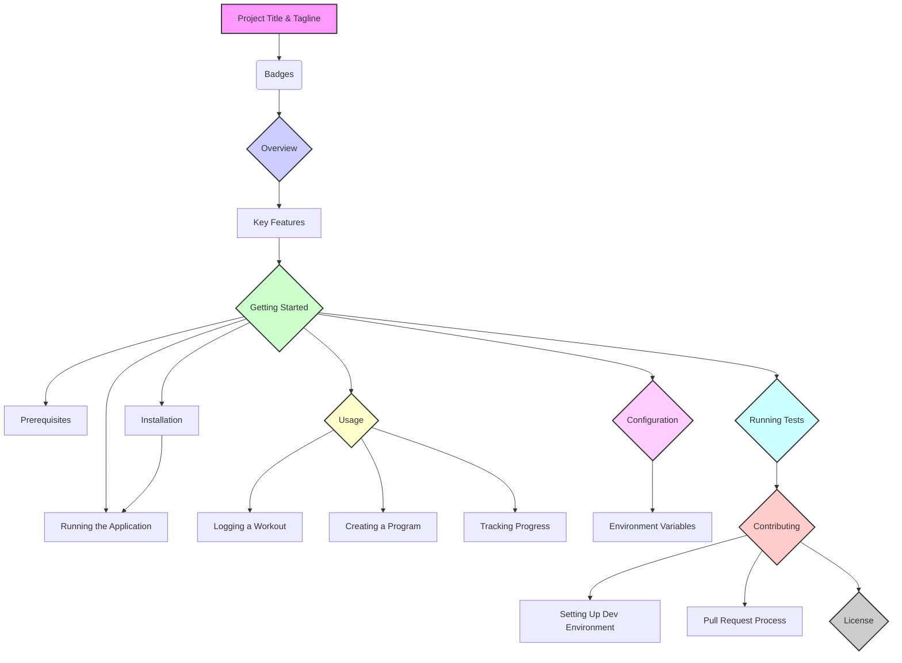

# Documentation Rewrite Plan: Exercise Tracker

This document outlines the plan for rewriting the project's documentation.

### Proposed `README.md` Structure

### Content Outline

Here's a breakdown of what each section will contain:

*   **Project Title & Tagline:** "Exercise Tracker" with a compelling tagline like "Your intelligent partner for strength and hypertrophy training."
*   **Badges:** Placeholder badges for build status, license, etc.
*   **Overview:** A compelling introduction based on the PRD's narrative, explaining what the app does, who it's for, and the problem it solves.
*   **Key Features:** A bulleted list derived from the "Functional Requirements" in the PRD (e.g., Workout Logging, Program Library, AI Workout Builder).
*   **Getting Started:**
    *   **Prerequisites:** A list of required software (Node.js, npm, Git) with installation links.
    *   **Installation:** Step-by-step instructions to clone the repository, install dependencies (`npm install`), and set up Firebase.
    *   **Running the Application:** How to start the development server (`npm start`).
*   **Usage:** Clear, practical examples of how to perform core actions in the app, potentially with screenshots or GIFs in the future.
*   **Configuration:** Explanation of the `.env` file and any necessary environment variables (e.g., Firebase API keys). I'll create a clear section on how to get these from the Firebase console.
*   **Running Tests:** Instructions on how to run the test suite using `npm test`.
*   **Contributing:** Guidelines for developers who want to contribute, including how to set up the development environment, the coding standards, and the pull request process.
*   **License:** The project's license (I'll assume MIT for now, but this can be changed).