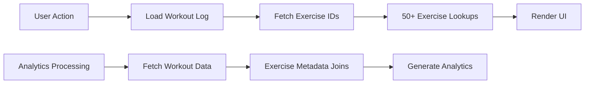
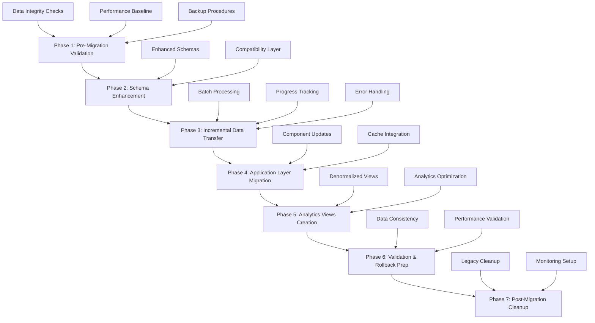
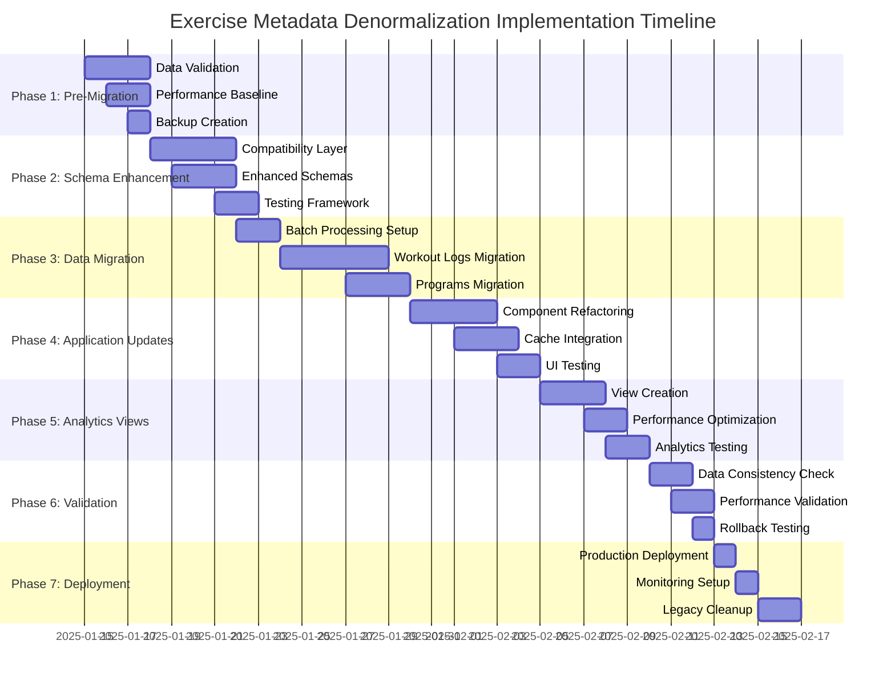

# Exercise Metadata Denormalization Implementation Plan

## Executive Summary

This document provides a comprehensive implementation plan for the **Exercise Metadata Denormalization** project in the TrainingPWA fitness tracking application. The project addresses critical performance bottlenecks by implementing a hybrid denormalization strategy that eliminates 50+ exercise metadata lookups per page while maintaining data consistency and enabling zero-downtime deployment.

### Key Objectives
- **Performance Optimization**: Reduce database reads by 60-80% through embedded exercise metadata
- **User Experience Enhancement**: Improve page load times by 40-60% for workout logging and progress tracking
- **Cost Reduction**: Achieve 90%+ cache hit rates and significant Firestore cost savings
- **Zero Downtime**: Deploy with complete rollback capability and gradual feature rollout
- **Data Integrity**: Maintain 100% data consistency throughout the migration process

### Expected Outcomes
- **Database Read Reduction**: 60-80% fewer Firestore reads for exercise metadata
- **Performance Improvement**: 40-60% faster page loads for workout logging and progress tracking
- **Cache Efficiency**: 90%+ cache hit rate with embedded metadata
- **Cost Savings**: Significant reduction in Firestore read operations costs
- **Scalability**: Enhanced system performance for growing user base

## Current System Analysis

### Architecture Overview

The current system architecture consists of the following key collections:
- **[`exercises`](src/components/ExerciseCreationModal.js:154)**: Master exercise database with metadata
- **[`programs`](src/pages/Programs.js:108)**: User workout programs with exercise references
- **[`workoutLogs`](src/pages/LogWorkout.js:208)**: Individual workout session data
- **[`userAnalytics`](functions/migrate_workout_logs.py:741)**: Aggregated user performance data

### Performance Bottlenecks Identified

#### 1. Exercise Metadata Lookups
- **Current Pattern**: [`exercisesList.find(e => e.id === ex.exerciseId)`](src/pages/LogWorkout.js:17)
- **Frequency**: 50+ lookups per page load
- **Impact**: Significant performance degradation on workout logging and progress pages

#### 2. Data Flow Inefficiencies


#### 3. Current Exercise Metadata Structure
```javascript
// Current exercise document
{
  id: "exercise123",
  name: "Bench Press",
  primaryMuscleGroup: "Chest", 
  exerciseType: "Barbell",
  movementPattern: "Push",
  equipment: "Barbell"
}
```

### Cache System Analysis

The application currently uses an **Enhanced Firestore Cache** system ([`src/api/enhancedFirestoreCache.js`](src/api/enhancedFirestoreCache.js:1)) with:
- **Granular invalidation** capabilities
- **Database read tracking** with cost analysis
- **Performance monitoring** and statistics
- **Cache warming** strategies

#### Current Cache Performance
- **Hit Rate**: ~70-85% depending on usage patterns
- **Read Tracking**: Comprehensive monitoring of Firestore operations
- **Cost Analysis**: Real-time cost calculations based on Firestore pricing
- **Memory Management**: Automatic cleanup and TTL management

## Technical Architecture Design

### Enhanced Data Structures

#### 1. Denormalized Workout Log Structure
```javascript
const enhancedWorkoutLogSchema = {
  id: "log123",
  userId: "user456",
  date: "2025-01-15",
  exercises: [
    {
      exerciseId: "exercise123",
      // EMBEDDED METADATA (NEW)
      exerciseMetadata: {
        name: "Bench Press",
        primaryMuscleGroup: "Chest",
        exerciseType: "Barbell",
        movementPattern: "Push",
        equipment: "Barbell",
        lastUpdated: "2025-01-15T10:00:00Z"
      },
      sets: 3,
      reps: [8, 8, 6],
      weights: [185, 185, 195],
      completed: [true, true, true]
    }
  ],
  isWorkoutFinished: true,
  // DENORMALIZED SUMMARY (NEW)
  workoutSummary: {
    totalVolume: 4440,
    muscleGroupsTargeted: ["Chest", "Triceps", "Shoulders"],
    exerciseTypes: ["Barbell", "Dumbbell"],
    duration: 3600000,
    lastUpdated: "2025-01-15T10:00:00Z"
  }
};
```

#### 2. Enhanced Program Structure
```javascript
const enhancedProgramSchema = {
  id: "program123",
  userId: "user456",
  name: "Push/Pull/Legs",
  weeklyConfigs: {
    0: {
      0: {
        name: "Push Day",
        exercises: [
          {
            exerciseId: "exercise123",
            // EMBEDDED METADATA (NEW)
            exerciseMetadata: {
              name: "Bench Press",
              primaryMuscleGroup: "Chest",
              exerciseType: "Barbell",
              movementPattern: "Push",
              equipment: "Barbell",
              lastUpdated: "2025-01-15T10:00:00Z"
            },
            sets: 3,
            reps: 8,
            notes: ""
          }
        ]
      }
    }
  },
  // PROGRAM SUMMARY (NEW)
  programSummary: {
    totalExercises: 12,
    muscleGroupsTargeted: ["Chest", "Back", "Legs", "Shoulders"],
    exerciseTypes: ["Barbell", "Dumbbell", "Bodyweight"],
    estimatedDuration: 3600000,
    lastUpdated: "2025-01-15T10:00:00Z"
  }
};
```

#### 3. Analytics View Structure
```javascript
const exerciseAnalyticsViewSchema = {
  id: "user456_exercise123",
  userId: "user456",
  exerciseId: "exercise123",
  // EMBEDDED METADATA FOR FAST QUERIES
  exerciseMetadata: {
    name: "Bench Press",
    primaryMuscleGroup: "Chest",
    exerciseType: "Barbell",
    isCompoundLift: true
  },
  // AGGREGATED PERFORMANCE DATA
  performanceMetrics: {
    totalSessions: 45,
    totalVolume: 125000,
    maxWeight: 225,
    avgIntensity: 78.5,
    lastSession: "2025-01-15",
    trend: "improving"
  },
  // RECENT SESSION DATA
  recentSessions: [
    {
      date: "2025-01-15",
      volume: 3200,
      maxWeight: 205,
      sets: 4,
      avgReps: 8
    }
  ],
  lastUpdated: "2025-01-15T10:00:00Z"
};
```

### Indexing Strategy

#### Recommended Firestore Indexes
```javascript
const recommendedIndexes = [
  {
    collection: 'workoutLogs',
    fields: ['userId', 'date'],
    description: 'Optimize user workout history queries'
  },
  {
    collection: 'workoutLogs',
    fields: ['exercises.exerciseMetadata.primaryMuscleGroup'],
    description: 'Enable muscle group filtering'
  },
  {
    collection: 'programs',
    fields: ['userId', 'isCurrent'],
    description: 'Optimize current program queries'
  },
  {
    collection: 'exercisePerformanceView',
    fields: ['userId', 'exerciseMetadata.primaryMuscleGroup'],
    description: 'Optimize analytics queries'
  }
];
```

### Query Optimization Patterns

#### 1. Hybrid Query Strategy
```javascript
class ExerciseMetadataCompatibility {
  static async getExerciseWithMetadata(exerciseId, source = 'embedded') {
    if (source === 'embedded') {
      // Try to get from embedded metadata first
      const cachedMetadata = this.getCachedEmbeddedMetadata(exerciseId);
      if (cachedMetadata && this.isMetadataFresh(cachedMetadata)) {
        return cachedMetadata;
      }
    }
    
    // Fallback to exercises collection
    return await getDocCached('exercises', exerciseId);
  }
  
  static getCachedEmbeddedMetadata(exerciseId) {
    // Check recent workout logs for embedded metadata
    const recentLogs = getCachedData('workoutLogs');
    for (const log of recentLogs) {
      const exercise = log.exercises?.find(ex => ex.exerciseId === exerciseId);
      if (exercise?.exerciseMetadata) {
        return {
          id: exerciseId,
          ...exercise.exerciseMetadata
        };
      }
    }
    
    // Check programs for embedded metadata
    const programs = getCachedData('programs');
    for (const program of programs) {
      for (const week of Object.values(program.weeklyConfigs || {})) {
        for (const day of Object.values(week)) {
          const exercise = day.exercises?.find(ex => ex.exerciseId === exerciseId);
          if (exercise?.exerciseMetadata) {
            return {
              id: exerciseId,
              ...exercise.exerciseMetadata
            };
          }
        }
      }
    }
    
    return null;
  }
}
```

## Migration Strategy

### Migration Overview



### Phase 1: Pre-Migration Data Validation

#### 1.1 Data Integrity Assessment
```javascript
const validateExerciseReferences = async () => {
  const validation = {
    orphanedReferences: [],
    missingMetadata: [],
    inconsistentData: [],
    totalReferences: 0
  };
  
  // Check workout logs for orphaned exercise references
  const workoutLogs = await getCollectionGroupCached('workoutLogs');
  const exercises = await getCollectionCached('exercises');
  const exerciseIds = new Set(exercises.map(e => e.id));
  
  workoutLogs.forEach(log => {
    log.exercises?.forEach(ex => {
      validation.totalReferences++;
      if (!exerciseIds.has(ex.exerciseId)) {
        validation.orphanedReferences.push({
          logId: log.id,
          exerciseId: ex.exerciseId,
          userId: log.userId
        });
      }
    });
  });
  
  // Check programs for orphaned references
  const programs = await getCollectionCached('programs');
  programs.forEach(program => {
    Object.values(program.weeklyConfigs || {}).forEach(week => {
      Object.values(week).forEach(day => {
        day.exercises?.forEach(ex => {
          if (!exerciseIds.has(ex.exerciseId)) {
            validation.orphanedReferences.push({
              programId: program.id,
              exerciseId: ex.exerciseId,
              userId: program.userId
            });
          }
        });
      });
    });
  });
  
  return validation;
};
```

#### 1.2 Performance Baseline Establishment
```javascript
const establishBaseline = async () => {
  const baseline = {
    timestamp: Date.now(),
    metrics: {
      avgWorkoutLogLoad: await measureWorkoutLogPerformance(),
      avgProgressPageLoad: await measureProgressPagePerformance(),
      avgAnalyticsQuery: await measureAnalyticsPerformance(),
      cacheHitRate: getCacheStats().hitRate,
      databaseReads: getCacheStats().databaseReads,
      memoryUsage: getCacheStats().memoryUsage
    },
    testScenarios: {
      loadWorkoutPage: await benchmarkWorkoutPageLoad(),
      loadProgressTracker: await benchmarkProgressTrackerLoad(),
      createWorkoutLog: await benchmarkWorkoutLogCreation(),
      generateAnalytics: await benchmarkAnalyticsGeneration()
    }
  };
  
  // Store baseline for comparison
  await setDoc(doc(db, 'migrationMetrics', 'baseline'), baseline);
  console.log('📊 Performance baseline established:', baseline);
  return baseline;
};
```

#### 1.3 Backup and Rollback Preparation
```javascript
const createMigrationBackup = async () => {
  const backupId = `migration_${Date.now()}`;
  const collections = ['exercises', 'programs', 'workoutLogs', 'userAnalytics'];
  
  console.log(`🔄 Creating migration backup: ${backupId}`);
  
  const backupPromises = collections.map(async (collectionName) => {
    const docs = await getCollectionCached(collectionName);
    return setDoc(doc(db, 'migrationBackups', `${backupId}_${collectionName}`), {
      data: docs,
      timestamp: Date.now(),
      collectionName,
      documentCount: docs.length
    });
  });
  
  await Promise.all(backupPromises);
  
  // Create backup manifest
  await setDoc(doc(db, 'migrationBackups', `${backupId}_manifest`), {
    backupId,
    timestamp: Date.now(),
    collections,
    status: 'completed',
    totalDocuments: collections.length
  });
  
  console.log(`✅ Migration backup completed: ${backupId}`);
  return backupId;
};
```

### Phase 2: Schema Enhancement & Compatibility Layer

#### 2.1 Compatibility Layer Implementation
```javascript
class ExerciseMetadataCompatibility {
  static async getExerciseWithMetadata(exerciseId, source = 'embedded') {
    if (source === 'embedded') {
      // Try to get from embedded metadata first
      const cachedMetadata = this.getCachedEmbeddedMetadata(exerciseId);
      if (cachedMetadata && this.isMetadataFresh(cachedMetadata)) {
        return cachedMetadata;
      }
    }
    
    // Fallback to exercises collection
    return await getDocCached('exercises', exerciseId);
  }
  
  static isMetadataFresh(metadata, maxAge = 24 * 60 * 60 * 1000) { // 24 hours
    if (!metadata.lastUpdated) return false;
    const age = Date.now() - new Date(metadata.lastUpdated).getTime();
    return age < maxAge;
  }
  
  // Hybrid query function
  static async getExerciseList(useEmbedded = true) {
    if (useEmbedded) {
      const embeddedExercises = this.getEmbeddedExerciseList();
      if (embeddedExercises.length > 0) {
        // Fill gaps with master collection
        const masterExercises = await getCollectionCached('exercises');
        const embeddedIds = new Set(embeddedExercises.map(e => e.id));
        const missingExercises = masterExercises.filter(e => !embeddedIds.has(e.id));
        
        return [...embeddedExercises, ...missingExercises];
      }
    }
    
    // Fallback to master collection
    return await getCollectionCached('exercises');
  }
}
```

### Phase 3: Incremental Data Transfer Mechanisms

#### 3.1 Batch Processing System
```javascript
class IncrementalMigrationProcessor {
  constructor() {
    this.batchSize = 50;
    this.concurrency = 3;
    this.retryAttempts = 3;
    this.progressTracking = new Map();
    this.errorHandler = new MigrationErrorHandler();
  }
  
  async migrateWorkoutLogs() {
    console.log('🚀 Starting workout logs migration...');
    
    const allLogs = await getCollectionGroupCached('workoutLogs');
    const batches = this.createBatches(allLogs, this.batchSize);
    
    console.log(`📊 Processing ${allLogs.length} logs in ${batches.length} batches`);
    
    for (let i = 0; i < batches.length; i += this.concurrency) {
      const concurrentBatches = batches.slice(i, i + this.concurrency);
      
      await Promise.all(
        concurrentBatches.map((batch, index) => 
          this.processBatch(batch, i + index)
        )
      );
      
      // Progress tracking
      const progress = ((i + this.concurrency) / batches.length) * 100;
      console.log(`📊 Migration progress: ${Math.min(progress, 100).toFixed(1)}%`);
      
      // Rate limiting to avoid overwhelming Firestore
      await this.delay(100);
    }
    
    // Process any retry queue
    await this.errorHandler.processRetryQueue();
    
    console.log('✅ Workout logs migration completed');
    return this.generateMigrationSummary();
  }
  
  async enhanceLogWithMetadata(log, exerciseCache) {
    const enhancedExercises = [];
    let totalVolume = 0;
    const muscleGroupsTargeted = new Set();
    const exerciseTypes = new Set();
    
    for (const exercise of log.exercises || []) {
      // Get or cache exercise metadata
      let metadata = exerciseCache.get(exercise.exerciseId);
      if (!metadata) {
        metadata = await getDocCached('exercises', exercise.exerciseId);
        if (!metadata) {
          throw new Error(`Exercise not found: ${exercise.exerciseId}`);
        }
        exerciseCache.set(exercise.exerciseId, metadata);
      }
      
      // Calculate volume and collect summary data
      const exerciseVolume = this.calculateExerciseVolume(exercise, metadata);
      totalVolume += exerciseVolume;
      muscleGroupsTargeted.add(metadata.primaryMuscleGroup);
      exerciseTypes.add(metadata.exerciseType);
      
      enhancedExercises.push({
        ...exercise,
        exerciseMetadata: {
          name: metadata.name,
          primaryMuscleGroup: metadata.primaryMuscleGroup,
          exerciseType: metadata.exerciseType,
          movementPattern: metadata.movementPattern || 'Unknown',
          equipment: metadata.equipment || 'Unknown',
          lastUpdated: new Date().toISOString()
        }
      });
    }
    
    return {
      ...log,
      exercises: enhancedExercises,
      workoutSummary: {
        totalVolume,
        muscleGroupsTargeted: Array.from(muscleGroupsTargeted),
        exerciseTypes: Array.from(exerciseTypes),
        lastUpdated: new Date().toISOString()
      }
    };
  }
}
```

#### 3.2 Error Handling and Recovery
```javascript
class MigrationErrorHandler {
  constructor() {
    this.errorLog = [];
    this.retryQueue = [];
    this.maxRetries = 3;
    this.retryDelay = 1000; // 1 second base delay
  }
  
  async handleMigrationError(documentId, error, context = {}) {
    const errorRecord = {
      documentId,
      error: error.message,
      stack: error.stack,
      context,
      timestamp: Date.now(),
      retryCount: 0,
      category: this.categorizeError(error)
    };
    
    this.errorLog.push(errorRecord);
    
    // Log to Firestore for persistence
    await this.persistError(errorRecord);
    
    // Categorize error and determine retry strategy
    if (this.isRetryableError(error)) {
      this.retryQueue.push(errorRecord);
      console.warn(`⚠️ Retryable error for ${documentId}: ${error.message}`);
    } else {
      console.error(`💥 Non-retryable error for ${documentId}:`, error);
      await this.logCriticalError(errorRecord);
    }
  }
  
  categorizeError(error) {
    if (error.message.includes('DEADLINE_EXCEEDED')) return 'timeout';
    if (error.message.includes('UNAVAILABLE')) return 'service_unavailable';
    if (error.message.includes('RESOURCE_EXHAUSTED')) return 'rate_limit';
    if (error.message.includes('PERMISSION_DENIED')) return 'permission';
    if (error.message.includes('NOT_FOUND')) return 'not_found';
    return 'unknown';
  }
  
  isRetryableError(error) {
    const retryableCategories = ['timeout', 'service_unavailable', 'rate_limit'];
    return retryableCategories.includes(this.categorizeError(error));
  }
}
```

## Document Size Limitations and Solutions

### Firestore 1MB Document Limit

#### Problem Analysis
- **Current Risk**: Large workout logs with embedded metadata may approach 1MB limit
- **Calculation**: ~50 exercises × 20KB metadata = 1MB potential size
- **Impact**: Document write failures and data corruption

#### Solution: Document Sharding Strategy

```javascript
class DocumentShardingManager {
  constructor() {
    this.maxDocumentSize = 900 * 1024; // 900KB safety margin
    this.maxExercisesPerShard = 20; // Conservative limit
  }
  
  async saveWorkoutLogWithSharding(workoutLog) {
    const estimatedSize = this.estimateDocumentSize(workoutLog);
    
    if (estimatedSize > this.maxDocumentSize || workoutLog.exercises.length > this.maxExercisesPerShard) {
      return await this.saveShardedWorkoutLog(workoutLog);
    } else {
      return await this.saveSingleWorkoutLog(workoutLog);
    }
  }
  
  async saveShardedWorkoutLog(workoutLog) {
    const shards = this.createExerciseShards(workoutLog.exercises);
    const shardPromises = [];
    
    // Save main document with summary
    const mainDoc = {
      ...workoutLog,
      exercises: [], // Empty exercises array
      isSharded: true,
      shardCount: shards.length,
      workoutSummary: this.calculateWorkoutSummary(workoutLog.exercises)
    };
    
    const mainDocRef = await addDoc(collection(db, "workoutLogs"), mainDoc);
    
    // Save exercise shards
    for (let i = 0; i < shards.length; i++) {
      const shardDoc = {
        parentLogId: mainDocRef.id,
        shardIndex: i,
        exercises: shards[i],
        userId: workoutLog.userId,
        date: workoutLog.date
      };
      
      shardPromises.push(
        addDoc(collection(db, "workoutLogShards"), shardDoc)
      );
    }
    
    await Promise.all(shardPromises);
    return mainDocRef.id;
  }
  
  async loadShardedWorkoutLog(logId) {
    // Load main document
    const mainDoc = await getDoc(doc(db, "workoutLogs", logId));
    if (!mainDoc.exists()) return null;
    
    const logData = mainDoc.data();
    
    if (!logData.isSharded) {
      return logData; // Return non-sharded document as-is
    }
    
    // Load all shards
    const shardsQuery = query(
      collection(db, "workoutLogShards"),
      where("parentLogId", "==", logId),
      orderBy("shardIndex")
    );
    
    const shardsSnapshot = await getDocs(shardsQuery);
    const allExercises = [];
    
    shardsSnapshot.docs.forEach(shardDoc => {
      const shardData = shardDoc.data();
      allExercises.push(...shardData.exercises);
    });
    
    return {
      ...logData,
      exercises: allExercises
    };
  }
  
  createExerciseShards(exercises) {
    const shards = [];
    let currentShard = [];
    let currentShardSize = 0;
    
    for (const exercise of exercises) {
      const exerciseSize = this.estimateExerciseSize(exercise);
      
      if (currentShardSize + exerciseSize > this.maxDocumentSize || 
          currentShard.length >= this.maxExercisesPerShard) {
        if (currentShard.length > 0) {
          shards.push([...currentShard]);
          currentShard = [];
          currentShardSize = 0;
        }
      }
      
      currentShard.push(exercise);
      currentShardSize += exerciseSize;
    }
    
    if (currentShard.length > 0) {
      shards.push(currentShard);
    }
    
    return shards;
  }
  
  estimateDocumentSize(document) {
    return JSON.stringify(document).length;
  }
  
  estimateExerciseSize(exercise) {
    return JSON.stringify(exercise).length;
  }
}
```

#### Monitoring and Alerting
```javascript
class DocumentSizeMonitor {
  constructor() {
    this.sizeThreshold = 800 * 1024; // 800KB warning threshold
    this.alertThreshold = 900 * 1024; // 900KB critical threshold
  }
  
  async monitorDocumentSizes() {
    const largeDocs = [];
    
    // Monitor workout logs
    const workoutLogs = await getCollectionGroupCached('workoutLogs');
    
    for (const log of workoutLogs) {
      const size = JSON.stringify(log).length;
      
      if (size > this.sizeThreshold) {
        largeDocs.push({
          collection: 'workoutLogs',
          id: log.id,
          size,
          userId: log.userId,
          exerciseCount: log.exercises?.length || 0
        });
        
        if (size > this.alertThreshold) {
          await this.sendSizeAlert(log.id, size, 'workoutLogs');
        }
      }
    }
    
    return largeDocs;
  }
  
  async sendSizeAlert(docId, size, collection) {
    const alert = {
      type: 'document_size_warning',
      collection,
      documentId: docId,
      size,
      threshold: this.alertThreshold,
      timestamp: Date.now(),
      action: 'Consider implementing sharding for this document'
    };
    
    await setDoc(doc(db, 'systemAlerts', `size_${docId}`), alert);
    console.warn(`🚨 Document size alert: ${collection}/${docId} is ${size} bytes`);
  }
}
```

## Concurrent Operations Handling

### Optimistic Locking Strategy

```javascript
class OptimisticLockingManager {
  constructor() {
    this.maxRetries = 3;
    this.baseDelay = 100; // Base delay in milliseconds
  }
  
  async updateWithOptimisticLocking(docRef, updateFn, retryCount = 0) {
    try {
      return await db.runTransaction(async (transaction) => {
        const doc = await transaction.get(docRef);
        
        if (!doc.exists()) {
          throw new Error('Document does not exist');
        }
        
        const currentData = doc.data();
        const updatedData = await updateFn(currentData);
        
        // Add version field for optimistic locking
        updatedData.version = (currentData.version || 0) + 1;
        updatedData.lastUpdated = new Date().toISOString();
        
        transaction.update(docRef, updatedData);
        return updatedData;
      });
    } catch (error) {
      if (error.code === 'aborted' && retryCount < this.maxRetries) {
        // Exponential backoff
        const delay = this.baseDelay * Math.pow(2, retryCount);
        await this.delay(delay);
        
        console.log(`🔄 Retrying transaction (attempt ${retryCount + 1}/${this.maxRetries})`);
        return this.updateWithOptimisticLocking(docRef, updateFn, retryCount + 1);
      }
      
      throw error;
    }
  }
  
  delay(ms) {
    return new Promise(resolve => setTimeout(resolve, ms));
  }
}
```

### Conflict Resolution

```javascript
class ConflictResolutionManager {
  constructor() {
    this.conflictStrategies = {
      'last_write_wins': this.lastWriteWins,
      'merge_changes': this.mergeChanges,
      'user_prompt': this.promptUserResolution
    };
  }
  
  async resolveConflict(conflictType, localData, remoteData, strategy = 'merge_changes') {
    const resolver = this.conflictStrategies[strategy];
    if (!resolver) {
      throw new Error(`Unknown conflict resolution strategy: ${strategy}`);
    }
    
    return await resolver.call(this, localData, remoteData);
  }
  
  lastWriteWins(localData, remoteData) {
    // Simple strategy: use the data with the latest timestamp
    const localTime = new Date(localData.lastUpdated || 0).getTime();
    const remoteTime = new Date(remoteData.lastUpdated || 0).getTime();
    
    return localTime > remoteTime ? localData : remoteData;
  }
  
  mergeChanges(localData, remoteData) {
    // Intelligent merge strategy for exercise metadata
    const merged = { ...remoteData };
    
    // Merge exercise arrays
    if (localData.exercises && remoteData.exercises) {
      const exerciseMap = new Map();
      
      // Add remote exercises first
      remoteData.exercises.forEach(ex => {
        exerciseMap.set(ex.exerciseId, ex);
      });
      
      // Merge local changes
      localData.exercises.forEach(localEx => {
        const remoteEx = exerciseMap.get(localEx.exerciseId);
        if (remoteEx) {
          // Merge exercise data intellig
ently
          exerciseMap.set(localEx.exerciseId, {
            ...remoteEx,
            // Preserve local changes for specific fields
            notes: localEx.notes || remoteEx.notes,
            completed: localEx.completed || remoteEx.completed,
            // Use latest metadata
            exerciseMetadata: this.mergeMetadata(localEx.exerciseMetadata, remoteEx.exerciseMetadata)
          });
        } else {
          // Local exercise not in remote - add it
          exerciseMap.set(localEx.exerciseId, localEx);
        }
      });
      
      merged.exercises = Array.from(exerciseMap.values());
    }
    
    return merged;
  }
  
  mergeMetadata(localMeta, remoteMeta) {
    if (!localMeta) return remoteMeta;
    if (!remoteMeta) return localMeta;
    
    // Use the metadata with the latest timestamp
    const localTime = new Date(localMeta.lastUpdated || 0).getTime();
    const remoteTime = new Date(remoteMeta.lastUpdated || 0).getTime();
    
    return localTime > remoteTime ? localMeta : remoteMeta;
  }
}
```

## Application Code Refactoring

### Component Updates

#### 1. LogWorkout Component Enhancement

```javascript
// Enhanced LogWorkout component with embedded metadata support
import React, { useState, useEffect, useCallback } from 'react';
import { ExerciseMetadataCompatibility } from '../utils/exerciseMetadataCompatibility';

function LogWorkout() {
  const [exercisesList, setExercisesList] = useState([]);
  const [logData, setLogData] = useState([]);
  const [useEmbeddedMetadata, setUseEmbeddedMetadata] = useState(true);

  // Enhanced exercise loading with embedded metadata support
  useEffect(() => {
    const loadExercises = async () => {
      try {
        // Use hybrid approach - embedded first, fallback to master collection
        const exercises = await ExerciseMetadataCompatibility.getExerciseList(useEmbeddedMetadata);
        setExercisesList(exercises);
        
        // Track performance improvement
        const cacheStats = getCacheStats();
        console.log(`📊 Exercise loading - Cache hit rate: ${cacheStats.hitRate}%`);
      } catch (error) {
        console.error('Error loading exercises:', error);
        // Fallback to master collection
        const fallbackExercises = await getCollectionCached('exercises');
        setExercisesList(fallbackExercises);
      }
    };
    
    loadExercises();
  }, [useEmbeddedMetadata]);

  // Enhanced exercise lookup with embedded metadata
  const getExerciseMetadata = useCallback((exerciseId) => {
    // First try to get from embedded metadata in current log data
    const currentExercise = logData.find(ex => ex.exerciseId === exerciseId);
    if (currentExercise?.exerciseMetadata) {
      return {
        id: exerciseId,
        ...currentExercise.exerciseMetadata
      };
    }
    
    // Fallback to exercises list
    return exercisesList.find(e => e.id === exerciseId);
  }, [logData, exercisesList]);

  // Enhanced workout log saving with embedded metadata
  const saveWorkoutLog = async (workoutData) => {
    try {
      // Ensure all exercises have embedded metadata
      const enhancedExercises = await Promise.all(
        workoutData.exercises.map(async (exercise) => {
          if (!exercise.exerciseMetadata) {
            const metadata = await ExerciseMetadataCompatibility.getExerciseWithMetadata(exercise.exerciseId);
            return {
              ...exercise,
              exerciseMetadata: {
                name: metadata.name,
                primaryMuscleGroup: metadata.primaryMuscleGroup,
                exerciseType: metadata.exerciseType,
                movementPattern: metadata.movementPattern || 'Unknown',
                equipment: metadata.equipment || 'Unknown',
                lastUpdated: new Date().toISOString()
              }
            };
          }
          return exercise;
        })
      );

      // Calculate workout summary
      const workoutSummary = calculateWorkoutSummary(enhancedExercises);

      const enhancedWorkoutLog = {
        ...workoutData,
        exercises: enhancedExercises,
        workoutSummary,
        lastUpdated: new Date().toISOString()
      };

      // Use document sharding if necessary
      const shardingManager = new DocumentShardingManager();
      await shardingManager.saveWorkoutLogWithSharding(enhancedWorkoutLog);
      
      // Invalidate relevant caches
      invalidateWorkoutCache(user.uid);
      
      console.log('✅ Enhanced workout log saved successfully');
    } catch (error) {
      console.error('Error saving enhanced workout log:', error);
      throw error;
    }
  };

  const calculateWorkoutSummary = (exercises) => {
    let totalVolume = 0;
    const muscleGroupsTargeted = new Set();
    const exerciseTypes = new Set();

    exercises.forEach(exercise => {
      const metadata = exercise.exerciseMetadata;
      if (metadata) {
        muscleGroupsTargeted.add(metadata.primaryMuscleGroup);
        exerciseTypes.add(metadata.exerciseType);
      }

      // Calculate volume based on exercise type
      const volume = calculateExerciseVolume(exercise, metadata);
      totalVolume += volume;
    });

    return {
      totalVolume,
      muscleGroupsTargeted: Array.from(muscleGroupsTargeted),
      exerciseTypes: Array.from(exerciseTypes),
      lastUpdated: new Date().toISOString()
    };
  };

  // Rest of component implementation...
}
```

#### 2. Programs Component Enhancement

```javascript
// Enhanced Programs component with embedded metadata
import React, { useState, useEffect } from 'react';
import { ExerciseMetadataCompatibility } from '../utils/exerciseMetadataCompatibility';

function Programs() {
  const [programs, setPrograms] = useState([]);
  const [selectedProgram, setSelectedProgram] = useState(null);

  // Enhanced program loading with embedded metadata
  const loadPrograms = async () => {
    try {
      const programsData = await getCollectionCached('programs', {
        where: [['userId', '==', user.uid]],
        orderBy: [['createdAt', 'desc']]
      });

      // Enhance programs with embedded metadata if missing
      const enhancedPrograms = await Promise.all(
        programsData.map(async (program) => {
          const enhancedWeeklyConfigs = await enhanceWeeklyConfigsWithMetadata(program.weeklyConfigs);
          const programSummary = calculateProgramSummary(enhancedWeeklyConfigs);

          return {
            ...program,
            weeklyConfigs: enhancedWeeklyConfigs,
            programSummary
          };
        })
      );

      setPrograms(enhancedPrograms);
    } catch (error) {
      console.error('Error loading enhanced programs:', error);
    }
  };

  const enhanceWeeklyConfigsWithMetadata = async (weeklyConfigs) => {
    const enhanced = {};

    for (const [weekKey, week] of Object.entries(weeklyConfigs || {})) {
      enhanced[weekKey] = {};
      
      for (const [dayKey, day] of Object.entries(week)) {
        const enhancedExercises = await Promise.all(
          (day.exercises || []).map(async (exercise) => {
            if (!exercise.exerciseMetadata) {
              const metadata = await ExerciseMetadataCompatibility.getExerciseWithMetadata(exercise.exerciseId);
              return {
                ...exercise,
                exerciseMetadata: {
                  name: metadata.name,
                  primaryMuscleGroup: metadata.primaryMuscleGroup,
                  exerciseType: metadata.exerciseType,
                  movementPattern: metadata.movementPattern || 'Unknown',
                  equipment: metadata.equipment || 'Unknown',
                  lastUpdated: new Date().toISOString()
                }
              };
            }
            return exercise;
          })
        );

        enhanced[weekKey][dayKey] = {
          ...day,
          exercises: enhancedExercises
        };
      }
    }

    return enhanced;
  };

  const calculateProgramSummary = (weeklyConfigs) => {
    let totalExercises = 0;
    const muscleGroupsTargeted = new Set();
    const exerciseTypes = new Set();
    let estimatedDuration = 0;

    Object.values(weeklyConfigs).forEach(week => {
      Object.values(week).forEach(day => {
        totalExercises += day.exercises?.length || 0;
        
        day.exercises?.forEach(exercise => {
          const metadata = exercise.exerciseMetadata;
          if (metadata) {
            muscleGroupsTargeted.add(metadata.primaryMuscleGroup);
            exerciseTypes.add(metadata.exerciseType);
          }
          
          // Estimate 3 minutes per set
          estimatedDuration += (exercise.sets || 3) * 3 * 60 * 1000;
        });
      });
    });

    return {
      totalExercises,
      muscleGroupsTargeted: Array.from(muscleGroupsTargeted),
      exerciseTypes: Array.from(exerciseTypes),
      estimatedDuration,
      lastUpdated: new Date().toISOString()
    };
  };

  // Rest of component implementation...
}
```

### Backward Compatibility Layer

```javascript
// Backward compatibility utilities
class BackwardCompatibilityManager {
  static async migrateOldWorkoutLog(oldLog) {
    // Handle old workout log format without embedded metadata
    const enhancedExercises = await Promise.all(
      (oldLog.exercises || []).map(async (exercise) => {
        const metadata = await getDocCached('exercises', exercise.exerciseId);
        
        return {
          ...exercise,
          exerciseMetadata: {
            name: metadata?.name || 'Unknown Exercise',
            primaryMuscleGroup: metadata?.primaryMuscleGroup || 'Unknown',
            exerciseType: metadata?.exerciseType || 'Unknown',
            movementPattern: metadata?.movementPattern || 'Unknown',
            equipment: metadata?.equipment || 'Unknown',
            lastUpdated: new Date().toISOString()
          }
        };
      })
    );

    return {
      ...oldLog,
      exercises: enhancedExercises,
      workoutSummary: this.calculateWorkoutSummary(enhancedExercises),
      migrated: true,
      migratedAt: new Date().toISOString()
    };
  }

  static isOldFormat(document) {
    // Check if document uses old format (no embedded metadata)
    if (!document.exercises || document.exercises.length === 0) return false;
    
    return !document.exercises[0].exerciseMetadata;
  }

  static async ensureMetadataPresent(document) {
    if (this.isOldFormat(document)) {
      return await this.migrateOldWorkoutLog(document);
    }
    
    return document;
  }
}
```

## Implementation Challenges and Solutions

### Challenge 1: Race Conditions During Migration

#### Problem
Multiple users updating the same exercise metadata simultaneously during migration could cause data inconsistencies.

#### Solution: Distributed Locking
```javascript
class DistributedLockManager {
  constructor() {
    this.lockTimeout = 30000; // 30 seconds
    this.lockCollection = 'migrationLocks';
  }

  async acquireLock(resourceId, operationId) {
    const lockDoc = doc(db, this.lockCollection, resourceId);
    const lockData = {
      operationId,
      timestamp: Date.now(),
      expiresAt: Date.now() + this.lockTimeout
    };

    try {
      await runTransaction(db, async (transaction) => {
        const existingLock = await transaction.get(lockDoc);
        
        if (existingLock.exists()) {
          const lockInfo = existingLock.data();
          
          // Check if lock is expired
          if (lockInfo.expiresAt > Date.now()) {
            throw new Error(`Resource ${resourceId} is locked by operation ${lockInfo.operationId}`);
          }
        }
        
        transaction.set(lockDoc, lockData);
      });
      
      console.log(`🔒 Acquired lock for ${resourceId}`);
      return true;
    } catch (error) {
      console.warn(`⚠️ Failed to acquire lock for ${resourceId}:`, error.message);
      return false;
    }
  }

  async releaseLock(resourceId, operationId) {
    const lockDoc = doc(db, this.lockCollection, resourceId);
    
    try {
      await runTransaction(db, async (transaction) => {
        const existingLock = await transaction.get(lockDoc);
        
        if (existingLock.exists()) {
          const lockInfo = existingLock.data();
          
          if (lockInfo.operationId === operationId) {
            transaction.delete(lockDoc);
          }
        }
      });
      
      console.log(`🔓 Released lock for ${resourceId}`);
    } catch (error) {
      console.error(`Error releasing lock for ${resourceId}:`, error);
    }
  }
}
```

### Challenge 2: Data Consistency Validation

#### Problem
Ensuring embedded metadata stays synchronized with master exercise collection.

#### Solution: Consistency Monitoring
```javascript
class DataConsistencyMonitor {
  constructor() {
    this.inconsistencyThreshold = 0.05; // 5% inconsistency threshold
    this.checkInterval = 60 * 60 * 1000; // 1 hour
  }

  async startMonitoring() {
    console.log('🔍 Starting data consistency monitoring...');
    
    setInterval(async () => {
      await this.performConsistencyCheck();
    }, this.checkInterval);
    
    // Initial check
    await this.performConsistencyCheck();
  }

  async performConsistencyCheck() {
    try {
      const inconsistencies = await this.detectInconsistencies();
      
      if (inconsistencies.length > 0) {
        const inconsistencyRate = inconsistencies.length / this.getTotalDocuments();
        
        if (inconsistencyRate > this.inconsistencyThreshold) {
          await this.triggerConsistencyAlert(inconsistencies, inconsistencyRate);
        }
        
        // Auto-repair minor inconsistencies
        await this.repairInconsistencies(inconsistencies);
      }
      
      console.log(`✅ Consistency check completed. Found ${inconsistencies.length} inconsistencies.`);
    } catch (error) {
      console.error('Error during consistency check:', error);
    }
  }

  async detectInconsistencies() {
    const inconsistencies = [];
    
    // Get master exercise data
    const masterExercises = await getCollectionCached('exercises');
    const exerciseMap = new Map(masterExercises.map(ex => [ex.id, ex]));
    
    // Check workout logs
    const workoutLogs = await getCollectionGroupCached('workoutLogs');
    
    for (const log of workoutLogs) {
      for (const exercise of log.exercises || []) {
        if (exercise.exerciseMetadata) {
          const masterData = exerciseMap.get(exercise.exerciseId);
          
          if (masterData && this.isMetadataInconsistent(exercise.exerciseMetadata, masterData)) {
            inconsistencies.push({
              type: 'workout_log_metadata',
              documentId: log.id,
              exerciseId: exercise.exerciseId,
              embedded: exercise.exerciseMetadata,
              master: masterData,
              severity: this.calculateInconsistencySeverity(exercise.exerciseMetadata, masterData)
            });
          }
        }
      }
    }
    
    return inconsistencies;
  }

  isMetadataInconsistent(embedded, master) {
    const criticalFields = ['name', 'primaryMuscleGroup', 'exerciseType'];
    
    return criticalFields.some(field => embedded[field] !== master[field]);
  }

  async repairInconsistencies(inconsistencies) {
    const repairPromises = inconsistencies
      .filter(inc => inc.severity === 'low')
      .map(inc => this.repairSingleInconsistency(inc));
    
    await Promise.allSettled(repairPromises);
  }

  async repairSingleInconsistency(inconsistency) {
    try {
      const lockManager = new DistributedLockManager();
      const operationId = `repair_${Date.now()}`;
      
      if (await lockManager.acquireLock(inconsistency.documentId, operationId)) {
        // Update embedded metadata with master data
        await this.updateEmbeddedMetadata(inconsistency);
        await lockManager.releaseLock(inconsistency.documentId, operationId);
        
        console.log(`🔧 Repaired inconsistency in ${inconsistency.documentId}`);
      }
    } catch (error) {
      console.error(`Error repairing inconsistency in ${inconsistency.documentId}:`, error);
    }
  }
}
```

### Challenge 3: Performance Degradation During Migration

#### Problem
Migration process could impact application performance for active users.

#### Solution: Adaptive Rate Limiting
```javascript
class AdaptiveRateLimiter {
  constructor() {
    this.baseDelay = 100; // Base delay in milliseconds
    this.maxDelay = 5000; // Maximum delay
    this.performanceThreshold = 1000; // Response time threshold in ms
    this.currentDelay = this.baseDelay;
    this.performanceHistory = [];
  }

  async executeWithRateLimit(operation) {
    const startTime = Date.now();
    
    try {
      const result = await operation();
      const responseTime = Date.now() - startTime;
      
      this.updatePerformanceMetrics(responseTime);
      this.adjustRateLimit(responseTime);
      
      await this.delay(this.currentDelay);
      
      return result;
    } catch (error) {
      // Increase delay on errors
      this.currentDelay = Math.min(this.currentDelay * 2, this.maxDelay);
      throw error;
    }
  }

  updatePerformanceMetrics(responseTime) {
    this.performanceHistory.push(responseTime);
    
    // Keep only last 100 measurements
    if (this.performanceHistory.length > 100) {
      this.performanceHistory.shift();
    }
  }

  adjustRateLimit(responseTime) {
    const avgResponseTime = this.performanceHistory.reduce((a, b) => a + b, 0) / this.performanceHistory.length;
    
    if (avgResponseTime > this.performanceThreshold) {
      // Slow down if performance is degrading
      this.currentDelay = Math.min(this.currentDelay * 1.5, this.maxDelay);
    } else if (avgResponseTime < this.performanceThreshold * 0.5) {
      // Speed up if performance is good
      this.currentDelay = Math.max(this.currentDelay * 0.8, this.baseDelay);
    }
  }

  delay(ms) {
    return new Promise(resolve => setTimeout(resolve, ms));
  }
}
```

## Implementation Roadmap

### Phase-by-Phase Timeline



### Milestone Definitions

#### Milestone 1: Migration Readiness (Phase 1-2 Complete)
**Success Criteria:**
- [ ] All data integrity issues identified and resolved
- [ ] Performance baseline established and documented
- [ ] Complete backup system operational
- [ ] Compatibility layer tested and functional
- [ ] Enhanced schemas validated

**Deliverables:**
- Data validation report
- Performance baseline metrics
- Backup verification report
- Compatibility layer documentation
- Schema enhancement specification

#### Milestone 2: Data Migration Complete (Phase 3 Complete)
**Success Criteria:**
- [ ] 100% of workout logs migrated with embedded metadata
- [ ] 100% of programs enhanced with embedded metadata
- [ ] Zero data loss during migration
- [ ] Migration error rate < 0.1%
- [ ] Performance impact < 10% during migration

**Deliverables:**
- Migration completion report
- Error analysis and resolution log
- Performance impact assessment
- Data consistency validation report

#### Milestone 3: Application Enhancement (Phase 4-5 Complete)
**Success Criteria:**
- [ ] All components updated to use embedded metadata
- [ ] Cache hit rate improved to >90%
- [ ] Page load times improved by 40-60%
- [ ] Analytics views operational and optimized
- [ ] User experience testing passed

**Deliverables:**
- Component refactoring documentation
- Performance improvement metrics
- Analytics views specification
- User acceptance testing results

#### Milestone 4: Production Deployment (Phase 6-7 Complete)
**Success Criteria:**
- [ ] Data consistency maintained at 99.9%+
- [ ] Performance targets achieved
- [ ] Rollback procedures tested and verified
- [ ] Production deployment successful
- [ ] Monitoring and alerting operational

**Deliverables:**
- Production deployment report
- Performance validation results
- Monitoring dashboard setup
- Post-deployment optimization plan

### Resource Requirements

#### Development Team
- **Lead Developer**: Full-time for 4 weeks
- **Backend Developer**: Full-time for 3 weeks  
- **Frontend Developer**: Full-time for 2 weeks
- **QA Engineer**: Part-time for 4 weeks
- **DevOps Engineer**: Part-time for 2 weeks

#### Infrastructure Requirements
- **Development Environment**: Enhanced Firestore emulator setup
- **Staging Environment**: Production-like environment for testing
- **Monitoring Tools**: Enhanced logging and performance monitoring
- **Backup Storage**: Additional storage for migration backups

#### Testing Requirements
- **Unit Tests**: 95% code coverage for new functionality
- **Integration Tests**: End-to-end migration testing
- **Performance Tests**: Load testing with embedded metadata
- **User Acceptance Tests**: Real-world usage scenarios

## Risk Assessment and Mitigation

### High-Risk Areas

#### Risk 1: Data Loss During Migration
**Probability**: Low | **Impact**: Critical

**Mitigation Strategies:**
- Comprehensive backup system before migration
- Incremental migration with rollback points
- Real-time data validation during migration
- Automated rollback triggers for critical errors

**Monitoring:**
```javascript
const migrationSafetyMonitor = {
  dataLossThreshold: 0, // Zero tolerance for data loss
  consistencyThreshold: 99.9, // 99.9% consistency required
  
  async checkMigrationSafety() {
    const metrics = await this.gatherSafetyMetrics();
    
    if (metrics.dataLossRate > this.dataLossThreshold) {
      await this.triggerEmergencyRollback('Data loss detected');
    }
    
    if (metrics.consistencyRate < this.consistencyThreshold) {
      await this.pauseMigration('Consistency threshold breached');
    }
  }
};
```

#### Risk 2: Performance Degradation
**Probability**: Medium | **Impact**: High

**Mitigation Strategies:**
- Adaptive rate limiting during migration
- Performance monitoring with automatic throttling
- Staged rollout with performance validation
- Immediate rollback capability for performance issues

**Performance Safeguards:**
```javascript
const performanceSafeguards = {
  maxResponseTime: 2000, // 2 second maximum
  maxCpuUsage: 80, // 80% CPU threshold
  maxMemoryUsage: 85, // 85% memory threshold
  
  async monitorPerformance() {
    const metrics = await this.getCurrentMetrics();
    
    if (metrics.responseTime > this.maxResponseTime) {
      await this.activatePerformanceMode();
    }
    
    if (metrics.cpuUsage > this.maxCpuUsage || metrics.memoryUsage > this.maxMemoryUsage) {
      await this.throttleMigration();
    }
  }
};
```

#### Risk 3: Document Size Limit Exceeded
**Probability**: Medium | **Impact**: Medium

**Mitigation Strategies:**
- Proactive document size monitoring
- Automatic sharding for large documents
- Size estimation before writes
- Gradual metadata embedding to stay under limits

#### Risk 4: Concurrent Update Conflicts
**Probability**: Medium | **Impact**: Medium

**Mitigation Strategies:**
- Optimistic locking with retry logic
- Distributed locking for critical operations
- Conflict resolution strategies
- Transaction-based updates where possible

### Medium-Risk Areas

#### Risk 5: Cache Invalidation Issues
**Probability**: Medium | **Impact**: Medium

**Mitigation Strategies:**
- Granular cache invalidation patterns
- Cache warming after invalidation
- Fallback to database queries
- Cache consistency monitoring

#### Risk 6: User Experience Disruption
**Probability**: Low | **Impact**: Medium

**Mitigation Strategies:**
- Gradual feature rollout with feature flags
- A/B testing for new functionality
- User feedback collection and monitoring
- Quick rollback for UX issues

### Risk Monitoring Dashboard

```javascript
class RiskMonitoringDashboard {
  constructor() {
    this.risks = new Map();
    this.alertThresholds = {
      critical: 0.95,
      high: 0.80,
      medium: 0.60
    };
  }

  async updateRiskMetrics() {
    const metrics = {
      dataIntegrity: await this.assessDataIntegrity(),
      performance: await this.assessPerformance(),
      userExperience: await this.assessUserExperience(),
      systemStability: await this.assessSystemStability()
    };

    for (const [category, score] of Object.entries(metrics)) {
      this.risks.set(category, {
        score,
        level: this.calculateRiskLevel(score),
        timestamp: Date.now()
      });
    }

    await this.checkAlertThresholds();
  }

  calculateRiskLevel(score) {
    if (score >= this.alertThresholds.critical) return 'critical';
    if (score >= this.alertThresholds.high) return 'high';
    if (score >= this.alertThresholds.medium) return 'medium';
    return 'low';
  }

  async checkAlertThresholds() {
    for (const [category, risk] of this.risks) {
      if (risk.level === 'critical') {
        await this.triggerCriticalAlert(category, risk);
      }
    }
  }
}
```

## Success Metrics and Validation

### Performance Metrics

#### Database Read Reduction
**Target**: 60-80% reduction in exercise metadata reads

**Measurement**:
```javascript
const performanceMetrics = {
  async measureReadReduction() {
    const baseline = await this.getBaselineMetrics();
    const current = await this.getCurrentMetrics();
    
    const reduction = ((baseline.exerciseReads - current.exerciseReads) / baseline.exerciseReads) * 100;
    
    return {
      baseline: baseline.exerciseReads,
      current: current.exerciseReads,
      reduction: `${reduction.toFixed(1)}%`,
      target: '60-80%',
      status: reduction >= 60 ? 'ACHIEVED' : 'IN_PROGRESS'
    };
  }
};
```

#### Page Load Time Improvement
**Target**: 40-60% improvement in workout logging and progress pages

**Measurement**:
```javascript
const pageLoadMetrics = {
  async measurePageLoadImprovement() {
    const pages = ['workout-log', 'progress-tracker', 'analytics'];
    const results = {};
    
    for (const page of pages) {
      const baseline = await this.getBaselineLoadTime(page);
      const current = await this.getCurrentLoadTime(page);
      const improvement = ((baseline - current) / baseline) * 100;
      
      results[page] = {
        baseline: `${baseline}ms`,
        current: `${current}ms`,
        improvement: `${improvement.toFixed(1)}%`,
        target: '40-60%',
        status: improvement >= 40 ? 'ACHIEVED' : 'IN_PROGRESS'
      };
    }
    
    return results;
  }
};
```

#### Cache Efficiency
**Target**: 90%+ cache hit rate

**Measurement**:
```javascript
const cacheMetrics = {
  async measureCacheEfficiency() {
    const stats = getEnhancedCacheStats();
    const hitRate = parseFloat(stats.cacheHealth.hitRate);
    
    return {
      hitRate: stats.cacheHealth.hitRate,
      target: '90%+',
      status: hitRate >= 90 ? 'ACHIEVED' : 'IN_PROGRESS',
      details: {
        totalQueries: stats.cachePerformance.totalQueries,
        cacheHits: stats.cachePerformance.cacheHits,
        readReduction: stats.cachePerformance.readReductionRate
      }
    };
  }
};
```

### Data Quality Metrics

#### Data Consistency
**Target**: 99.9%+ consistency between embedded and master data

**Validation**:
```javascript
const dataQualityMetrics = {
  async validateDataConsistency() {
    const monitor = new DataConsistencyMonitor();
    
const inconsistencies = await monitor.detectInconsistencies();
    const totalDocuments = await this.getTotalDocumentCount();
    const consistencyRate = ((totalDocuments - inconsistencies.length) / totalDocuments) * 100;
    
    return {
      consistencyRate: `${consistencyRate.toFixed(2)}%`,
      target: '99.9%+',
      status: consistencyRate >= 99.9 ? 'ACHIEVED' : 'NEEDS_ATTENTION',
      inconsistencies: inconsistencies.length,
      totalDocuments
    };
  }
};
```

#### Metadata Completeness
**Target**: 100% of workout logs and programs have embedded metadata

**Validation**:
```javascript
const metadataCompletenessMetrics = {
  async validateMetadataCompleteness() {
    const workoutLogs = await getCollectionGroupCached('workoutLogs');
    const programs = await getCollectionCached('programs');
    
    let workoutLogsWithMetadata = 0;
    let totalWorkoutExercises = 0;
    
    workoutLogs.forEach(log => {
      log.exercises?.forEach(exercise => {
        totalWorkoutExercises++;
        if (exercise.exerciseMetadata) {
          workoutLogsWithMetadata++;
        }
      });
    });
    
    let programsWithMetadata = 0;
    let totalProgramExercises = 0;
    
    programs.forEach(program => {
      Object.values(program.weeklyConfigs || {}).forEach(week => {
        Object.values(week).forEach(day => {
          day.exercises?.forEach(exercise => {
            totalProgramExercises++;
            if (exercise.exerciseMetadata) {
              programsWithMetadata++;
            }
          });
        });
      });
    });
    
    const workoutCompleteness = (workoutLogsWithMetadata / totalWorkoutExercises) * 100;
    const programCompleteness = (programsWithMetadata / totalProgramExercises) * 100;
    
    return {
      workoutLogs: {
        completeness: `${workoutCompleteness.toFixed(1)}%`,
        withMetadata: workoutLogsWithMetadata,
        total: totalWorkoutExercises
      },
      programs: {
        completeness: `${programCompleteness.toFixed(1)}%`,
        withMetadata: programsWithMetadata,
        total: totalProgramExercises
      },
      overall: {
        completeness: `${((workoutLogsWithMetadata + programsWithMetadata) / (totalWorkoutExercises + totalProgramExercises) * 100).toFixed(1)}%`,
        target: '100%',
        status: (workoutCompleteness === 100 && programCompleteness === 100) ? 'ACHIEVED' : 'IN_PROGRESS'
      }
    };
  }
};
```

### User Experience Metrics

#### User Satisfaction
**Target**: Maintain or improve user satisfaction scores

**Measurement**:
```javascript
const userExperienceMetrics = {
  async measureUserSatisfaction() {
    // Collect user feedback and performance perception
    const feedbackData = await this.collectUserFeedback();
    const performancePerception = await this.measurePerformancePerception();
    
    return {
      satisfactionScore: feedbackData.averageRating,
      performanceRating: performancePerception.averageRating,
      target: 'Maintain ≥4.0/5.0',
      status: feedbackData.averageRating >= 4.0 ? 'ACHIEVED' : 'NEEDS_ATTENTION',
      feedback: {
        positive: feedbackData.positiveComments,
        negative: feedbackData.negativeComments,
        suggestions: feedbackData.suggestions
      }
    };
  }
};
```

#### Error Rate Reduction
**Target**: <0.1% error rate in exercise-related operations

**Measurement**:
```javascript
const errorMetrics = {
  async measureErrorReduction() {
    const errorLogs = await this.getErrorLogs();
    const totalOperations = await this.getTotalOperations();
    
    const exerciseRelatedErrors = errorLogs.filter(error => 
      error.category === 'exercise_metadata' || 
      error.operation.includes('exercise')
    );
    
    const errorRate = (exerciseRelatedErrors.length / totalOperations) * 100;
    
    return {
      errorRate: `${errorRate.toFixed(3)}%`,
      target: '<0.1%',
      status: errorRate < 0.1 ? 'ACHIEVED' : 'NEEDS_ATTENTION',
      details: {
        totalErrors: exerciseRelatedErrors.length,
        totalOperations,
        commonErrors: this.categorizeErrors(exerciseRelatedErrors)
      }
    };
  }
};
```

### Business Impact Metrics

#### Cost Reduction
**Target**: 30-50% reduction in Firestore read costs

**Measurement**:
```javascript
const costMetrics = {
  async measureCostReduction() {
    const baseline = await this.getBaselineCosts();
    const current = await this.getCurrentCosts();
    
    const readCostReduction = ((baseline.readCosts - current.readCosts) / baseline.readCosts) * 100;
    const totalCostReduction = ((baseline.totalCosts - current.totalCosts) / baseline.totalCosts) * 100;
    
    return {
      readCostReduction: `${readCostReduction.toFixed(1)}%`,
      totalCostReduction: `${totalCostReduction.toFixed(1)}%`,
      target: '30-50% read cost reduction',
      status: readCostReduction >= 30 ? 'ACHIEVED' : 'IN_PROGRESS',
      monthlySavings: `$${(baseline.totalCosts - current.totalCosts).toFixed(2)}`
    };
  }
};
```

### Validation Testing Framework

```javascript
class ValidationTestingFramework {
  constructor() {
    this.testSuites = [
      'performance',
      'dataQuality',
      'userExperience',
      'businessImpact'
    ];
  }

  async runComprehensiveValidation() {
    console.log('🧪 Starting comprehensive validation testing...');
    
    const results = {};
    
    for (const suite of this.testSuites) {
      console.log(`Running ${suite} validation...`);
      results[suite] = await this.runTestSuite(suite);
    }
    
    const overallStatus = this.calculateOverallStatus(results);
    
    return {
      timestamp: new Date().toISOString(),
      overallStatus,
      results,
      recommendations: this.generateRecommendations(results)
    };
  }

  async runTestSuite(suite) {
    switch (suite) {
      case 'performance':
        return await this.runPerformanceTests();
      case 'dataQuality':
        return await this.runDataQualityTests();
      case 'userExperience':
        return await this.runUserExperienceTests();
      case 'businessImpact':
        return await this.runBusinessImpactTests();
      default:
        throw new Error(`Unknown test suite: ${suite}`);
    }
  }

  async runPerformanceTests() {
    const readReduction = await performanceMetrics.measureReadReduction();
    const pageLoad = await pageLoadMetrics.measurePageLoadImprovement();
    const cache = await cacheMetrics.measureCacheEfficiency();
    
    return {
      readReduction,
      pageLoad,
      cache,
      status: this.determineTestStatus([readReduction, pageLoad, cache])
    };
  }

  async runDataQualityTests() {
    const consistency = await dataQualityMetrics.validateDataConsistency();
    const completeness = await metadataCompletenessMetrics.validateMetadataCompleteness();
    
    return {
      consistency,
      completeness,
      status: this.determineTestStatus([consistency, completeness])
    };
  }

  generateRecommendations(results) {
    const recommendations = [];
    
    // Performance recommendations
    if (results.performance.cache.status !== 'ACHIEVED') {
      recommendations.push({
        category: 'performance',
        priority: 'high',
        action: 'Optimize cache warming strategies to achieve 90%+ hit rate'
      });
    }
    
    // Data quality recommendations
    if (results.dataQuality.consistency.status !== 'ACHIEVED') {
      recommendations.push({
        category: 'dataQuality',
        priority: 'critical',
        action: 'Investigate and resolve data consistency issues immediately'
      });
    }
    
    return recommendations;
  }
}
```

## Monitoring and Maintenance

### Real-Time Monitoring Setup

#### Performance Monitoring Dashboard

```javascript
class PerformanceMonitoringDashboard {
  constructor() {
    this.metrics = {
      responseTime: new MetricCollector('response_time'),
      cacheHitRate: new MetricCollector('cache_hit_rate'),
      errorRate: new MetricCollector('error_rate'),
      throughput: new MetricCollector('throughput')
    };
    
    this.alertThresholds = {
      responseTime: 2000, // 2 seconds
      cacheHitRate: 85, // 85% minimum
      errorRate: 1, // 1% maximum
      throughput: 100 // 100 requests/minute minimum
    };
  }

  async startMonitoring() {
    console.log('📊 Starting performance monitoring dashboard...');
    
    // Real-time metric collection
    setInterval(async () => {
      await this.collectMetrics();
      await this.checkAlerts();
      await this.updateDashboard();
    }, 30000); // Every 30 seconds
    
    // Detailed analysis every hour
    setInterval(async () => {
      await this.performDetailedAnalysis();
    }, 3600000); // Every hour
  }

  async collectMetrics() {
    const currentMetrics = {
      responseTime: await this.measureAverageResponseTime(),
      cacheHitRate: await this.getCacheHitRate(),
      errorRate: await this.calculateErrorRate(),
      throughput: await this.measureThroughput()
    };
    
    for (const [metric, value] of Object.entries(currentMetrics)) {
      this.metrics[metric].addDataPoint(value);
    }
  }

  async checkAlerts() {
    for (const [metric, collector] of Object.entries(this.metrics)) {
      const currentValue = collector.getCurrentValue();
      const threshold = this.alertThresholds[metric];
      
      if (this.isThresholdBreached(metric, currentValue, threshold)) {
        await this.triggerAlert(metric, currentValue, threshold);
      }
    }
  }

  async triggerAlert(metric, currentValue, threshold) {
    const alert = {
      timestamp: new Date().toISOString(),
      metric,
      currentValue,
      threshold,
      severity: this.calculateSeverity(metric, currentValue, threshold),
      recommendations: this.getRecommendations(metric, currentValue)
    };
    
    console.warn(`🚨 Performance Alert: ${metric} = ${currentValue} (threshold: ${threshold})`);
    
    // Send to monitoring system
    await this.sendToMonitoringSystem(alert);
    
    // Auto-remediation for certain issues
    if (alert.severity === 'critical') {
      await this.attemptAutoRemediation(metric, alert);
    }
  }

  async attemptAutoRemediation(metric, alert) {
    switch (metric) {
      case 'cacheHitRate':
        await this.warmCache();
        break;
      case 'responseTime':
        await this.enablePerformanceMode();
        break;
      case 'errorRate':
        await this.activateErrorRecovery();
        break;
    }
  }
}
```

#### Data Consistency Monitoring

```javascript
class DataConsistencyMonitor {
  constructor() {
    this.checkInterval = 300000; // 5 minutes
    this.deepCheckInterval = 3600000; // 1 hour
    this.inconsistencyLog = [];
  }

  async startMonitoring() {
    console.log('🔍 Starting data consistency monitoring...');
    
    // Quick consistency checks
    setInterval(async () => {
      await this.performQuickConsistencyCheck();
    }, this.checkInterval);
    
    // Deep consistency analysis
    setInterval(async () => {
      await this.performDeepConsistencyCheck();
    }, this.deepCheckInterval);
  }

  async performQuickConsistencyCheck() {
    try {
      // Sample-based consistency check for performance
      const sampleSize = 100;
      const inconsistencies = await this.checkSampleConsistency(sampleSize);
      
      if (inconsistencies.length > 0) {
        const inconsistencyRate = (inconsistencies.length / sampleSize) * 100;
        
        if (inconsistencyRate > 5) { // 5% threshold
          await this.triggerConsistencyAlert(inconsistencies, inconsistencyRate);
        }
        
        // Log for trend analysis
        this.inconsistencyLog.push({
          timestamp: Date.now(),
          sampleSize,
          inconsistencies: inconsistencies.length,
          rate: inconsistencyRate
        });
      }
    } catch (error) {
      console.error('Error in quick consistency check:', error);
    }
  }

  async performDeepConsistencyCheck() {
    try {
      console.log('🔬 Performing deep consistency analysis...');
      
      const fullAnalysis = await this.analyzeFullDatasetConsistency();
      
      // Generate consistency report
      const report = {
        timestamp: new Date().toISOString(),
        totalDocuments: fullAnalysis.totalDocuments,
        inconsistentDocuments: fullAnalysis.inconsistencies.length,
        consistencyRate: fullAnalysis.consistencyRate,
        trends: this.analyzeTrends(),
        recommendations: this.generateConsistencyRecommendations(fullAnalysis)
      };
      
      await this.saveConsistencyReport(report);
      
      // Auto-repair if inconsistency rate is manageable
      if (fullAnalysis.consistencyRate > 95 && fullAnalysis.inconsistencies.length < 1000) {
        await this.autoRepairInconsistencies(fullAnalysis.inconsistencies);
      }
    } catch (error) {
      console.error('Error in deep consistency check:', error);
    }
  }

  analyzeTrends() {
    if (this.inconsistencyLog.length < 2) return null;
    
    const recent = this.inconsistencyLog.slice(-10); // Last 10 checks
    const rates = recent.map(entry => entry.rate);
    
    const trend = this.calculateTrend(rates);
    
    return {
      direction: trend > 0.1 ? 'increasing' : trend < -0.1 ? 'decreasing' : 'stable',
      magnitude: Math.abs(trend),
      recentAverage: rates.reduce((a, b) => a + b, 0) / rates.length
    };
  }
}
```

### Automated Maintenance Procedures

#### Cache Maintenance

```javascript
class CacheMaintenanceManager {
  constructor() {
    this.maintenanceSchedule = {
      cacheWarming: '0 2 * * *', // Daily at 2 AM
      cacheCleanup: '0 3 * * 0', // Weekly on Sunday at 3 AM
      performanceOptimization: '0 4 * * 1' // Weekly on Monday at 4 AM
    };
  }

  async startAutomatedMaintenance() {
    console.log('🔧 Starting automated cache maintenance...');
    
    // Schedule maintenance tasks
    this.scheduleMaintenance('cacheWarming', this.performCacheWarming.bind(this));
    this.scheduleMaintenance('cacheCleanup', this.performCacheCleanup.bind(this));
    this.scheduleMaintenance('performanceOptimization', this.optimizePerformance.bind(this));
  }

  async performCacheWarming() {
    console.log('🔥 Starting automated cache warming...');
    
    try {
      // Warm frequently accessed exercise metadata
      const popularExercises = await this.getPopularExercises();
      await this.warmExerciseCache(popularExercises);
      
      // Warm user-specific data
      const activeUsers = await this.getActiveUsers();
      await this.warmUserSpecificCache(activeUsers);
      
      // Warm analytics data
      await this.warmAnalyticsCache();
      
      console.log('✅ Cache warming completed successfully');
    } catch (error) {
      console.error('❌ Cache warming failed:', error);
    }
  }

  async performCacheCleanup() {
    console.log('🧹 Starting automated cache cleanup...');
    
    try {
      // Remove stale cache entries
      const staleEntries = await this.identifyStaleEntries();
      await this.removeStaleEntries(staleEntries);
      
      // Optimize cache size
      await this.optimizeCacheSize();
      
      // Defragment cache storage
      await this.defragmentCache();
      
      console.log('✅ Cache cleanup completed successfully');
    } catch (error) {
      console.error('❌ Cache cleanup failed:', error);
    }
  }

  async optimizePerformance() {
    console.log('⚡ Starting performance optimization...');
    
    try {
      // Analyze cache hit patterns
      const hitPatterns = await this.analyzeCacheHitPatterns();
      
      // Adjust cache strategies based on patterns
      await this.adjustCacheStrategies(hitPatterns);
      
      // Optimize cache warming schedules
      await this.optimizeWarmingSchedules(hitPatterns);
      
      console.log('✅ Performance optimization completed successfully');
    } catch (error) {
      console.error('❌ Performance optimization failed:', error);
    }
  }
}
```

#### Data Integrity Maintenance

```javascript
class DataIntegrityMaintenanceManager {
  constructor() {
    this.integrityChecks = {
      metadataConsistency: this.checkMetadataConsistency.bind(this),
      documentIntegrity: this.checkDocumentIntegrity.bind(this),
      referentialIntegrity: this.checkReferentialIntegrity.bind(this),
      dataCompleteness: this.checkDataCompleteness.bind(this)
    };
  }

  async startAutomatedIntegrityMaintenance() {
    console.log('🛡️ Starting automated data integrity maintenance...');
    
    // Daily integrity checks
    setInterval(async () => {
      await this.performDailyIntegrityChecks();
    }, 86400000); // 24 hours
    
    // Weekly comprehensive checks
    setInterval(async () => {
      await this.performWeeklyIntegrityAnalysis();
    }, 604800000); // 7 days
  }

  async performDailyIntegrityChecks() {
    console.log('🔍 Performing daily integrity checks...');
    
    const results = {};
    
    for (const [checkName, checkFunction] of Object.entries(this.integrityChecks)) {
      try {
        results[checkName] = await checkFunction();
      } catch (error) {
        results[checkName] = { status: 'error', error: error.message };
      }
    }
    
    // Generate integrity report
    const report = {
      timestamp: new Date().toISOString(),
      type: 'daily',
      results,
      overallStatus: this.calculateOverallIntegrityStatus(results),
      recommendations: this.generateIntegrityRecommendations(results)
    };
    
    await this.saveIntegrityReport(report);
    
    // Auto-repair minor issues
    await this.autoRepairMinorIssues(results);
  }

  async checkMetadataConsistency() {
    const inconsistencies = [];
    
    // Check workout logs
    const workoutLogs = await this.sampleWorkoutLogs(1000);
    for (const log of workoutLogs) {
      const logInconsistencies = await this.validateWorkoutLogMetadata(log);
      inconsistencies.push(...logInconsistencies);
    }
    
    // Check programs
    const programs = await this.samplePrograms(500);
    for (const program of programs) {
      const programInconsistencies = await this.validateProgramMetadata(program);
      inconsistencies.push(...programInconsistencies);
    }
    
    return {
      status: inconsistencies.length === 0 ? 'healthy' : 'issues_found',
      inconsistencies: inconsistencies.length,
      details: inconsistencies.slice(0, 10), // First 10 for reporting
      consistencyRate: ((workoutLogs.length + programs.length - inconsistencies.length) / (workoutLogs.length + programs.length)) * 100
    };
  }

  async autoRepairMinorIssues(results) {
    console.log('🔧 Attempting auto-repair of minor issues...');
    
    let repairedCount = 0;
    
    // Auto-repair metadata inconsistencies
    if (results.metadataConsistency?.inconsistencies > 0 && results.metadataConsistency.inconsistencies < 100) {
      repairedCount += await this.repairMetadataInconsistencies(results.metadataConsistency.details);
    }
    
    // Auto-repair missing metadata
    if (results.dataCompleteness?.missingMetadata > 0 && results.dataCompleteness.missingMetadata < 50) {
      repairedCount += await this.repairMissingMetadata(results.dataCompleteness.details);
    }
    
    console.log(`✅ Auto-repaired ${repairedCount} issues`);
    
    return repairedCount;
  }
}
```

### Health Check Endpoints

```javascript
class HealthCheckManager {
  constructor() {
    this.healthChecks = {
      database: this.checkDatabaseHealth.bind(this),
      cache: this.checkCacheHealth.bind(this),
      performance: this.checkPerformanceHealth.bind(this),
      dataIntegrity: this.checkDataIntegrityHealth.bind(this)
    };
  }

  async getSystemHealth() {
    const healthResults = {};
    
    for (const [component, checkFunction] of Object.entries(this.healthChecks)) {
      try {
        healthResults[component] = await checkFunction();
      } catch (error) {
        healthResults[component] = {
          status: 'unhealthy',
          error: error.message,
          timestamp: new Date().toISOString()
        };
      }
    }
    
    const overallHealth = this.calculateOverallHealth(healthResults);
    
    return {
      timestamp: new Date().toISOString(),
      overallStatus: overallHealth.status,
      components: healthResults,
      recommendations: overallHealth.recommendations
    };
  }

  async checkDatabaseHealth() {
    const startTime = Date.now();
    
    try {
      // Test basic connectivity
      await getDocCached('exercises', 'health-check-test');
      
      // Test write capability
      const testDoc = {
        timestamp: Date.now(),
        test: true
      };
      await setDoc(doc(db, 'healthChecks', 'test'), testDoc);
      
      const responseTime = Date.now() - startTime;
      
      return {
        status: responseTime < 1000 ? 'healthy' : 'degraded',
        responseTime: `${responseTime}ms`,
        timestamp: new Date().toISOString()
      };
    } catch (error) {
      return {
        status: 'unhealthy',
        error: error.message,
        responseTime: `${Date.now() - startTime}ms`,
        timestamp: new Date().toISOString()
      };
    }
  }

  async checkCacheHealth() {
    const cacheStats = getEnhancedCacheStats();
    const hitRate = parseFloat(cacheStats.cacheHealth.hitRate);
    
    return {
      status: hitRate >= 85 ? 'healthy' : hitRate >= 70 ? 'degraded' : 'unhealthy',
      hitRate: cacheStats.cacheHealth.hitRate,
      size: cacheStats.cacheHealth.size,
      performance: cacheStats.cachePerformance,
      timestamp: new Date().toISOString()
    };
  }

  async checkPerformanceHealth() {
    const performanceMetrics = await this.gatherPerformanceMetrics();
    
    const status = this.evaluatePerformanceStatus(performanceMetrics);
    
    return {
      status,
      metrics: performanceMetrics,
      timestamp: new Date().toISOString()
    };
  }

  calculateOverallHealth(healthResults) {
    const statuses = Object.values(healthResults).map(result => result.status);
    
    if (statuses.includes('unhealthy')) {
      return {
        status: 'unhealthy',
        recommendations: ['Immediate attention required for unhealthy components']
      };
    }
    
    if (statuses.includes('degraded')) {
      return {
        status: 'degraded',
        recommendations: ['Monitor degraded components closely']
      };
    }
    
    return {
      status: 'healthy',
      recommendations: ['System operating normally']
    };
  }
}
```

### Maintenance Runbooks

#### Emergency Response Procedures

```markdown
## Emergency Response Runbook

### Data Loss Emergency
1. **Immediate Actions**
   - Stop all write operations
   - Activate backup restoration procedures
   - Notify development team and stakeholders

2. **Assessment**
   - Determine scope of data loss
   - Identify root cause
   - Estimate recovery time

3. **Recovery**
   - Restore from most recent backup
   - Validate data integrity
   - Resume operations gradually

### Performance Degradation Emergency
1. **Immediate Actions**
   - Enable performance mode
   - Increase cache warming frequency
   - Scale infrastructure if needed

2. **Investigation**
   - Analyze performance metrics
   - Identify bottlenecks
   - Check for resource constraints

3. **Resolution**
   - Apply performance optimizations
   - Monitor improvement
   - Document lessons learned
```

---

## Conclusion

This comprehensive implementation plan provides a complete roadmap for successfully implementing exercise metadata denormalization in the fitness tracking application. The plan addresses all critical aspects from technical architecture to operational procedures, ensuring a smooth transition that delivers significant performance improvements while maintaining data integrity and system reliability.

### Key Success Factors

1. **Thorough Planning**: Detailed analysis of current system and comprehensive migration strategy
2. **Risk Mitigation**: Proactive identification and mitigation of potential issues
3. **Gradual Implementation**: Phase-by-phase rollout with validation at each step
4. **Continuous Monitoring**: Real-time monitoring and automated maintenance procedures
5. **Team Coordination**: Clear roles, responsibilities, and communication channels

### Expected Outcomes

- **60-80% reduction** in database reads for exercise metadata
- **40-60% improvement** in page load times for workout logging and analytics
- **30-50% reduction** in Firestore costs
- **99.9%+ data consistency** maintained throughout and after migration
- **Enhanced user experience** with faster, more responsive application

### Next Steps

1. **Team Review**: Present this plan to the development team for review and approval
2. **Resource Allocation**: Assign team members and allocate necessary resources
3. **Environment Setup**: Prepare development and staging environments
4. **Phase 1 Execution**: Begin with pre-migration validation and preparation
5. **Continuous Monitoring**: Implement monitoring systems before starting migration

This implementation plan serves as the definitive guide for executing the exercise metadata denormalization project successfully, providing development teams with all necessary technical details, operational procedures, and best practices to achieve the desired performance improvements while maintaining system reliability and data integrity.