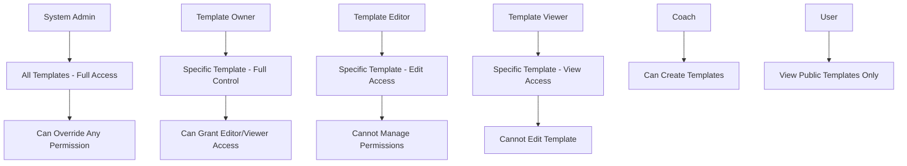
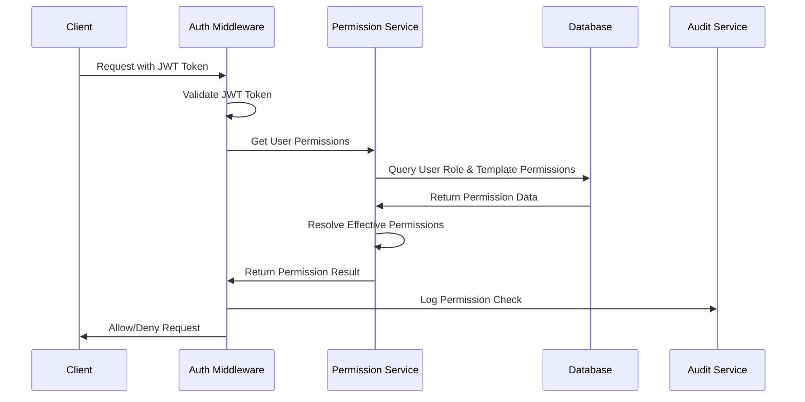
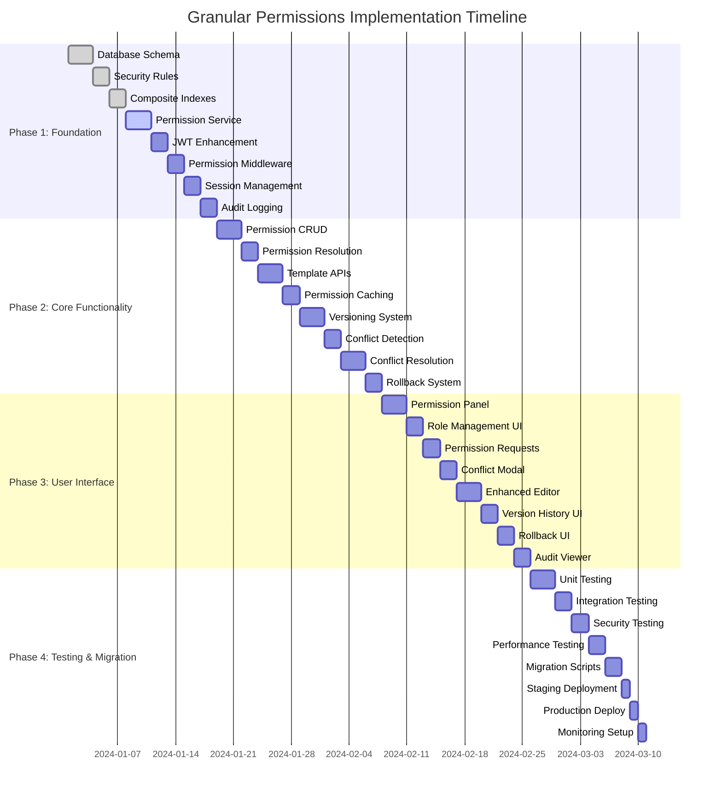

# Granular Editing Permissions for Program Templates - Technical Requirements

## Executive Summary

This document provides comprehensive technical requirements for implementing granular editing permissions for program templates in the Exercise Tracker application. The design focuses on simple broad permissions (owner, editor, viewer) with robust conflict resolution and audit capabilities.

**Key Design Decisions:**
- Simple permission model: Owner, Editor, Viewer roles per template
- Last save wins conflict resolution with notifications
- Permission management restricted to owners and admins
- Template versioning for rollback capabilities
- Comprehensive audit trail for all permission and template changes

## 1. Enhanced Permission System Design

### 1.1 Role Definitions

#### System-Level Roles
```javascript
// Enhanced user roles with expanded capabilities
const SYSTEM_ROLES = {
  ADMIN: {
    name: 'admin',
    capabilities: [
      'CREATE_TEMPLATES',
      'EDIT_ALL_TEMPLATES',
      'MANAGE_ALL_PERMISSIONS',
      'DELETE_ANY_TEMPLATE',
      'VIEW_AUDIT_LOGS',
      'MANAGE_USERS',
      'TRANSFER_OWNERSHIP'
    ]
  },
  COACH: {
    name: 'coach',
    capabilities: [
      'CREATE_TEMPLATES',
      'EDIT_OWN_TEMPLATES',
      'VIEW_ALL_TEMPLATES'
    ]
  },
  USER: {
    name: 'user',
    capabilities: [
      'VIEW_PUBLIC_TEMPLATES',
      'ADOPT_TEMPLATES',
      'CREATE_PERSONAL_PROGRAMS'
    ]
  }
};
```

#### Template-Specific Roles
```javascript
// Template-level permission roles
const TEMPLATE_PERMISSIONS = {
  OWNER: {
    name: 'owner',
    capabilities: [
      'EDIT_TEMPLATE',
      'DELETE_TEMPLATE',
      'MANAGE_PERMISSIONS',
      'TRANSFER_OWNERSHIP',
      'VIEW_TEMPLATE',
      'VIEW_EDIT_HISTORY',
      'ROLLBACK_CHANGES'
    ]
  },
  EDITOR: {
    name: 'editor',
    capabilities: [
      'EDIT_TEMPLATE',
      'VIEW_TEMPLATE',
      'VIEW_EDIT_HISTORY'
    ]
  },
  VIEWER: {
    name: 'viewer',
    capabilities: [
      'VIEW_TEMPLATE',
      'ADOPT_TEMPLATE'
    ]
  }
};
```

### 1.2 Permission Inheritance Model



### 1.3 Permission Resolution Logic

```javascript
// Permission resolution algorithm
function resolveUserPermissions(userId, templateId, systemRole, templatePermissions) {
  // 1. System admin has full access to everything
  if (systemRole === 'admin') {
    return TEMPLATE_PERMISSIONS.OWNER.capabilities;
  }
  
  // 2. Check template-specific permissions
  const templatePermission = templatePermissions.find(p => 
    p.userId === userId && p.templateId === templateId
  );
  
  if (templatePermission) {
    return TEMPLATE_PERMISSIONS[templatePermission.role.toUpperCase()].capabilities;
  }
  
  // 3. Check if template is public and user has system-level access
  if (template.isPublic) {
    return TEMPLATE_PERMISSIONS.VIEWER.capabilities;
  }
  
  // 4. No access
  return [];
}
```

## 2. Database Schema Modifications

### 2.1 Enhanced Users Collection

```javascript
// users/{userId}
{
  uid: "firebase_auth_uid",
  email: "user@example.com",
  displayName: "User Name",
  role: "admin" | "coach" | "user",
  permissions: {
    // System-level permissions based on role
    canCreateTemplates: boolean,
    canEditAllTemplates: boolean,
    canManageUsers: boolean,
    canViewAuditLogs: boolean
  },
  profile: {
    firstName: string,
    lastName: string,
    avatar: string,
    timezone: string
  },
  preferences: {
    emailNotifications: boolean,
    conflictNotifications: boolean
  },
  createdAt: timestamp,
  updatedAt: timestamp,
  lastLogin: timestamp
}
```

### 2.2 Template Permissions Collection

```javascript
// templatePermissions/{permissionId}
{
  id: "auto_generated_id",
  templateId: "template_id",
  userId: "user_id",
  role: "owner" | "editor" | "viewer",
  grantedBy: "admin_or_owner_user_id",
  grantedAt: timestamp,
  expiresAt: timestamp | null, // Optional expiration
  isActive: boolean,
  metadata: {
    grantReason: string,
    lastAccessedAt: timestamp,
    accessCount: number
  }
}

// Composite indexes required:
// - templateId + userId (unique)
// - templateId + role
// - userId + role
// - grantedBy + grantedAt
```

### 2.3 Enhanced Programs Collection

```javascript
// programs/{programId}
{
  // Existing fields...
  id: "program_id",
  userId: "creator_uid",
  name: "Program Name",
  description: "Program Description",
  isTemplate: boolean,
  weeklyConfigs: object,
  createdAt: timestamp,
  updatedAt: timestamp,
  
  // New permission-related fields
  permissions: {
    isPublic: boolean,
    allowedRoles: ["viewer", "editor"], // Who can access by default
    requiresApproval: boolean, // For permission requests
    allowComments: boolean
  },
  
  // Template metadata
  templateMetadata: {
    category: string, // "strength", "cardio", "hybrid"
    difficulty: "beginner" | "intermediate" | "advanced",
    estimatedDuration: number, // in minutes per session
    equipment: string[],
    tags: string[]
  },
  
  // Version control
  version: {
    current: number,
    lastMajorUpdate: timestamp,
    changesSinceLastVersion: number
  },
  
  // Edit tracking
  editHistory: {
    lastEditedBy: "user_id",
    lastEditedAt: timestamp,
    currentlyEditingBy: "user_id" | null,
    editStartedAt: timestamp | null,
    conflictCount: number
  },
  
  // Statistics
  stats: {
    adoptionCount: number,
    viewCount: number,
    editCount: number,
    lastAdoptedAt: timestamp
  }
}
```

### 2.4 Template Versions Collection

```javascript
// templateVersions/{versionId}
{
  id: "auto_generated_id",
  templateId: "template_id",
  version: number,
  versionType: "major" | "minor" | "patch",
  
  // Snapshot of template data at this version
  templateSnapshot: {
    name: string,
    description: string,
    weeklyConfigs: object,
    templateMetadata: object
  },
  
  // Version metadata
  createdBy: "user_id",
  createdAt: timestamp,
  changeDescription: string,
  changeType: "content" | "structure" | "metadata",
  
  // Change summary
  changes: {
    added: string[],
    modified: string[],
    removed: string[]
  },
  
  // Rollback information
  canRollback: boolean,
  rollbackReason: string | null
}
```

### 2.5 Audit Trail Collection

```javascript
// auditLogs/{logId}
{
  id: "auto_generated_id",
  entityType: "template" | "permission" | "user",
  entityId: "entity_id",
  action: "CREATE" | "UPDATE" | "DELETE" | "GRANT" | "REVOKE" | "VIEW",
  
  // Actor information
  performedBy: "user_id",
  performedAt: timestamp,
  ipAddress: string,
  userAgent: string,
  
  // Change details
  changes: {
    before: object | null,
    after: object | null,
    fields: string[]
  },
  
  // Context
  context: {
    reason: string,
    source: "web" | "api" | "admin",
    sessionId: string
  },
  
  // Additional metadata
  metadata: {
    affectedUsers: string[],
    severity: "low" | "medium" | "high",
    category: "permission" | "content" | "structure"
  }
}
```

### 2.6 Conflict Resolution Collection

```javascript
// editConflicts/{conflictId}
{
  id: "auto_generated_id",
  templateId: "template_id",
  
  // Conflict participants
  originalEditor: "user_id",
  conflictingEditor: "user_id",
  
  // Conflict details
  conflictType: "concurrent_edit" | "version_mismatch",
  detectedAt: timestamp,
  resolvedAt: timestamp | null,
  resolution: "manual" | "auto_merge" | "last_save_wins" | null,
  
  // Conflict data
  conflictData: {
    originalVersion: number,
    conflictingChanges: object,
    winningChanges: object,
    lostChanges: object
  },
  
  // Resolution metadata
  resolvedBy: "user_id" | null,
  resolutionNotes: string,
  notificationsSent: string[] // user IDs notified
}
```

## 3. API Endpoint Specifications

### 3.1 Permission Management Endpoints

#### Grant Template Permission
```javascript
POST /api/templates/{templateId}/permissions
Authorization: Bearer {token}
Content-Type: application/json

Request Body:
{
  userId: "target_user_id",
  role: "editor" | "viewer",
  reason: "Optional reason for granting access",
  expiresAt: "2024-12-31T23:59:59Z" // Optional
}

Response:
{
  success: true,
  permission: {
    id: "permission_id",
    templateId: "template_id",
    userId: "target_user_id",
    role: "editor",
    grantedBy: "current_user_id",
    grantedAt: "2024-01-15T10:30:00Z"
  }
}

Error Responses:
- 403: Insufficient permissions to grant access
- 404: Template or user not found
- 409: Permission already exists
```

#### Revoke Template Permission
```javascript
DELETE /api/templates/{templateId}/permissions/{userId}
Authorization: Bearer {token}

Response:
{
  success: true,
  message: "Permission revoked successfully"
}

Error Responses:
- 403: Insufficient permissions to revoke access
- 404: Permission not found
- 400: Cannot revoke owner permission
```

#### List Template Permissions
```javascript
GET /api/templates/{templateId}/permissions
Authorization: Bearer {token}

Response:
{
  success: true,
  permissions: [
    {
      id: "permission_id",
      userId: "user_id",
      userDisplayName: "User Name",
      role: "editor",
      grantedBy: "admin_id",
      grantedAt: "2024-01-15T10:30:00Z",
      lastAccessedAt: "2024-01-20T14:15:00Z"
    }
  ],
  totalCount: 5
}
```

### 3.2 Template Editing Endpoints

#### Get Template with Permission Check
```javascript
GET /api/templates/{templateId}
Authorization: Bearer {token}

Response:
{
  success: true,
  template: {
    // Template data
    id: "template_id",
    name: "Template Name",
    // ... other fields
  },
  userPermissions: {
    canEdit: boolean,
    canManagePermissions: boolean,
    canDelete: boolean,
    role: "owner" | "editor" | "viewer"
  },
  editStatus: {
    isCurrentlyBeingEdited: boolean,
    editedBy: "user_id" | null,
    editStartedAt: "timestamp" | null
  }
}
```

#### Start Template Edit Session
```javascript
POST /api/templates/{templateId}/edit-session
Authorization: Bearer {token}

Response:
{
  success: true,
  editSession: {
    sessionId: "session_id",
    startedAt: "2024-01-20T15:30:00Z",
    expiresAt: "2024-01-20T16:30:00Z", // 1 hour timeout
    currentVersion: 5
  }
}

Error Responses:
- 403: Insufficient permissions to edit
- 409: Template currently being edited by another user
```

#### Update Template with Conflict Detection
```javascript
PUT /api/templates/{templateId}
Authorization: Bearer {token}
Content-Type: application/json

Request Body:
{
  sessionId: "edit_session_id",
  expectedVersion: 5,
  changes: {
    name: "Updated Template Name",
    weeklyConfigs: { /* updated configs */ },
    changeDescription: "Added new exercise to week 2"
  }
}

Response (Success):
{
  success: true,
  template: { /* updated template */ },
  newVersion: 6
}

Response (Conflict):
{
  success: false,
  error: "EDIT_CONFLICT",
  conflict: {
    conflictId: "conflict_id",
    message: "Template was modified by another user",
    conflictingUser: "other_user_display_name",
    conflictingChanges: { /* summary of conflicting changes */ },
    resolutionOptions: ["overwrite", "merge", "cancel"]
  }
}
```

#### Resolve Edit Conflict
```javascript
POST /api/templates/{templateId}/resolve-conflict
Authorization: Bearer {token}
Content-Type: application/json

Request Body:
{
  conflictId: "conflict_id",
  resolution: "overwrite" | "cancel",
  changes: { /* final changes to apply */ }
}

Response:
{
  success: true,
  template: { /* resolved template */ },
  newVersion: 6,
  notifiedUsers: ["user_id_1", "user_id_2"]
}
```

### 3.3 Versioning and Rollback Endpoints

#### Get Template Version History
```javascript
GET /api/templates/{templateId}/versions
Authorization: Bearer {token}
Query Parameters:
- limit: number (default: 20)
- offset: number (default: 0)

Response:
{
  success: true,
  versions: [
    {
      version: 5,
      createdBy: "user_id",
      createdAt: "2024-01-20T14:30:00Z",
      changeDescription: "Added new exercise",
      changeType: "content",
      canRollback: true
    }
  ],
  totalCount: 15
}
```

#### Rollback Template Version
```javascript
POST /api/templates/{templateId}/rollback
Authorization: Bearer {token}
Content-Type: application/json

Request Body:
{
  targetVersion: 4,
  reason: "Reverting problematic changes"
}

Response:
{
  success: true,
  template: { /* rolled back template */ },
  newVersion: 6, // Creates new version with old content
  rollbackInfo: {
    rolledBackFrom: 5,
    rolledBackTo: 4,
    reason: "Reverting problematic changes"
  }
}
```

### 3.4 Audit and Monitoring Endpoints

#### Get Audit Logs
```javascript
GET /api/audit-logs
Authorization: Bearer {token} (Admin only)
Query Parameters:
- entityType: "template" | "permission" | "user"
- entityId: string
- action: string
- performedBy: string
- startDate: ISO date
- endDate: ISO date
- limit: number
- offset: number

Response:
{
  success: true,
  logs: [
    {
      id: "log_id",
      entityType: "template",
      entityId: "template_id",
      action: "UPDATE",
      performedBy: "user_id",
      performedAt: "2024-01-20T15:30:00Z",
      changes: {
        fields: ["name", "weeklyConfigs"],
        summary: "Updated template name and added exercise"
      }
    }
  ],
  totalCount: 150
}
```

## 4. Authentication & Authorization Flow

### 4.1 Enhanced Role Verification Process



### 4.2 Permission Validation Middleware

```javascript
// Enhanced permission middleware
class PermissionMiddleware {
  static async validateTemplateAccess(req, res, next) {
    try {
      const { templateId } = req.params;
      const { user } = req;
      const requiredCapability = req.route.capability;
      
      // Get user's effective permissions for this template
      const permissions = await PermissionService.getUserTemplatePermissions(
        user.uid, 
        templateId
      );
      
      // Check if user has required capability
      if (!permissions.includes(requiredCapability)) {
        await AuditService.logUnauthorizedAccess({
          userId: user.uid,
          templateId,
          attemptedAction: requiredCapability,
          timestamp: new Date()
        });
        
        return res.status(403).json({
          error: 'INSUFFICIENT_PERMISSIONS',
          message: 'You do not have permission to perform this action',
          required: requiredCapability,
          current: permissions
        });
      }
      
      // Add permissions to request context
      req.userPermissions = permissions;
      req.templateAccess = {
        canEdit: permissions.includes('EDIT_TEMPLATE'),
        canManagePermissions: permissions.includes('MANAGE_PERMISSIONS'),
        canDelete: permissions.includes('DELETE_TEMPLATE')
      };
      
      next();
    } catch (error) {
      console.error('Permission validation error:', error);
      res.status(500).json({ error: 'PERMISSION_CHECK_FAILED' });
    }
  }
  
  static requireCapability(capability) {
    return (req, res, next) => {
      req.route.capability = capability;
      return PermissionMiddleware.validateTemplateAccess(req, res, next);
    };
  }
}
```

### 4.3 Token-Based Permission Validation

```javascript
// JWT token enhancement for permissions
class TokenService {
  static generateEnhancedToken(user, permissions) {
    const payload = {
      uid: user.uid,
      email: user.email,
      role: user.role,
      permissions: {
        system: permissions.system,
        templates: permissions.templates.slice(0, 50) // Limit token size
      },
      iat: Math.floor(Date.now() / 1000),
      exp: Math.floor(Date.now() / 1000) + (60 * 60) // 1 hour
    };
    
    return jwt.sign(payload, process.env.JWT_SECRET);
  }
  
  static async validateAndRefreshPermissions(token) {
    try {
      const decoded = jwt.verify(token, process.env.JWT_SECRET);
      
      // Check if permissions need refresh (older than 30 minutes)
      const tokenAge = Date.now() / 1000 - decoded.iat;
      if (tokenAge > 1800) { // 30 minutes
        const freshPermissions = await PermissionService.getUserPermissions(decoded.uid);
        return this.generateEnhancedToken(decoded, freshPermissions);
      }
      
      return token;
    } catch (error) {
      throw new Error('INVALID_TOKEN');
    }
  }
}
```

### 4.4 Session Management for Role Changes

```javascript
// Session management for permission changes
class SessionManager {
  static async invalidateUserSessions(userId, reason = 'PERMISSION_CHANGE') {
    try {
      // Invalidate all active sessions for user
      await redis.del(`user_sessions:${userId}:*`);
      
      // Notify user of session invalidation
      await NotificationService.sendPermissionChangeNotification(userId, {
        type: 'SESSION_INVALIDATED',
        reason,
        timestamp: new Date()
      });
      
      // Log session invalidation
      await AuditService.logSessionInvalidation({
        userId,
        reason,
        timestamp: new Date()
      });
      
    } catch (error) {
      console.error('Session invalidation error:', error);
    }
  }
  
  static async refreshUserPermissions(userId) {
    try {
      // Get fresh permissions from database
      const permissions = await PermissionService.getUserPermissions(userId);
      
      // Update cached permissions
      await CacheService.setUserPermissions(userId, permissions, 1800); // 30 min TTL
      
      // Generate new token
      const user = await UserService.getUser(userId);
      const newToken = TokenService.generateEnhancedToken(user, permissions);
      
      return newToken;
    } catch (error) {
      console.error('Permission refresh error:', error);
      throw error;
    }
  }
}
```

## 5. Conflict Resolution & Versioning

### 5.1 Template Versioning Strategy

```javascript
// Version management system
class VersionManager {
  static async createVersion(templateId, changes, userId, versionType = 'minor') {
    try {
      const template = await TemplateService.getTemplate(templateId);
      const currentVersion = template.version.current;
      const newVersion = currentVersion + 1;
      
      // Create version snapshot
      const versionSnapshot = {
        id: generateId(),
        templateId,
        version: newVersion,
        versionType,
        templateSnapshot: {
          name: template.name,
          description: template.description,
          weeklyConfigs: template.weeklyConfigs,
          templateMetadata: template.templateMetadata
        },
        createdBy: userId,
        createdAt: new Date(),
        changeDescription: changes.changeDescription || 'Template updated',
        changeType: this.detectChangeType(changes),
        changes: this.generateChangeSummary(template, changes),
        canRollback: true
      };
      
      // Save version
      await db.collection('templateVersions').doc(versionSnapshot.id).set(versionSnapshot);
      
      // Update template version info
      await db.collection('programs').doc(templateId).update({
        'version.current': newVersion,
        'version.lastMajorUpdate': versionType === 'major' ? new Date() : template.version.lastMajorUpdate,
        'version.changesSinceLastVersion': 0
      });
      
      return versionSnapshot;
    } catch (error) {
      console.error('Version creation error:', error);
      throw error;
    }
  }
  
  static detectChangeType(changes) {
    if (changes.weeklyConfigs) return 'structure';
    if (changes.templateMetadata) return 'metadata';
    return 'content';
  }
  
  static generateChangeSummary(originalTemplate, changes) {
    const summary = {
      added: [],
      modified: [],
      removed: []
    };
    
    // Analyze changes and populate summary
    Object.keys(changes).forEach(field => {
      if (!originalTemplate[field]) {
        summary.added.push(field);
      } else if (originalTemplate[field] !== changes[field]) {
        summary.modified.push(field);
      }
    });
    
    return summary;
  }
}
```

### 5.2 Concurrent Edit Detection

```javascript
// Conflict detection system
class ConflictDetector {
  static async detectConflict(templateId, expectedVersion, userId) {
    try {
      const template = await TemplateService.getTemplate(templateId);
      const currentVersion = template.version.current;
      
      // Version mismatch indicates potential conflict
      if (expectedVersion !== currentVersion) {
        return {
          hasConflict: true,
          conflictType: 'version_mismatch',
          expectedVersion,
          currentVersion,
          lastEditedBy: template.editHistory.lastEditedBy,
          lastEditedAt: template.editHistory.lastEditedAt
        };
      }
      
      // Check if someone else is currently editing
      const editStatus = template.editHistory;
      if (editStatus.currentlyEditingBy && editStatus.currentlyEditingBy !== userId) {
        const editDuration = Date.now() - editStatus.editStartedAt.toMillis();
        
        // If edit session is older than 1 hour, consider it stale
        if (editDuration > 3600000) { // 1 hour in milliseconds
          await this.clearStaleEditSession(templateId);
          return { hasConflict: false };
        }
        
        return {
          hasConflict: true,
          conflictType: 'concurrent_edit',
          conflictingUser: editStatus.currentlyEditingBy,
          editStartedAt: editStatus.editStartedAt,
          editDuration
        };
      }
      
      return { hasConflict: false };
    } catch (error) {
      console.error('Conflict detection error:', error);
      throw error;
    }
  }
  
  static async clearStaleEditSession(templateId) {
    await db.collection('programs').doc(templateId).update({
      'editHistory.currentlyEditingBy': null,
      'editHistory.editStartedAt': null
    });
  }
}
```

### 5.3 Conflict Resolution Implementation

```javascript
// Conflict resolution service
class ConflictResolver {
  static async resolveConflict(conflictId, resolution, changes, userId) {
    try {
      const conflict = await db.collection('editConflicts').doc(conflictId).get();
      if (!conflict.exists) {
        throw new Error('Conflict not found');
      }
      
      const conflictData = conflict.data();
      const templateId = conflictData.templateId;
      
      let resolvedTemplate;
      let notificationUsers = [];
      
      switch (resolution) {
        case 'overwrite':
          resolvedTemplate = await this.applyOverwriteResolution(
            templateId, 
            changes, 
            userId
          );
          notificationUsers = [conflictData.originalEditor];
          break;
          
        case 'cancel':
          // Simply mark conflict as resolved without changes
          await this.markConflictResolved(conflictId, 'cancel', userId);
          return { success: true, action: 'cancelled' };
          
        default:
          throw new Error('Invalid resolution type');
      }
      
      // Mark conflict as resolved
      await this.markConflictResolved(conflictId, resolution, userId);
      
      // Send notifications to affected users
      await this.notifyConflictResolution(
        templateId, 
        resolution, 
        notificationUsers, 
        userId
      );
      
      return {
        success: true,
        template: resolvedTemplate,
        notifiedUsers: notificationUsers
      };
      
    } catch (error) {
      console.error('Conflict resolution error:', error);
      throw error;
    }
  }
  
  static async applyOverwriteResolution(templateId, changes, userId) {
    // Create new version with overwrite
    const newVersion = await VersionManager.createVersion(
      templateId, 
      changes, 
      userId, 
      'minor'
    );
    
    // Apply changes to template
    const updatedTemplate = await TemplateService.updateTemplate(
      templateId, 
      changes, 
      userId
    );
    
    return updatedTemplate;
  }
  
  static async markConflictResolved(conflictId, resolution, userId) {
    await db.collection('editConflicts').doc(conflictId).update({
      resolvedAt: new Date(),
      resolution,
      resolvedBy: userId,
      resolutionNotes: `Conflict resolved via ${resolution}`
    });
  }
  
  static async notifyConflictResolution(templateId, resolution, userIds, resolvedBy) {
    const template = await TemplateService.getTemplate(templateId);
    const resolver = await UserService.getUser(resolvedBy);
    
    for (const userId of userIds) {
      await NotificationService.sendConflictResolutionNotification(userId, {
        templateId,
        templateName: template.name,
        resolution,
        resolvedBy: resolver.displayName,
        resolvedAt: new Date()
      });
    }
  }
}
```

### 5.4 Backup and Rollback Procedures

```javascript
// Rollback service
class RollbackService {
  static async rollbackTemplate(templateId, targetVersion, reason, userId) {
    try {
      // Validate rollback permissions
      const permissions = await PermissionService.getUserTemplatePermissions(userId, templateId);
      if (!permissions.includes('ROLLBACK_CHANGES')) {
        throw new Error('INSUFFICIENT_PERMISSIONS');
      }
      
      // Get target version data
      const versionDoc = await db.collection('templateVersions')
        .where('templateId', '==', templateId)
        .where('version', '==', targetVersion)
        .limit(1)
        .get();
        
      if (versionDoc.empty) {
        throw new Error('TARGET_VERSION_NOT_FOUND');
      }
      
      const targetVersionData = versionDoc.docs[0].data();
      
      // Create rollback version (new version with old content)
      const currentTemplate = await TemplateService.getTemplate(templateId);
      const rollbackChanges = {
        ...targetVersionData.templateSnapshot,
        changeDescription: `Rolled back to version ${targetVersion}: ${reason}`
      };
      
      const newVersion = await VersionManager.createVersion(
        templateId,
        rollbackChanges,
        userId,
        'major' // Rollbacks are major changes
      );
      
      // Apply rollback changes
      await db.collection('programs').doc(templateId).update({
        ...rollbackChanges,
        'editHistory.lastEditedBy': userId,
        'editHistory.lastEditedAt': new Date(),
        'editHistory.currentlyEditingBy': null,
        'editHistory.editStartedAt': null
      });
      
      // Log rollback action
      await AuditService.logRollback({
        templateId,
        rolledBackFrom: currentTemplate.version.current,
        rolledBackTo: targetVersion,
        performedBy: userId,
        reason,
        timestamp: new Date()
      });
      
      return {
        success: true,
        newVersion: newVersion.version,
        rollbackInfo: {
          rolledBackFrom: currentTemplate.version.current,
,
          reason
        }
      };
      
    } catch (error) {
      console.error('Rollback error:', error);
      throw error;
    }
  }
  
  static async validateRollbackSafety(templateId, targetVersion) {
    // Check if rollback would cause data loss
    const versionsAfterTarget = await db.collection('templateVersions')
      .where('templateId', '==', templateId)
      .where('version', '>', targetVersion)
      .orderBy('version', 'asc')
      .get();
      
    const criticalChanges = versionsAfterTarget.docs.filter(doc => {
      const data = doc.data();
      return data.versionType === 'major' || data.changeType === 'structure';
    });
    
    return {
      isSafe: criticalChanges.length === 0,
      warnings: criticalChanges.map(doc => ({
        version: doc.data().version,
        changeType: doc.data().changeType,
        description: doc.data().changeDescription
      }))
    };
  }
}
```

## 6. Firestore Security Rules Updates

### 6.1 Enhanced Security Rules

```javascript
// firestore.rules - Enhanced security rules for granular permissions
rules_version = '2';
service cloud.firestore {
  match /databases/{database}/documents {
    
    // Helper functions for permission checking
    function isAuthenticated() {
      return request.auth != null;
    }
    
    function getUserRole() {
      return get(/databases/$(database)/documents/users/$(request.auth.uid)).data.role;
    }
    
    function isAdmin() {
      return isAuthenticated() && getUserRole() == 'admin';
    }
    
    function isCoach() {
      return isAuthenticated() && (getUserRole() == 'coach' || getUserRole() == 'admin');
    }
    
    function hasTemplatePermission(templateId, requiredRole) {
      return exists(/databases/$(database)/documents/templatePermissions/$(templateId + '_' + request.auth.uid)) &&
             get(/databases/$(database)/documents/templatePermissions/$(templateId + '_' + request.auth.uid)).data.role == requiredRole &&
             get(/databases/$(database)/documents/templatePermissions/$(templateId + '_' + request.auth.uid)).data.isActive == true;
    }
    
    function canEditTemplate(templateId) {
      return isAdmin() || 
             hasTemplatePermission(templateId, 'owner') || 
             hasTemplatePermission(templateId, 'editor');
    }
    
    function canViewTemplate(templateId) {
      let template = get(/databases/$(database)/documents/programs/$(templateId));
      return isAdmin() || 
             hasTemplatePermission(templateId, 'owner') || 
             hasTemplatePermission(templateId, 'editor') || 
             hasTemplatePermission(templateId, 'viewer') ||
             (template.data.permissions.isPublic == true);
    }
    
    function canManagePermissions(templateId) {
      return isAdmin() || hasTemplatePermission(templateId, 'owner');
    }
    
    // Users collection rules
    match /users/{userId} {
      allow read: if isAuthenticated() && (request.auth.uid == userId || isAdmin());
      allow write: if isAuthenticated() && request.auth.uid == userId;
      allow create: if isAuthenticated() && request.auth.uid == userId;
    }
    
    // Programs collection rules (templates)
    match /programs/{programId} {
      allow read: if isAuthenticated() && 
                     (resource.data.userId == request.auth.uid || 
                      !resource.data.isTemplate || 
                      canViewTemplate(programId));
      
      allow create: if isAuthenticated() && 
                       (request.auth.uid == resource.data.userId || 
                        (resource.data.isTemplate && isCoach()));
      
      allow update: if isAuthenticated() && 
                       (request.auth.uid == resource.data.userId || 
                        (resource.data.isTemplate && canEditTemplate(programId)));
      
      allow delete: if isAuthenticated() && 
                       (request.auth.uid == resource.data.userId || 
                        (resource.data.isTemplate && (isAdmin() || hasTemplatePermission(programId, 'owner'))));
    }
    
    // Template permissions collection rules
    match /templatePermissions/{permissionId} {
      allow read: if isAuthenticated() && 
                     (request.auth.uid == resource.data.userId || 
                      canManagePermissions(resource.data.templateId) ||
                      isAdmin());
      
      allow create: if isAuthenticated() && 
                       canManagePermissions(resource.data.templateId) &&
                       request.auth.uid == resource.data.grantedBy;
      
      allow update: if isAuthenticated() && 
                       canManagePermissions(resource.data.templateId);
      
      allow delete: if isAuthenticated() && 
                       (canManagePermissions(resource.data.templateId) || 
                        request.auth.uid == resource.data.userId);
    }
    
    // Template versions collection rules
    match /templateVersions/{versionId} {
      allow read: if isAuthenticated() && canViewTemplate(resource.data.templateId);
      allow create: if isAuthenticated() && canEditTemplate(resource.data.templateId);
      // Versions are immutable once created
      allow update: if false;
      allow delete: if isAdmin(); // Only admins can delete versions for cleanup
    }
    
    // Audit logs collection rules
    match /auditLogs/{logId} {
      allow read: if isAdmin();
      allow create: if isAuthenticated(); // System creates audit logs
      allow update: if false; // Audit logs are immutable
      allow delete: if false; // Audit logs should never be deleted
    }
    
    // Edit conflicts collection rules
    match /editConflicts/{conflictId} {
      allow read: if isAuthenticated() && 
                     (request.auth.uid == resource.data.originalEditor || 
                      request.auth.uid == resource.data.conflictingEditor ||
                      canEditTemplate(resource.data.templateId));
      
      allow create: if isAuthenticated() && canEditTemplate(resource.data.templateId);
      allow update: if isAuthenticated() && canEditTemplate(resource.data.templateId);
      allow delete: if isAdmin();
    }
  }
}
```

### 6.2 Security Rule Testing

```javascript
// Security rule test cases
describe('Firestore Security Rules', () => {
  test('Template permissions - Owner can manage permissions', async () => {
    const db = getFirestore(getApp('owner'));
    await assertSucceeds(
      db.collection('templatePermissions').add({
        templateId: 'template1',
        userId: 'user2',
        role: 'editor',
        grantedBy: 'owner',
        isActive: true
      })
    );
  });
  
  test('Template permissions - Editor cannot manage permissions', async () => {
    const db = getFirestore(getApp('editor'));
    await assertFails(
      db.collection('templatePermissions').add({
        templateId: 'template1',
        userId: 'user3',
        role: 'viewer',
        grantedBy: 'editor',
        isActive: true
      })
    );
  });
  
  test('Template editing - Editor can update template', async () => {
    const db = getFirestore(getApp('editor'));
    await assertSucceeds(
      db.collection('programs').doc('template1').update({
        name: 'Updated Template Name'
      })
    );
  });
  
  test('Template viewing - Public template accessible to all', async () => {
    const db = getFirestore(getApp('user'));
    await assertSucceeds(
      db.collection('programs').doc('public-template').get()
    );
  });
});
```

## 7. UI/UX Specifications

### 7.1 Permission Management Interface

#### Template Permission Panel
```jsx
// TemplatePermissionPanel.jsx
import React, { useState, useEffect } from 'react';
import { useAuth } from '../contexts/AuthContext';
import { PermissionService } from '../services/PermissionService';

const TemplatePermissionPanel = ({ templateId, userPermissions }) => {
  const [permissions, setPermissions] = useState([]);
  const [showAddUser, setShowAddUser] = useState(false);
  const [loading, setLoading] = useState(true);
  const { user } = useAuth();

  useEffect(() => {
    loadPermissions();
  }, [templateId]);

  const loadPermissions = async () => {
    try {
      const data = await PermissionService.getTemplatePermissions(templateId);
      setPermissions(data.permissions);
    } catch (error) {
      console.error('Failed to load permissions:', error);
    } finally {
      setLoading(false);
    }
  };

  const handleRoleChange = async (userId, newRole) => {
    try {
      await PermissionService.updatePermission(templateId, userId, newRole);
      await loadPermissions();
    } catch (error) {
      console.error('Failed to update permission:', error);
    }
  };

  const handleRemovePermission = async (userId) => {
    try {
      await PermissionService.revokePermission(templateId, userId);
      await loadPermissions();
    } catch (error) {
      console.error('Failed to revoke permission:', error);
    }
  };

  if (!userPermissions.canManagePermissions) {
    return (
      <div className="permission-panel-readonly">
        <h3>Template Access</h3>
        <p>You have {userPermissions.role} access to this template.</p>
      </div>
    );
  }

  return (
    <div className="permission-panel">
      <div className="permission-header">
        <h3>Manage Template Permissions</h3>
        <button 
          className="btn-primary"
          onClick={() => setShowAddUser(true)}
        >
          Add User
        </button>
      </div>

      {loading ? (
        <div className="loading">Loading permissions...</div>
      ) : (
        <div className="permission-list">
          {permissions.map(permission => (
            <div key={permission.userId} className="permission-item">
              <div className="user-info">
                <span className="user-name">{permission.userDisplayName}</span>
                <span className="user-email">{permission.userEmail}</span>
              </div>
              
              <div className="permission-controls">
                <select
                  value={permission.role}
                  onChange={(e) => handleRoleChange(permission.userId, e.target.value)}
                  disabled={permission.role === 'owner'}
                >
                  <option value="viewer">Viewer</option>
                  <option value="editor">Editor</option>
                  <option value="owner">Owner</option>
                </select>
                
                {permission.role !== 'owner' && (
                  <button
                    className="btn-danger-small"
                    onClick={() => handleRemovePermission(permission.userId)}
                  >
                    Remove
                  </button>
                )}
              </div>
              
              <div className="permission-meta">
                <small>
                  Granted by {permission.grantedByName} on{' '}
                  {new Date(permission.grantedAt).toLocaleDateString()}
                </small>
              </div>
            </div>
          ))}
        </div>
      )}

      {showAddUser && (
        <AddUserModal
          templateId={templateId}
          onClose={() => setShowAddUser(false)}
          onUserAdded={loadPermissions}
        />
      )}
    </div>
  );
};
```

#### Conflict Resolution Interface
```jsx
// ConflictResolutionModal.jsx
import React, { useState } from 'react';
import { ConflictService } from '../services/ConflictService';

const ConflictResolutionModal = ({ conflict, onResolve, onCancel }) => {
  const [resolution, setResolution] = useState('overwrite');
  const [resolving, setResolving] = useState(false);

  const handleResolve = async () => {
    setResolving(true);
    try {
      await ConflictService.resolveConflict(conflict.conflictId, resolution);
      onResolve(resolution);
    } catch (error) {
      console.error('Failed to resolve conflict:', error);
    } finally {
      setResolving(false);
    }
  };

  return (
    <div className="modal-overlay">
      <div className="conflict-modal">
        <div className="modal-header">
          <h2>Edit Conflict Detected</h2>
          <button className="close-btn" onClick={onCancel}>×</button>
        </div>

        <div className="conflict-details">
          <div className="conflict-message">
            <p>
              <strong>{conflict.conflictingUser}</strong> has also been editing this template.
              Their changes were saved while you were working.
            </p>
          </div>

          <div className="conflict-summary">
            <h4>Conflicting Changes:</h4>
            <ul>
              {conflict.conflictingChanges.map((change, index) => (
                <li key={index}>{change}</li>
              ))}
            </ul>
          </div>

          <div className="resolution-options">
            <h4>How would you like to resolve this conflict?</h4>
            
            <label className="resolution-option">
              <input
                type="radio"
                value="overwrite"
                checked={resolution === 'overwrite'}
                onChange={(e) => setResolution(e.target.value)}
              />
              <div className="option-content">
                <strong>Overwrite their changes</strong>
                <p>Your changes will be saved and their changes will be lost.</p>
              </div>
            </label>

            <label className="resolution-option">
              <input
                type="radio"
                value="cancel"
                checked={resolution === 'cancel'}
                onChange={(e) => setResolution(e.target.value)}
              />
              <div className="option-content">
                <strong>Cancel your changes</strong>
                <p>Keep their changes and discard your modifications.</p>
              </div>
            </label>
          </div>
        </div>

        <div className="modal-actions">
          <button className="btn-secondary" onClick={onCancel}>
            Cancel
          </button>
          <button 
            className="btn-primary" 
            onClick={handleResolve}
            disabled={resolving}
          >
            {resolving ? 'Resolving...' : 'Resolve Conflict'}
          </button>
        </div>
      </div>
    </div>
  );
};
```

### 7.2 Version History Interface

```jsx
// VersionHistoryPanel.jsx
import React, { useState, useEffect } from 'react';
import { VersionService } from '../services/VersionService';

const VersionHistoryPanel = ({ templateId, userPermissions }) => {
  const [versions, setVersions] = useState([]);
  const [loading, setLoading] = useState(true);
  const [showRollbackConfirm, setShowRollbackConfirm] = useState(null);

  useEffect(() => {
    loadVersionHistory();
  }, [templateId]);

  const loadVersionHistory = async () => {
    try {
      const data = await VersionService.getVersionHistory(templateId);
      setVersions(data.versions);
    } catch (error) {
      console.error('Failed to load version history:', error);
    } finally {
      setLoading(false);
    }
  };

  const handleRollback = async (targetVersion) => {
    try {
      const reason = prompt('Please provide a reason for rolling back:');
      if (!reason) return;

      await VersionService.rollbackToVersion(templateId, targetVersion, reason);
      await loadVersionHistory();
      setShowRollbackConfirm(null);
    } catch (error) {
      console.error('Rollback failed:', error);
    }
  };

  return (
    <div className="version-history-panel">
      <h3>Version History</h3>
      
      {loading ? (
        <div className="loading">Loading version history...</div>
      ) : (
        <div className="version-list">
          {versions.map(version => (
            <div key={version.version} className="version-item">
              <div className="version-header">
                <span className="version-number">v{version.version}</span>
                <span className="version-type">{version.versionType}</span>
                <span className="version-date">
                  {new Date(version.createdAt).toLocaleDateString()}
                </span>
              </div>
              
              <div className="version-details">
                <p className="change-description">{version.changeDescription}</p>
                <p className="version-author">by {version.createdByName}</p>
              </div>
              
              <div className="version-changes">
                {version.changes.added.length > 0 && (
                  <div className="changes-added">
                    <strong>Added:</strong> {version.changes.added.join(', ')}
                  </div>
                )}
                {version.changes.modified.length > 0 && (
                  <div className="changes-modified">
                    <strong>Modified:</strong> {version.changes.modified.join(', ')}
                  </div>
                )}
                {version.changes.removed.length > 0 && (
                  <div className="changes-removed">
                    <strong>Removed:</strong> {version.changes.removed.join(', ')}
                  </div>
                )}
              </div>
              
              {userPermissions.canEdit && version.canRollback && (
                <div className="version-actions">
                  <button
                    className="btn-secondary-small"
                    onClick={() => setShowRollbackConfirm(version.version)}
                  >
                    Rollback to this version
                  </button>
                </div>
              )}
            </div>
          ))}
        </div>
      )}

      {showRollbackConfirm && (
        <div className="modal-overlay">
          <div className="rollback-confirm-modal">
            <h3>Confirm Rollback</h3>
            <p>
              Are you sure you want to rollback to version {showRollbackConfirm}?
              This will create a new version with the content from version {showRollbackConfirm}.
            </p>
            <div className="modal-actions">
              <button 
                className="btn-secondary"
                onClick={() => setShowRollbackConfirm(null)}
              >
                Cancel
              </button>
              <button 
                className="btn-danger"
                onClick={() => handleRollback(showRollbackConfirm)}
              >
                Rollback
              </button>
            </div>
          </div>
        </div>
      )}
    </div>
  );
};
```

### 7.3 Enhanced Template Editor

```jsx
// EnhancedTemplateEditor.jsx
import React, { useState, useEffect, useRef } from 'react';
import { useAuth } from '../contexts/AuthContext';
import { TemplateService } from '../services/TemplateService';
import { ConflictService } from '../services/ConflictService';

const EnhancedTemplateEditor = ({ templateId }) => {
  const [template, setTemplate] = useState(null);
  const [editSession, setEditSession] = useState(null);
  const [hasUnsavedChanges, setHasUnsavedChanges] = useState(false);
  const [conflict, setConflict] = useState(null);
  const [saving, setSaving] = useState(false);
  const { user } = useAuth();
  const autoSaveTimer = useRef(null);

  useEffect(() => {
    loadTemplate();
    return () => {
      if (autoSaveTimer.current) {
        clearTimeout(autoSaveTimer.current);
      }
      endEditSession();
    };
  }, [templateId]);

  const loadTemplate = async () => {
    try {
      const data = await TemplateService.getTemplate(templateId);
      setTemplate(data.template);
    } catch (error) {
      console.error('Failed to load template:', error);
    }
  };

  const startEditSession = async () => {
    try {
      const session = await TemplateService.startEditSession(templateId);
      setEditSession(session);
    } catch (error) {
      if (error.code === 'TEMPLATE_BEING_EDITED') {
        // Handle concurrent editing
        alert(`This template is currently being edited by ${error.editedBy}`);
      }
    }
  };

  const endEditSession = async () => {
    if (editSession) {
      await TemplateService.endEditSession(templateId, editSession.sessionId);
      setEditSession(null);
    }
  };

  const handleTemplateChange = (changes) => {
    setTemplate(prev => ({ ...prev, ...changes }));
    setHasUnsavedChanges(true);
    
    // Auto-save after 2 seconds of inactivity
    if (autoSaveTimer.current) {
      clearTimeout(autoSaveTimer.current);
    }
    autoSaveTimer.current = setTimeout(() => {
      saveTemplate(changes, true); // Auto-save
    }, 2000);
  };

  const saveTemplate = async (changes, isAutoSave = false) => {
    if (!editSession) {
      await startEditSession();
    }

    setSaving(true);
    try {
      const result = await TemplateService.updateTemplate(templateId, {
        sessionId: editSession.sessionId,
        expectedVersion: template.version.current,
        changes,
        isAutoSave
      });

      setTemplate(result.template);
      setHasUnsavedChanges(false);
      
    } catch (error) {
      if (error.code === 'EDIT_CONFLICT') {
        setConflict(error.conflict);
      } else {
        console.error('Save failed:', error);
      }
    } finally {
      setSaving(false);
    }
  };

  const handleConflictResolution = async (resolution) => {
    try {
      const result = await ConflictService.resolveConflict(
        conflict.conflictId,
        resolution,
        template
      );
      
      setTemplate(result.template);
      setConflict(null);
      setHasUnsavedChanges(false);
      
    } catch (error) {
      console.error('Conflict resolution failed:', error);
    }
  };

  return (
    <div className="enhanced-template-editor">
      <div className="editor-header">
        <div className="editor-status">
          {saving && <span className="status-saving">Saving...</span>}
          {hasUnsavedChanges && !saving && (
            <span className="status-unsaved">Unsaved changes</span>
          )}
          {!hasUnsavedChanges && !saving && (
            <span className="status-saved">All changes saved</span>
          )}
        </div>
        
        <div className="editor-actions">
          <button 
            className="btn-secondary"
            onClick={() => saveTemplate(template)}
            disabled={!hasUnsavedChanges || saving}
          >
            Save Changes
          </button>
        </div>
      </div>

      {template && (
        <div className="template-editor-content">
          {/* Template editing form components */}
          <TemplateForm
            template={template}
            onChange={handleTemplateChange}
            disabled={saving}
          />
        </div>
      )}

      {conflict && (
        <ConflictResolutionModal
          conflict={conflict}
          onResolve={handleConflictResolution}
          onCancel={() => setConflict(null)}
        />
      )}
    </div>
  );
};
```

## 8. Performance Considerations

### 8.1 Database Query Optimization

```javascript
// Optimized permission queries with caching
class OptimizedPermissionService {
  constructor() {
    this.permissionCache = new Map();
    this.cacheTimeout = 5 * 60 * 1000; // 5 minutes
  }

  async getUserTemplatePermissions(userId, templateId) {
    const cacheKey = `${userId}:${templateId}`;
    const cached = this.permissionCache.get(cacheKey);
    
    if (cached && Date.now() - cached.timestamp < this.cacheTimeout) {
      return cached.permissions;
    }

    // Batch query for user's system role and template permissions
    const [userDoc, permissionDoc] = await Promise.all([
      db.collection('users').doc(userId).get(),
      db.collection('templatePermissions')
        .where('userId', '==', userId)
        .where('templateId', '==', templateId)
        .where('isActive', '==', true)
        .limit(1)
        .get()
    ]);

    const permissions = this.resolvePermissions(
      userDoc.data(),
      permissionDoc.empty ? null : permissionDoc.docs[0].data()
    );

    // Cache the result
    this.permissionCache.set(cacheKey, {
      permissions,
      timestamp: Date.now()
    });

    return permissions;
  }

  // Batch permission check for multiple templates
  async getUserPermissionsForTemplates(userId, templateIds) {
    const uncachedTemplates = templateIds.filter(templateId => {
      const cacheKey = `${userId}:${templateId}`;
      const cached = this.permissionCache.get(cacheKey);
      return !cached || Date.now() - cached.timestamp >= this.cacheTimeout;
    });

    if (uncachedTemplates.length === 0) {
      // All permissions are cached
      return templateIds.reduce((acc, templateId) => {
        const cacheKey = `${userId}:${templateId}`;
        acc[templateId] = this.permissionCache.get(cacheKey).permissions;
        return acc;
      }, {});
    }

    // Batch query for uncached permissions
    const [userDoc, permissionsQuery] = await Promise.all([
      db.collection('users').doc(userId).get(),
      db.collection('templatePermissions')
        .where('userId', '==', userId)
        .where('templateId', 'in', uncachedTemplates)
        .where('isActive', '==', true)
        .get()
    ]);

    const userData = userDoc.data();
    const permissionsByTemplate = {};

    // Process permissions for each template
    uncachedTemplates.forEach(templateId => {
      const permissionDoc = permissionsQuery.docs.find(
        doc => doc.data().templateId === templateId
      );
      
      const permissions = this.resolvePermissions(
        userData,
        permissionDoc ? permissionDoc.data() : null
      );

      permissionsByTemplate[templateId] = permissions;
      
      // Cache the result
      const cacheKey = `${userId}:${templateId}`;
      this.permissionCache.set(cacheKey, {
        permissions,
        timestamp: Date.now()
      });
    });

    // Include cached permissions
    templateIds.forEach(templateId => {
      if (!permissionsByTemplate[templateId]) {
        const cacheKey = `${userId}:${templateId}`;
        permissionsByTemplate[templateId] = this.permissionCache.get(cacheKey).permissions;
      }
    });

    return permissionsByTemplate;
  }

  invalidateUserCache(userId) {
    // Remove all cached permissions for a user
    for (const [key] of this.permissionCache) {
      if (key.startsWith(`${userId}:`)) {
        this.permissionCache.delete(key);
      }
    }
  }

  invalidateTemplateCache(templateId) {
    // Remove all cached permissions for a template
    for (const [key] of this.permissionCache) {
      if (key.endsWith(`:${templateId}`)) {
        this.permissionCache.delete(key);
      }
    }
  }
}
```

### 8.2 Firestore Index Optimization

```javascript
// Required Firestore composite indexes
const REQUIRED_INDEXES = [
  // Template permissions queries
  {
    collection: 'templatePermissions',
    fields: [
      { field: 'templateId', order: 'ASCENDING' },
      { field: 'isActive', order: 'ASCENDING' },
      { field: 'role', order: 'ASCENDING' }
    ]
  },
  {
    collection: 'templatePermissions',
    fields: [
      { field: 'userId', order: 'ASCENDING' },
      { field: 'isActive', order: 'ASCENDING' },
      { field: 'grantedAt', order: 'DESCENDING' }
    ]
  },
  
  // Template versions queries
  {
    collection: 'templateVersions',
    fields: [
      { field: 'templateId', order: 'ASCENDING' },
      { field: 'version', order: 'DESCENDING' }
    ]
  },
  
  // Audit logs queries
  {
    collection: 'auditLogs',
    fields: [
      { field: 'entityType', order: 'ASCENDING' },
      { field: 'entityId', order: 'ASCENDING' },
      { field: 'performedAt', order: 'DESCENDING' }
    ]
  },
  {
    collection: 'auditLogs',
    fields: [
      { field: 'performedBy', order: 'ASCENDING' },
      { field: 'performedAt', order: 'DESCENDING' }
    ]
  },
  
  // Edit conflicts queries
  {
    collection: 'editConflicts',
    fields: [
      { field: 'templateId', order: 'ASCENDING' },
      { field: 'resolvedAt', order: 'ASCENDING' },
      { field: 'detectedAt', order: 'DESCENDING' }
    ]
  }
];

// Index creation script
async function createRequiredIndexes() {
  for (const index of REQUIRED_INDEXES) {
    console.log(`Creating index for ${index.collection}:`, index.fields);
    // Indexes are typically created through Firebase Console or CLI
    // This is for documentation purposes
  }
}
```

### 8.3 Client-Side Performance Optimizations

```javascript
// React Query integration for permission caching
import { useQuery, useQueryClient } from 'react-query';

const useTemplatePermissions = (templateId) => {
  return useQuery(
    ['templatePermissions', templateId],
    () => PermissionService.getTemplatePermissions(templateId),
    {
      staleTime: 5 * 60 * 1000, // 5 minutes
      cacheTime: 10 * 60 * 1000, // 10 minutes
      refetchOnWindowFocus: false
    }
  );
};

const useUserPermissions = (userId, templateIds) => {
  return useQuery(
    ['userPermissions', userId, templateIds],
    () => PermissionService.getUserPermissionsForTemplates(userId, templateIds),
    {
      staleTime: 5 * 60 * 1000,
      cacheTime: 10 * 
          rolledBackTo: targetVersion
* 60 * 1000,
      enabled: templateIds.length > 0
    }
  );
};

// Optimized component rendering with memoization
const TemplateList = React.memo(({ templates, userPermissions }) => {
  const memoizedTemplates = useMemo(() => {
    return templates.map(template => ({
      ...template,
      userCanEdit: userPermissions[template.id]?.includes('EDIT_TEMPLATE'),
      userCanView: userPermissions[template.id]?.includes('VIEW_TEMPLATE')
    }));
  }, [templates, userPermissions]);

  return (
    <div className="template-list">
      {memoizedTemplates.map(template => (
        <TemplateCard key={template.id} template={template} />
      ))}
    </div>
  );
});

// Virtualized list for large template collections
import { FixedSizeList as List } from 'react-window';

const VirtualizedTemplateList = ({ templates, userPermissions }) => {
  const Row = ({ index, style }) => (
    <div style={style}>
      <TemplateCard 
        template={templates[index]} 
        userPermissions={userPermissions[templates[index].id]}
      />
    </div>
  );

  return (
    <List
      height={600}
      itemCount={templates.length}
      itemSize={120}
      width="100%"
    >
      {Row}
    </List>
  );
};
```

## 9. Migration Strategy

### 9.1 Database Migration Plan

```javascript
// Migration script for existing data
class PermissionMigrationService {
  static async migrateExistingTemplates() {
    console.log('Starting template permission migration...');
    
    try {
      // Get all existing templates
      const templatesSnapshot = await db.collection('programs')
        .where('isTemplate', '==', true)
        .get();
      
      const batch = db.batch();
      let batchCount = 0;
      
      for (const templateDoc of templatesSnapshot.docs) {
        const template = templateDoc.data();
        const templateId = templateDoc.id;
        
        // Create owner permission for template creator
        const ownerPermissionId = `${templateId}_${template.userId}`;
        const ownerPermissionRef = db.collection('templatePermissions').doc(ownerPermissionId);
        
        batch.set(ownerPermissionRef, {
          id: ownerPermissionId,
          templateId: templateId,
          userId: template.userId,
          role: 'owner',
          grantedBy: 'system',
          grantedAt: template.createdAt || new Date(),
          isActive: true,
          metadata: {
            grantReason: 'Template creator - migrated from existing data',
            lastAccessedAt: new Date(),
            accessCount: 0
          }
        });
        
        // Update template with new permission structure
        const templateRef = db.collection('programs').doc(templateId);
        batch.update(templateRef, {
          permissions: {
            isPublic: template.isPublic || false,
            allowedRoles: ['viewer'],
            requiresApproval: false,
            allowComments: true
          },
          templateMetadata: {
            category: 'general',
            difficulty: 'intermediate',
            estimatedDuration: 60,
            equipment: [],
            tags: []
          },
          version: {
            current: 1,
            lastMajorUpdate: template.createdAt || new Date(),
            changesSinceLastVersion: 0
          },
          editHistory: {
            lastEditedBy: template.userId,
            lastEditedAt: template.updatedAt || template.createdAt || new Date(),
            currentlyEditingBy: null,
            editStartedAt: null,
            conflictCount: 0
          },
          stats: {
            adoptionCount: 0,
            viewCount: 0,
            editCount: 0,
            lastAdoptedAt: null
          }
        });
        
        // Create initial version record
        const versionId = `${templateId}_v1`;
        const versionRef = db.collection('templateVersions').doc(versionId);
        
        batch.set(versionRef, {
          id: versionId,
          templateId: templateId,
          version: 1,
          versionType: 'major',
          templateSnapshot: {
            name: template.name,
            description: template.description || '',
            weeklyConfigs: template.weeklyConfigs,
            templateMetadata: {
              category: 'general',
              difficulty: 'intermediate',
              estimatedDuration: 60,
              equipment: [],
              tags: []
            }
          },
          createdBy: template.userId,
          createdAt: template.createdAt || new Date(),
          changeDescription: 'Initial version - migrated from existing template',
          changeType: 'structure',
          changes: {
            added: ['name', 'description', 'weeklyConfigs'],
            modified: [],
            removed: []
          },
          canRollback: false // Initial version cannot be rolled back
        });
        
        batchCount++;
        
        // Commit batch every 500 operations (Firestore limit)
        if (batchCount >= 500) {
          await batch.commit();
          console.log(`Migrated ${batchCount} templates...`);
          batchCount = 0;
        }
      }
      
      // Commit remaining operations
      if (batchCount > 0) {
        await batch.commit();
      }
      
      console.log('Template migration completed successfully');
      
    } catch (error) {
      console.error('Migration failed:', error);
      throw error;
    }
  }
  
  static async migrateUserRoles() {
    console.log('Starting user role migration...');
    
    try {
      const usersSnapshot = await db.collection('users').get();
      const batch = db.batch();
      
      for (const userDoc of usersSnapshot.docs) {
        const user = userDoc.data();
        const userId = userDoc.id;
        
        // Determine new role based on existing data
        let newRole = 'user';
        if (user.role === 'admin') {
          newRole = 'admin';
        } else if (user.canCreateTemplates) {
          newRole = 'coach';
        }
        
        // Update user document with enhanced structure
        const userRef = db.collection('users').doc(userId);
        batch.update(userRef, {
          role: newRole,
          permissions: {
            canCreateTemplates: newRole === 'admin' || newRole === 'coach',
            canEditAllTemplates: newRole === 'admin',
            canManageUsers: newRole === 'admin',
            canViewAuditLogs: newRole === 'admin'
          },
          profile: {
            firstName: user.firstName || '',
            lastName: user.lastName || '',
            avatar: user.avatar || '',
            timezone: user.timezone || 'UTC'
          },
          preferences: {
            emailNotifications: user.emailNotifications !== false,
            conflictNotifications: true
          },
          lastLogin: user.lastLogin || new Date()
        });
      }
      
      await batch.commit();
      console.log('User role migration completed successfully');
      
    } catch (error) {
      console.error('User migration failed:', error);
      throw error;
    }
  }
  
  static async createInitialAuditLogs() {
    console.log('Creating initial audit logs...');
    
    try {
      const batch = db.batch();
      
      // Create system audit log for migration
      const migrationLogRef = db.collection('auditLogs').doc();
      batch.set(migrationLogRef, {
        id: migrationLogRef.id,
        entityType: 'system',
        entityId: 'migration',
        action: 'MIGRATE',
        performedBy: 'system',
        performedAt: new Date(),
        ipAddress: 'system',
        userAgent: 'migration-script',
        changes: {
          before: null,
          after: {
            permissionSystem: 'enabled',
            versionControl: 'enabled',
            auditTrail: 'enabled'
          },
          fields: ['permissionSystem', 'versionControl', 'auditTrail']
        },
        context: {
          reason: 'Initial system migration to granular permissions',
          source: 'admin',
          sessionId: 'migration-session'
        },
        metadata: {
          affectedUsers: [],
          severity: 'high',
          category: 'structure'
        }
      });
      
      await batch.commit();
      console.log('Initial audit logs created successfully');
      
    } catch (error) {
      console.error('Audit log creation failed:', error);
      throw error;
    }
  }
}

// Migration execution script
async function runMigration() {
  try {
    console.log('Starting granular permissions migration...');
    
    // Step 1: Migrate user roles
    await PermissionMigrationService.migrateUserRoles();
    
    // Step 2: Migrate existing templates
    await PermissionMigrationService.migrateExistingTemplates();
    
    // Step 3: Create initial audit logs
    await PermissionMigrationService.createInitialAuditLogs();
    
    console.log('Migration completed successfully!');
    
  } catch (error) {
    console.error('Migration failed:', error);
    process.exit(1);
  }
}
```

### 9.2 Rollback Plan

```javascript
// Rollback script in case migration needs to be reversed
class MigrationRollbackService {
  static async rollbackPermissionMigration() {
    console.log('Starting migration rollback...');
    
    try {
      // Remove new collections
      await this.deleteCollection('templatePermissions');
      await this.deleteCollection('templateVersions');
      await this.deleteCollection('auditLogs');
      await this.deleteCollection('editConflicts');
      
      // Restore original template structure
      const templatesSnapshot = await db.collection('programs')
        .where('isTemplate', '==', true)
        .get();
      
      const batch = db.batch();
      
      for (const templateDoc of templatesSnapshot.docs) {
        const templateRef = db.collection('programs').doc(templateDoc.id);
        
        // Remove new fields
        batch.update(templateRef, {
          permissions: firebase.firestore.FieldValue.delete(),
          templateMetadata: firebase.firestore.FieldValue.delete(),
          version: firebase.firestore.FieldValue.delete(),
          editHistory: firebase.firestore.FieldValue.delete(),
          stats: firebase.firestore.FieldValue.delete()
        });
      }
      
      await batch.commit();
      console.log('Migration rollback completed successfully');
      
    } catch (error) {
      console.error('Rollback failed:', error);
      throw error;
    }
  }
  
  static async deleteCollection(collectionName) {
    const collectionRef = db.collection(collectionName);
    const snapshot = await collectionRef.get();
    
    const batch = db.batch();
    snapshot.docs.forEach(doc => {
      batch.delete(doc.ref);
    });
    
    await batch.commit();
    console.log(`Deleted collection: ${collectionName}`);
  }
}
```

## 10. Implementation Timeline

### 10.1 Phase 1: Foundation (Weeks 1-2)

**Week 1: Database Schema & Security**
- [ ] Design and implement enhanced database collections
- [ ] Create Firestore security rules
- [ ] Set up required composite indexes
- [ ] Implement basic permission service

**Week 2: Authentication & Authorization**
- [ ] Enhance JWT token system with permissions
- [ ] Implement permission middleware
- [ ] Create session management system
- [ ] Build audit logging service

### 10.2 Phase 2: Core Functionality (Weeks 3-4)

**Week 3: Permission Management**
- [ ] Implement permission CRUD operations
- [ ] Build permission resolution logic
- [ ] Create template permission APIs
- [ ] Develop permission caching system

**Week 4: Versioning & Conflict Resolution**
- [ ] Implement template versioning system
- [ ] Build conflict detection logic
- [ ] Create conflict resolution service
- [ ] Develop rollback functionality

### 10.3 Phase 3: User Interface (Weeks 5-6)

**Week 5: Permission Management UI**
- [ ] Build permission management panel
- [ ] Create user role management interface
- [ ] Implement permission request system
- [ ] Design conflict resolution modal

**Week 6: Enhanced Editor & Version Control**
- [ ] Enhance template editor with conflict detection
- [ ] Build version history interface
- [ ] Implement rollback UI
- [ ] Create audit log viewer (admin only)

### 10.4 Phase 4: Testing & Migration (Weeks 7-8)

**Week 7: Testing & Quality Assurance**
- [ ] Unit tests for all services
- [ ] Integration tests for API endpoints
- [ ] Security rule testing
- [ ] Performance testing and optimization

**Week 8: Migration & Deployment**
- [ ] Create migration scripts
- [ ] Test migration on staging environment
- [ ] Deploy to production
- [ ] Monitor system performance

### 10.5 Detailed Task Breakdown



## 11. Testing Strategy

### 11.1 Unit Testing

```javascript
// Permission service unit tests
describe('PermissionService', () => {
  describe('getUserTemplatePermissions', () => {
    test('should return owner permissions for template creator', async () => {
      const mockUser = { uid: 'user1', role: 'coach' };
      const mockTemplate = { id: 'template1', userId: 'user1' };
      
      const permissions = await PermissionService.getUserTemplatePermissions(
        mockUser.uid, 
        mockTemplate.id
      );
      
      expect(permissions).toContain('EDIT_TEMPLATE');
      expect(permissions).toContain('MANAGE_PERMISSIONS');
      expect(permissions).toContain('DELETE_TEMPLATE');
    });
    
    test('should return editor permissions for granted editor', async () => {
      const mockPermission = {
        userId: 'user2',
        templateId: 'template1',
        role: 'editor',
        isActive: true
      };
      
      jest.spyOn(db.collection('templatePermissions'), 'where')
        .mockReturnValue({
          get: jest.fn().mockResolvedValue({
            empty: false,
            docs: [{ data: () => mockPermission }]
          })
        });
      
      const permissions = await PermissionService.getUserTemplatePermissions(
        'user2', 
        'template1'
      );
      
      expect(permissions).toContain('EDIT_TEMPLATE');
      expect(permissions).not.toContain('MANAGE_PERMISSIONS');
    });
    
    test('should return viewer permissions for public template', async () => {
      const mockTemplate = { 
        id: 'template1', 
        permissions: { isPublic: true } 
      };
      
      const permissions = await PermissionService.getUserTemplatePermissions(
        'user3', 
        'template1'
      );
      
      expect(permissions).toContain('VIEW_TEMPLATE');
      expect(permissions).not.toContain('EDIT_TEMPLATE');
    });
  });
  
  describe('grantPermission', () => {
    test('should grant permission when user has manage rights', async () => {
      const result = await PermissionService.grantPermission(
        'template1',
        'user2',
        'editor',
        'owner1'
      );
      
      expect(result.success).toBe(true);
      expect(result.permission.role).toBe('editor');
    });
    
    test('should reject permission grant when user lacks manage rights', async () => {
      await expect(
        PermissionService.grantPermission(
          'template1',
          'user2',
          'editor',
          'user3' // Not owner or admin
        )
      ).rejects.toThrow('INSUFFICIENT_PERMISSIONS');
    });
  });
});

// Conflict resolution unit tests
describe('ConflictResolver', () => {
  test('should detect version mismatch conflict', async () => {
    const mockTemplate = {
      version: { current: 5 },
      editHistory: { currentlyEditingBy: null }
    };
    
    const conflict = await ConflictDetector.detectConflict(
      'template1',
      4, // Expected version is older
      'user1'
    );
    
    expect(conflict.hasConflict).toBe(true);
    expect(conflict.conflictType).toBe('version_mismatch');
  });
  
  test('should resolve conflict with overwrite strategy', async () => {
    const mockConflict = {
      id: 'conflict1',
      templateId: 'template1',
      originalEditor: 'user1',
      conflictingEditor: 'user2'
    };
    
    const result = await ConflictResolver.resolveConflict(
      'conflict1',
      'overwrite',
      { name: 'Updated Template' },
      'user2'
    );
    
    expect(result.success).toBe(true);
    expect(result.notifiedUsers).toContain('user1');
  });
});
```

### 11.2 Integration Testing

```javascript
// API endpoint integration tests
describe('Template Permission APIs', () => {
  let testUser, testTemplate, authToken;
  
  beforeEach(async () => {
    testUser = await createTestUser({ role: 'coach' });
    testTemplate = await createTestTemplate({ userId: testUser.uid });
    authToken = await generateAuthToken(testUser);
  });
  
  afterEach(async () => {
    await cleanupTestData();
  });
  
  describe('POST /api/templates/:id/permissions', () => {
    test('should grant permission to user', async () => {
      const targetUser = await createTestUser({ role: 'user' });
      
      const response = await request(app)
        .post(`/api/templates/${testTemplate.id}/permissions`)
        .set('Authorization', `Bearer ${authToken}`)
        .send({
          userId: targetUser.uid,
          role: 'editor',
          reason: 'Test permission grant'
        });
      
      expect(response.status).toBe(200);
      expect(response.body.success).toBe(true);
      expect(response.body.permission.role).toBe('editor');
    });
    
    test('should reject permission grant from non-owner', async () => {
      const nonOwner = await createTestUser({ role: 'user' });
      const nonOwnerToken = await generateAuthToken(nonOwner);
      const targetUser = await createTestUser({ role: 'user' });
      
      const response = await request(app)
        .post(`/api/templates/${testTemplate.id}/permissions`)
        .set('Authorization', `Bearer ${nonOwnerToken}`)
        .send({
          userId: targetUser.uid,
          role: 'editor'
        });
      
      expect(response.status).toBe(403);
      expect(response.body.error).toBe('INSUFFICIENT_PERMISSIONS');
    });
  });
  
  describe('PUT /api/templates/:id', () => {
    test('should update template with valid session', async () => {
      const sessionResponse = await request(app)
        .post(`/api/templates/${testTemplate.id}/edit-session`)
        .set('Authorization', `Bearer ${authToken}`);
      
      const session = sessionResponse.body.editSession;
      
      const updateResponse = await request(app)
        .put(`/api/templates/${testTemplate.id}`)
        .set('Authorization', `Bearer ${authToken}`)
        .send({
          sessionId: session.sessionId,
          expectedVersion: session.currentVersion,
          changes: {
            name: 'Updated Template Name',
            changeDescription: 'Updated template name'
          }
        });
      
      expect(updateResponse.status).toBe(200);
      expect(updateResponse.body.success).toBe(true);
      expect(updateResponse.body.newVersion).toBe(session.currentVersion + 1);
    });
    
    test('should detect conflict on version mismatch', async () => {
      const response = await request(app)
        .put(`/api/templates/${testTemplate.id}`)
        .set('Authorization', `Bearer ${authToken}`)
        .send({
          sessionId: 'test-session',
          expectedVersion: 1, // Outdated version
          changes: { name: 'Conflicting Update' }
        });
      
      expect(response.status).toBe(409);
      expect(response.body.error).toBe('EDIT_CONFLICT');
      expect(response.body.conflict).toBeDefined();
    });
  });
});
```

### 11.3 Security Testing

```javascript
// Security rule testing
describe('Firestore Security Rules', () => {
  let testEnv;
  
  beforeAll(async () => {
    testEnv = await initializeTestEnvironment({
      projectId: 'test-project',
      rules: fs.readFileSync('firestore.rules', 'utf8')
    });
  });
  
  afterAll(async () => {
    await testEnv.cleanup();
  });
  
  test('template owner can manage permissions', async () => {
    const ownerContext = testEnv.authenticatedContext('owner-uid');
    
    await assertSucceeds(
      ownerContext.firestore()
        .collection('templatePermissions')
        .add({
          templateId: 'template1',
          userId: 'user2',
          role: 'editor',
          grantedBy: 'owner-uid',
          isActive: true
        })
    );
  });
  
  test('non-owner cannot manage permissions', async () => {
    const userContext = testEnv.authenticatedContext('user-uid');
    
    await assertFails(
      userContext.firestore()
        .collection('templatePermissions')
        .add({
          templateId: 'template1',
          userId: 'user3',
          role: 'editor',
          grantedBy: 'user-uid',
          isActive: true
        })
    );
  });
  
  test('editor can update template content', async () => {
    const editorContext = testEnv.authenticatedContext('editor-uid');
    
    await assertSucceeds(
      editorContext.firestore()
        .collection('programs')
        .doc('template1')
        .update({
          name: 'Updated by Editor',
          'editHistory.lastEditedBy': 'editor-uid'
        })
    );
  });
  
  test('viewer cannot update template', async () => {
    const viewerContext = testEnv.authenticatedContext('viewer-uid');
    
    await assertFails(
      viewerContext.firestore()
        .collection('programs')
        .doc('template1')
        .update({
          name: 'Unauthorized Update'
        })
    );
  });
});
```

## 12. Risk Assessment

### 12.1 Technical Risks

| Risk | Probability | Impact | Mitigation Strategy |
|------|-------------|---------|-------------------|
| **Performance Degradation** | Medium | High | Implement caching, optimize queries, use composite indexes |
| **Data Migration Failure** | Low | High | Comprehensive testing, rollback plan, staged migration |
| **Security Vulnerabilities** | Low | Critical | Security rule testing, code review, penetration testing |
| **Firestore Quota Limits** | Medium | Medium | Monitor usage, implement pagination, optimize queries |
| **Concurrent Edit Conflicts** | High | Medium | Robust conflict detection, user-friendly resolution UI |

### 12.2 Business Risks

| Risk | Probability | Impact | Mitigation Strategy |
|------|-------------|---------|-------------------|
| **User Adoption Resistance** | Medium | Medium | Gradual rollout, user training, clear documentation |
| **Increased Complexity** | High | Medium | Intuitive UI design, progressive disclosure, help system |
| **Support Overhead** | Medium | Medium | Comprehensive documentation, admin tools, monitoring |
| **Feature Scope Creep** | Medium | Medium | Clear requirements, phased implementation, change control |

### 12.3 Operational Risks

| Risk | Probability | Impact | Mitigation Strategy |
|------|-------------|---------|-------------------|
| **Deployment Issues** | Low | High | Staging environment, automated deployment, rollback plan |
| **Monitoring Gaps** | Medium | Medium | Comprehensive logging, alerting, performance monitoring |
| **Backup/Recovery** | Low | Critical | Regular backups, tested recovery procedures, audit logs |
| **Team Knowledge** | Medium | Medium | Documentation, code reviews, knowledge sharing sessions |

## 13. Success Metrics

### 13.1 Technical Metrics

- **Performance**: Template load time < 2 seconds
- **Availability**: 99.9% uptime for permission system
- **Security**: Zero permission bypass incidents
- **Scalability**: Support 10,000+ concurrent users
- **Data Integrity**: Zero data loss incidents

### 13.2 User Experience Metrics

- **Permission Management**: < 30 seconds to grant/revoke permissions
- **Conflict Resolution**: < 2 minutes average resolution time
- **User Satisfaction**: > 4.0/5.0 rating for permission system
- **Error Rate**: < 1% permission-related errors
- **Support Tickets**: < 5% increase in permission-related tickets

### 13.3 Business Metrics

- **Template Collaboration**: 50% increase in multi-user template editing
- **Template Quality**: 25% reduction in template errors
- **User Engagement**: 20% increase in template adoption
- **Coach Productivity**: 30% reduction in template management time
- **System Adoption**: 80% of coaches using permission features within 3 months

## 14. Conclusion

This comprehensive technical requirements document provides a detailed roadmap for implementing granular editing permissions for program templates in the Exercise Tracker application. The design balances simplicity with functionality, focusing on:

### Key Achievements

1. **Simple Permission Model**: Owner, Editor, Viewer roles provide clear, understandable access control
2. **Robust Conflict Resolution**: Last save wins with notifications ensures data integrity
3. **Comprehensive Audit Trail**: Full tracking of all permission and template changes
4. **Scalable Architecture**: Optimized for performance with caching and efficient queries
5. **User-Friendly Interface**: Intuitive permission management and conflict resolution

### Technical Excellence

- **Security-First Design**: Comprehensive Firestore security rules and permission validation
- **Performance Optimization**: Caching strategies, query optimization, and efficient data structures
- **Maintainable Code**: Well-structured services, clear separation of concerns, comprehensive testing
- **Migration Strategy**: Safe, tested migration path with rollback capabilities

### Implementation Readiness

The document provides everything needed for successful implementation:
- Detailed database schemas and API specifications
- Complete UI/UX designs and component specifications
- Comprehensive testing strategy and security considerations
- Realistic timeline with clear milestones and deliverables
- Risk assessment and mitigation strategies

This foundation will enable the development team to implement a robust, scalable, and user-friendly granular permission system that enhances collaboration while maintaining security and data integrity.

---

**Document Version**: 1.0  
**Last Updated**: January 2024  
**Next Review**: Post-Implementation Review (Q2 2024)