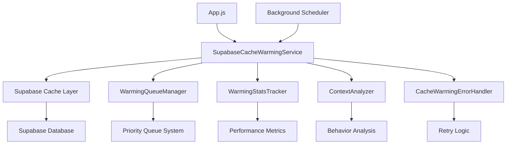

# Supabase Cache Warming Service Documentation

## Overview

The Supabase Cache Warming Service is an intelligent caching system that proactively loads frequently accessed data into memory to optimize application performance, reduce database load, and improve user experience. This service replaces the previous Firestore-based cache warming system with a new implementation designed specifically for Supabase.

## Key Features

- **Intelligent Warming Strategies**: Context-aware cache warming based on user behavior patterns, time of day, and page navigation
- **Priority-Based Queue Management**: Handles multiple warming requests with high, normal, and low priority processing
- **Comprehensive Statistics & Monitoring**: Tracks performance metrics, cost savings, and cache effectiveness
- **Background Maintenance**: Automatic cache optimization and cleanup on configurable schedules
- **Error Handling & Resilience**: Robust retry logic with exponential backoff and graceful degradation
- **Singleton Pattern**: Ensures consistent state management across the application

## Architecture



## API Reference

### Core Service Methods

#### `initializeAppCache()`
Warms the application-level cache with global data that all users need.

```javascript
const service = new SupabaseCacheWarmingService();
await service.initializeAppCache();
```

**Returns**: `Promise<Object>` - Warming result with timing and success status

#### `warmUserCacheWithRetry(userId, priority, maxRetries)`
Warms user-specific cache data with retry logic.

```javascript
await service.warmUserCacheWithRetry('user123', 'high', 3);
```

**Parameters**:
- `userId` (string): User ID to warm cache for
- `priority` (string): Priority level ('high', 'normal', 'low')
- `maxRetries` (number): Maximum retry attempts (default: 3)

#### `smartWarmCache(userId, context)`
Intelligently warms cache based on user behavior context and patterns.

```javascript
const context = {
  currentPage: 'LogWorkout',
  previousPage: 'Programs',
  timeOfDay: new Date(),
  userPreferences: { workoutFocus: 'strength' }
};

await service.smartWarmCache('user123', context);
```

#### `progressiveWarmCache(userId)`
Performs multi-phase cache warming with configurable delays between phases.

```javascript
await service.progressiveWarmCache('user123');
```

**Phases**:
1. **Critical Phase** (0ms delay): Essential user data, recent workouts
2. **Analytics Phase** (2s delay): Progress tracking, statistics
3. **Extended Phase** (5s delay): Historical data, recommendations

#### `performMaintenance()`
Performs cache maintenance including cleanup and optimization.

```javascript
await service.performMaintenance();
```

### Statistics and Monitoring

#### `getWarmingStats()`
Returns comprehensive statistics about cache warming performance.

```javascript
const stats = service.getWarmingStats();
console.log('Cache hit rate:', stats.successRate);
console.log('Cost savings:', stats.costSavings);
```

**Returns**:
```javascript
{
  totalEvents: 150,
  successfulEvents: 142,
  failedEvents: 8,
  successRate: "94.67%",
  averageDuration: "1,234ms",
  recentEvents: [...],
  currentlyWarming: false,
  queueSize: 0,
  costSavings: {
    estimatedSavings: "$2.45",
    readReductionRate: "73%",
    bandwidthSaved: "1.2MB"
  },
  performanceMetrics: {
    avgWarmingTime: 1234,
    cacheHitImprovement: "73%",
    userExperienceScore: 8.5
  }
}
```

#### `recordWarmingEvent(type, duration, success, error, metadata)`
Records a warming event for statistics tracking.

```javascript
service.recordWarmingEvent(
  'user-cache',
  1500,
  true,
  null,
  { userId: 'user123', priority: 'high' }
);
```

### Lifecycle Management

#### `start()`
Starts the cache warming service and background processes.

```javascript
service.start();
```

#### `stop()`
Stops the service and cleans up resources.

```javascript
service.stop();
```

#### `startMaintenanceSchedule(intervalMinutes)`
Starts automatic maintenance scheduling.

```javascript
service.startMaintenanceSchedule(15); // Every 15 minutes
```

## Configuration Options

### Service Configuration

```javascript
const service = new SupabaseCacheWarmingService({
  // Retry configuration
  maxRetries: 3,
  retryDelays: [1000, 2000, 4000], // Exponential backoff
  
  // Maintenance settings
  maintenanceInterval: 15, // minutes
  maxHistorySize: 50,
  
  // Queue configuration
  queueConfig: {
    maxQueueSize: 100,
    maxConcurrentWarming: 3,
    queueProcessingInterval: 500, // ms
    enablePersistence: false
  },
  
  // Statistics configuration
  statsConfig: {
    enableMemoryTracking: true,
    enableBandwidthTracking: true,
    enableCostAnalysis: true
  },
  
  // Error handling configuration
  errorHandlerConfig: {
    enableErrorRateMonitoring: true,
    enableDetailedLogging: true,
    enableGracefulDegradation: true
  }
});
```

### Queue Manager Configuration

```javascript
const queueConfig = {
  maxQueueSize: 100,              // Maximum items in queue
  maxConcurrentWarming: 3,        // Concurrent warming operations
  queueProcessingInterval: 500,   // Processing interval (ms)
  enablePersistence: false,       // Persist queue to localStorage
  persistenceKey: 'warming_queue' // Storage key for persistence
};
```

## Usage Patterns

### Basic Usage

```javascript
import { SupabaseCacheWarmingService } from '../services/supabaseCacheWarmingService';

// Initialize service
const cacheService = new SupabaseCacheWarmingService();

// Start the service
cacheService.start();

// Initialize app cache on startup
await cacheService.initializeAppCache();

// Warm user cache on authentication
const handleUserAuth = async (userId) => {
  await cacheService.warmUserCacheWithRetry(userId, 'high');
};

// Smart warming on page navigation
const handlePageNavigation = async (userId, pageName, previousPage) => {
  const context = {
    currentPage: pageName,
    previousPage: previousPage,
    timeOfDay: new Date()
  };
  
  await cacheService.smartWarmCache(userId, context);
};
```

### Advanced Usage with Context Analysis

```javascript
// Context-aware warming
const performContextualWarming = async (userId) => {
  const context = {
    currentPage: 'LogWorkout',
    previousPage: 'Programs',
    timeOfDay: new Date(),
    userPreferences: {
      workoutFocus: 'strength',
      preferredWorkoutTime: 'morning'
    },
    behaviorPatterns: {
      averageSessionLength: 25, // minutes
      frequentPages: ['LogWorkout', 'ProgressTracker'],
      lastWorkoutDate: new Date('2024-01-15')
    }
  };
  
  // Service will automatically determine optimal warming strategy
  await cacheService.smartWarmCache(userId, context);
};
```

### Progressive Warming for High-Priority Users

```javascript
// Multi-phase warming for premium users or during peak hours
const performProgressiveWarming = async (userId) => {
  try {
    const result = await cacheService.progressiveWarmCache(userId);
    
    console.log('Progressive warming completed:', {
      phases: result.phases,
      totalTime: result.totalDuration,
      success: result.success
    });
  } catch (error) {
    console.error('Progressive warming failed:', error);
    // Service will handle graceful degradation automatically
  }
};
```

## Integration Guide

### App.js Integration

```javascript
// src/App.js
import { SupabaseCacheWarmingService } from './services/supabaseCacheWarmingService';

function App() {
  const [cacheService] = useState(() => new SupabaseCacheWarmingService());
  
  useEffect(() => {
    // Start cache warming service
    cacheService.start();
    
    // Initialize app cache
    cacheService.initializeAppCache();
    
    // Cleanup on unmount
    return () => {
      cacheService.stop();
    };
  }, [cacheService]);
  
  // Handle user authentication
  useEffect(() => {
    if (user?.uid) {
      cacheService.warmUserCacheWithRetry(user.uid, 'high');
    }
  }, [user, cacheService]);
  
  // Handle page navigation
  useEffect(() => {
    if (user?.uid && location.pathname) {
      const context = {
        currentPage: location.pathname,
        timeOfDay: new Date()
      };
      
      cacheService.smartWarmCache(user.uid, context);
    }
  }, [location.pathname, user, cacheService]);
  
  // ... rest of component
}
```

### Component Integration

```javascript
// src/components/WorkoutComponent.js
import { SupabaseCacheWarmingService } from '../services/supabaseCacheWarmingService';

const WorkoutComponent = () => {
  const cacheService = SupabaseCacheWarmingService.instance;
  
  useEffect(() => {
    // Warm workout-specific data when component mounts
    if (user?.uid) {
      cacheService.smartWarmCache(user.uid, {
        currentPage: 'LogWorkout',
        context: 'workout-focused'
      });
    }
  }, [user]);
  
  // ... component logic
};
```

## Performance Tuning

### Optimization Strategies

1. **Priority-Based Warming**
   - Use 'high' priority for critical user data
   - Use 'normal' priority for general navigation
   - Use 'low' priority for background/historical data

2. **Context-Aware Timing**
   - Schedule intensive warming during off-peak hours
   - Prioritize workout data during typical workout times (6-9 AM, 5-8 PM)
   - Reduce warming frequency during low-activity periods

3. **Queue Management**
   - Adjust `maxConcurrentWarming` based on server capacity
   - Enable persistence for critical applications
   - Monitor queue overflow and adjust `maxQueueSize` accordingly

4. **Maintenance Scheduling**
   - Set maintenance intervals based on usage patterns
   - Perform heavy maintenance during low-traffic periods
   - Monitor cache hit rates and adjust warming strategies

### Performance Monitoring

```javascript
// Monitor cache performance
const monitorPerformance = () => {
  const stats = cacheService.getWarmingStats();
  
  // Alert if success rate drops below threshold
  if (parseFloat(stats.successRate) < 90) {
    console.warn('Cache warming success rate below 90%:', stats.successRate);
  }
  
  // Monitor queue size
  if (stats.queueSize > 50) {
    console.warn('Cache warming queue is getting large:', stats.queueSize);
  }
  
  // Track cost savings
  console.log('Estimated cost savings:', stats.costSavings.estimatedSavings);
};

// Run monitoring every 5 minutes
setInterval(monitorPerformance, 5 * 60 * 1000);
```

## Error Handling

### Error Categories

The service handles different types of errors with appropriate strategies:

1. **Network Errors**: Retry with exponential backoff
2. **Authentication Errors**: Skip warming, log warning
3. **Database Errors**: Retry with reduced scope
4. **Cache Errors**: Continue without caching, log error

### Graceful Degradation

When cache warming fails, the service:
- Continues normal application operation
- Allows database queries to proceed without cache
- Logs errors for monitoring and debugging
- Schedules retry attempts for later
- Provides fallback mechanisms for critical operations

### Error Monitoring

```javascript
// Monitor error rates
const monitorErrors = () => {
  const stats = cacheService.getWarmingStats();
  const errorRate = (stats.failedEvents / stats.totalEvents) * 100;
  
  if (errorRate > 10) {
    console.error(`High error rate detected: ${errorRate.toFixed(2)}%`);
    
    // Get recent errors for analysis
    const recentErrors = stats.recentEvents
      .filter(event => !event.success)
      .slice(-10);
    
    console.error('Recent errors:', recentErrors);
  }
};
```

## Troubleshooting Guide

### Common Issues

#### 1. Cache Warming Not Starting

**Symptoms**: No warming events in statistics, queue remains empty

**Possible Causes**:
- Service not started: Call `service.start()`
- Authentication issues: Verify user authentication
- Configuration errors: Check service configuration

**Solutions**:
```javascript
// Verify service is started
if (!service.isStarted) {
  service.start();
}

// Check authentication
if (!user?.uid) {
  console.warn('User not authenticated, skipping cache warming');
}

// Verify configuration
console.log('Service config:', service.config);
```

#### 2. High Error Rates

**Symptoms**: Low success rate in statistics, frequent error logs

**Possible Causes**:
- Network connectivity issues
- Supabase service problems
- Incorrect cache function imports
- Rate limiting

**Solutions**:
```javascript
// Check error details
const stats = service.getWarmingStats();
const recentErrors = stats.recentEvents
  .filter(event => !event.success)
  .map(event => event.error);

console.log('Recent errors:', recentErrors);

// Adjust retry configuration
const service = new SupabaseCacheWarmingService({
  maxRetries: 5,
  retryDelays: [2000, 4000, 8000, 16000, 32000]
});
```

#### 3. Queue Overflow

**Symptoms**: Warning messages about queue overflow, warming requests being dropped

**Possible Causes**:
- Too many concurrent warming requests
- Slow processing due to network issues
- Insufficient queue size configuration

**Solutions**:
```javascript
// Increase queue size
const service = new SupabaseCacheWarmingService({
  queueConfig: {
    maxQueueSize: 200,
    maxConcurrentWarming: 5
  }
});

// Monitor queue status
const queueStatus = service.queueManager.getQueueStatus();
console.log('Queue status:', queueStatus);
```

#### 4. Poor Cache Performance

**Symptoms**: Low cache hit rates, minimal performance improvement

**Possible Causes**:
- Incorrect warming strategies
- Cache TTL too short
- Data patterns not matching warming logic

**Solutions**:
```javascript
// Analyze cache statistics
const stats = service.getWarmingStats();
console.log('Cache performance:', stats.performanceMetrics);

// Adjust warming strategies
await service.smartWarmCache(userId, {
  currentPage: 'LogWorkout',
  priority: 'high',
  strategy: 'progressive'
});

// Monitor specific collections
const cacheStats = await getCacheStats();
console.log('Collection hit rates:', cacheStats.hitRatesByCollection);
```

### Debug Mode

Enable detailed logging for troubleshooting:

```javascript
const service = new SupabaseCacheWarmingService({
  errorHandlerConfig: {
    enableDetailedLogging: true
  },
  enableDebugMode: true
});

// Service will now log detailed information about all operations
```

### Health Checks

Implement health checks to monitor service status:

```javascript
const performHealthCheck = () => {
  const service = SupabaseCacheWarmingService.instance;
  
  const health = {
    isStarted: service.isStarted,
    isWarming: service.isWarming,
    queueSize: service.queueManager.getTotalQueueSize(),
    activeWarming: service.queueManager.activeWarming.size,
    uptime: Date.now() - service._startTime,
    lastMaintenance: service.lastMaintenanceTime,
    errorRate: service.getErrorRate(),
    memoryUsage: process.memoryUsage?.() || 'N/A'
  };
  
  console.log('Cache warming service health:', health);
  return health;
};

// Run health check every 10 minutes
setInterval(performHealthCheck, 10 * 60 * 1000);
```

## Migration from Firestore Cache

See the [Migration Guide](./SUPABASE_CACHE_MIGRATION_GUIDE.md) for detailed instructions on migrating from the previous Firestore-based cache warming system.

## Best Practices

1. **Initialize Early**: Start the service during app initialization
2. **Context-Aware Warming**: Provide rich context for intelligent warming decisions
3. **Monitor Performance**: Regularly check statistics and adjust configuration
4. **Handle Errors Gracefully**: Implement proper error handling and fallbacks
5. **Optimize for Usage Patterns**: Adjust warming strategies based on user behavior
6. **Resource Management**: Properly stop the service when no longer needed
7. **Testing**: Test warming strategies in development before production deployment

## API Compatibility

The service maintains API compatibility with the previous cache warming system while providing enhanced functionality. Existing code should work with minimal changes when importing the new service.

## Support and Maintenance

- Monitor error logs and performance metrics regularly
- Update warming strategies based on usage analytics
- Adjust configuration parameters based on application growth
- Keep dependencies updated for security and performance improvements